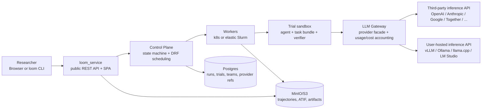

# Loom

Loom is a team platform for evaluating agents and LLM-powered systems on
benchmark tasks. Researchers use it to launch many trials, watch progress,
inspect failures, compare model/agent choices, and download reproducible
artifacts.

The important product boundary is simple:

- **Loom runs the evaluation platform.** It owns teams, auth, benchmark
  catalogs, job scheduling, sandbox execution, trajectories, metrics, and the
  web/CLI surfaces.
- **Users bring the inference API.** A team can connect a hosted provider such
  as OpenAI, Anthropic, Google, Together, or Fireworks, or expose its own
  OpenAI-compatible inference service from a GPU cluster.
- **v1.0 does not host model inference.** The public/platform deployment does
  not run vLLM or serve checkpoints for users. Any vLLM, Ollama, llama.cpp,
  LM Studio, or hosted API endpoint is operated by the user/team and registered
  as a provider connection.

Staging/dev route: [https://yylx.world/dev](https://yylx.world/dev)

## What Loom Does

Loom turns a model/agent evaluation into a tracked run:

1. A user picks a **provider/model**, **agent**, **benchmark**, and task subset
   from the web app or CLI.
2. Loom creates a batch and fans it out into trials.
3. Workers claim trials, materialize task bundles, run agents in sandboxes, and
   route all model calls through the Loom LLM Gateway.
4. Loom records event-sourced trajectories, ATIF metric documents, verifier
   outcomes, token usage, and artifacts.
5. Users inspect results in Monitor, Trial/Batch detail, Run Library, or through
   the CLI/API.

Out of the box, Loom includes benchmark adapters across coding, math,
reasoning, tool use, and agent tasks, plus CLI harnesses for common coding
agents and an `oracle` baseline. The v1.0 supported set is listed below.

## Architecture

The Control Plane, Gateway, Service, SPA, and Workers are stateless. Postgres
and MinIO/S3 are the durable state. The same `Trial.run()` orchestrator powers
both laptop CLI mode and service mode, so local and service-mode runs emit the
same trajectory and ATIF shapes.

Deeper reading: [`docs/architecture/overview.md`](docs/architecture/overview.md).

## v1.0 Status

v1.0 ships a curated subset of the built-in catalog. Unsupported rows stay
visible for transparency but cannot be selected from New Batch; the platform
labels them at the API and UI boundaries.

**Supported benchmarks (`Selectable`):**

| Benchmark id | Task family |
|---|---|
| `humaneval`, `mbpp`, `livecodebench`, `swe-bench-verified`, `terminal-bench-2` | Code generation and software engineering |
| `aime-24`, `aime-25`, `math-500` | Math |
| `gpqa`, `mmlu-pro` | Reasoning |
| `skillflow`, `skilllearnbench` | Agent / skill |

**Visible but disabled:**

| Reason | Benchmark ids |
|---|---|
| `Not in v1.0` (catalog transparency) | `aime-22`, `aime-23`, `bfcl`, `browsecomp`, `hendrycks-math`, `swe-bench`, `swe-bench-multimodal`, `tau2-bench` |
| `Deferred` (needs dataset or auth) | `gaia` (Hugging Face token + published bundle) |
| `Unsupported runtime` (needs UI sandbox) | `osworld`, `webarena` |

The allowlist lives in `src/loom/benchmark_readiness.py:V1_SUPPORTED_BENCHMARK_IDS`
so the CLI, API, and SPA agree. Out-of-tree benchmark adapters published via
the `loom.benchmarks` entry-point (for example Terminal-Bench-2 in
`packages/loom-benchmark-terminal-bench-2/`) are still selectable independently
of this list.

## Bring Your Own Inference API

Every real model-backed Loom run needs a provider connection owned by the team
submitting the work. Loom encrypts the provider API key, stores only secret
references in the database, and uses the LLM Gateway server-side during runtime.

Submission surface and inference source are independent choices. A user can
submit from the hosted web app or CLI on any machine that can reach Loom, while
the model itself can live behind a third-party API or on the user's own GPU
cluster.

**Option 1: Third-party hosted API.** OpenAI-compatible endpoints (OpenAI,
Together, Fireworks, a self-hosted vLLM), or provider-native APIs (Anthropic,
Google). The team registers provider type, base URL, API key (`env:` or
browser secret field), optional allowed model ids, and optional rate-card
namespace.

**Option 2: User-hosted inference on the user's cluster.** The cluster runs an
OpenAI-compatible HTTP service, usually vLLM. Loom only needs HTTPS reachability
to the final `/v1` endpoint — via public HTTPS, a bastion TCP forward, an SSH
reverse tunnel, VPN/Tailscale/WireGuard, or any stable URL that forwards to the
live inference job. Loom does not need SSH access into the cluster for normal
inference calls. Private endpoints or non-standard ports require an operator to
allowlist the IP/CIDR + TCP port in the Loom cluster egress config first.

Full setup workflows for both options — including the `loom inference deploy
slurm` helper that generates a Slurm bundle for GPU-cluster vLLM checkpoints —
live in [`docs/provider-onboarding.md`](docs/provider-onboarding.md).

## Providers and Agents

Two catalogs you pick from when creating a batch.

**Provider connection types** (the `--type` value on `loom providers create`):

| Type | Use for |
|---|---|
| `openai-compatible` | OpenAI, Together, Fireworks, vLLM, Ollama, LM Studio, any service exposing `/v1/chat/completions` |
| `anthropic` | Anthropic API (native dialect) |
| `google` | Google Gemini API |
| `custom` | Escape hatch when none of the above fit; tokens-only cost accounting |

`openai-compatible`, `anthropic`, and `google` route to native dialects in
the LLM Gateway and get rate-card-based cost lookup. `custom` falls back to
token totals only.

**Agent catalog** (the `--agent` value on `loom eval batch create`):

- **Builtins:** `oracle` (ground-truth canary, no model), `litellm`
  (multi-provider tool-loop; accepts any provider + api/local-server/hf
  model source).
- **CLI adapters from `loom-launcher`:** `claude-code` (Anthropic),
  `codex` (OpenAI), `gemini-cli` (Google), `kimi-cli` (Moonshot),
  `qwen-cli` (Alibaba), plus provider-agnostic `aider`, `openhands`,
  `openhands-sdk`, `opencode`, `swe-agent`, `mini-swe-agent`,
  `terminus_2`. CLI adapters install on demand into the trial
  sandbox via a layered image; the build is cached per
  `(task-image, agent)` pair.

The web app's New Batch dropdown is the same list. Provider/model
compatibility is enforced at submit time — incompatible combos fail with a
400 rather than blowing up on a worker. Sources of truth:
`src/loom_service/agent_catalog.py` and
`src/loom_service/routes/provider_connections.py`.

## Choose Your Quickstart

Pick the path that matches what you have, then follow the corresponding
quickstart in [`docs/user-guide.md`](docs/user-guide.md):

| You have… | Follow |
|---|---|
| No stack at all, just a task + a model key, throwaway run | [Laptop-only `loom run`](docs/user-guide.md#quickstart-laptop-only-loom-run) |
| No account; you want to run the full stack on your own machine | [Run Loom locally](docs/user-guide.md#quickstart-run-loom-locally) |
| An account on a running Loom and prefer a terminal | [Submit from the CLI to a Loom server](docs/user-guide.md#quickstart-submit-from-the-cli-to-a-loom-server) |
| The same account and want clicks | [Submit from the web app](docs/user-guide.md#quickstart-submit-from-the-web-app) |

The web and CLI paths submit into a running service and persist
trajectories/ATIF/usage server-side. `loom service up` runs that same service
stack against local Docker + Postgres + MinIO. `loom run` is a one-shot
in-process trial that writes `events.jsonl` + `atif.json` to a local directory
and exits — no DB, no team, no provider registration.

## Key Concepts

| Concept | Meaning |
|---|---|
| Team | Owns provider credentials, user-owned API tokens, submitted runs, cost attribution, and members. |
| Provider connection | Team-scoped inference API configuration. It can point to a hosted provider or a user-hosted endpoint. |
| Model | Concrete model id selected from a provider connection. Refresh discovers models; preflight proves one model can generate. |
| Agent | Harness that drives a model through a task, such as `litellm`, coding-agent CLIs, or `oracle`. |
| Benchmark | Adapter that publishes tasks into Loom's catalog. |
| Batch | A submitted run plan: task filter plus one or more agent/model combinations. |
| Trial | One executable unit from a batch. |
| Trajectory | Event-sourced JSONL record of execution, tool use, model calls, verifier checks, and finalization. |
| ATIF | Structured metric document with rewards, token usage, verifier output, and platform outcome. |

## Where to Read More

- [`docs/index.md`](docs/index.md) — documentation map.
- [`docs/user-guide.md`](docs/user-guide.md) — install, quickstarts, CLI and
  web workflows, backends, model sources, reference, and troubleshooting.
- [`docs/provider-onboarding.md`](docs/provider-onboarding.md) — hosted API and
  self-hosted GPU-cluster provider setup, including the `loom inference deploy
  slurm` helper.
- [`docs/architecture/overview.md`](docs/architecture/overview.md) — component
  map and execution model.
- [`docs/architecture/service-mode.md`](docs/architecture/service-mode.md) —
  service-mode details.
- [`docs/operator-runbook.md`](docs/operator-runbook.md) — production deploy,
  environment isolation, release gates, and operations.
- [`docs/remote-worker-pool.md`](docs/remote-worker-pool.md) — attaching extra
  Docker/Slurm worker capacity.
- [`docs/authoring-a-task.md`](docs/authoring-a-task.md) — creating a new task
  or benchmark adapter.
- [`docs/loom-vs-harbor.md`](docs/loom-vs-harbor.md) — design tradeoffs and
  gaps versus Harbor.
- [`docs/contributor-quickstart.md`](docs/contributor-quickstart.md) — repo
  layout, tests, and contribution workflow.

## License and Contributing

Loom is licensed under Apache-2.0. The canonical development repository is
[`qianyi-sun/loom`](https://github.com/qianyi-sun/loom). Contribution
workflow, branch conventions, release flow, and maintainer-only repository
hardening live in [`CONTRIBUTING.md`](CONTRIBUTING.md).
