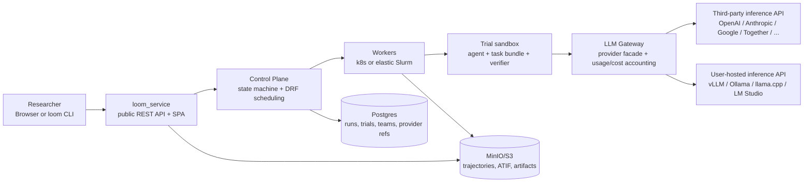
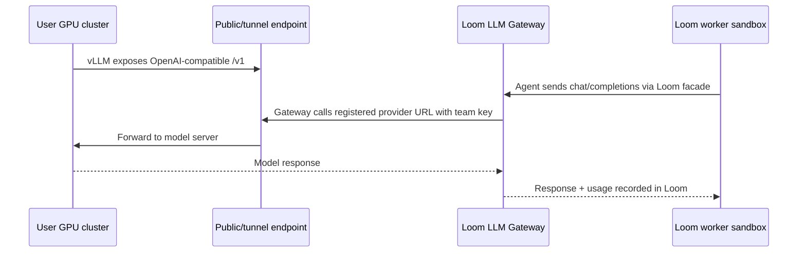

# Loom

Loom is a team platform for evaluating agents and LLM-powered systems on
benchmark tasks. Researchers use it to launch many trials, watch progress,
inspect failures, compare model/agent choices, and download reproducible
artifacts.

The important product boundary is simple:

- **Loom runs the evaluation platform.** It owns teams, auth, benchmark
  catalogs, job scheduling, sandbox execution, trajectories, metrics, and the
  web/CLI surfaces.
- **Users bring the inference API.** A team can connect a hosted provider such
  as OpenAI, Anthropic, Google, Together, or Fireworks, or expose its own
  OpenAI-compatible inference service from a GPU cluster.
- **v1.0 does not host model inference.** The public/platform deployment does
  not run vLLM or serve checkpoints for users. Any vLLM, Ollama, llama.cpp,
  LM Studio, or hosted API endpoint is operated by the user/team and registered
  as a provider connection.

Public beta/dev route: [https://yylx.world/dev](https://yylx.world/dev)

## What Loom Does

Loom turns a model/agent evaluation into a tracked run:

1. A user picks a **provider/model**, **agent**, **benchmark**, and task subset
   from the web app or CLI.
2. Loom creates a batch and fans it out into trials.
3. Workers claim trials, materialize task bundles, run agents in sandboxes, and
   route all model calls through the Loom LLM Gateway.
4. Loom records event-sourced trajectories, ATIF metric documents, verifier
   outcomes, token usage, and artifacts.
5. Users inspect results in Monitor, Trial/Batch detail, Run Library, or through
   the CLI/API.

Out of the box, Loom includes benchmark adapters across coding, math,
reasoning, tool use, and agent tasks. Agents are also pluggable; the shipped
catalog includes CLI harnesses for common coding agents plus an `oracle`
baseline. The current supported set is listed below.

## v1.0 Status

v1.0 ships a curated subset of the built-in catalog. Unsupported rows stay
visible for transparency but cannot be selected from New Batch; the platform
labels them at the API and UI boundaries.

**Supported benchmarks (`Selectable`):**

| Benchmark id | Task family |
|---|---|
| `humaneval`, `mbpp`, `livecodebench`, `swe-bench-verified`, `terminal-bench-2` | Code generation and software engineering |
| `aime-24`, `aime-25`, `math-500` | Math |
| `gpqa`, `mmlu-pro` | Reasoning |
| `skillflow`, `skilllearnbench` | Agent / skill |

**Visible but disabled:**

| Reason | Benchmark ids |
|---|---|
| `Not in v1.0` (catalog transparency) | `aime-22`, `aime-23`, `bfcl`, `browsecomp`, `hendrycks-math`, `swe-bench`, `swe-bench-multimodal`, `tau2-bench` |
| `Deferred` (needs dataset or auth) | `gaia` (Hugging Face token + published bundle) |
| `Unsupported runtime` (needs UI sandbox) | `osworld`, `webarena` |

The allowlist lives in `src/loom/benchmark_readiness.py:V1_SUPPORTED_BENCHMARK_IDS`
so the CLI, API, and SPA agree. Out-of-tree benchmark adapters published via
the `loom.benchmarks` entry-point (for example Terminal-Bench-2 in
`packages/loom-benchmark-terminal-bench-2/`) are still selectable independently
of this list.

## Architecture



The Control Plane, Gateway, Service, SPA, and Workers are stateless. Postgres
and MinIO/S3 are the durable state. The same `Trial.run()` orchestrator powers
both laptop CLI mode and service mode, so local and service-mode runs emit the
same trajectory and ATIF shapes.

## Bring Your Own Inference API

Every real model-backed Loom run needs a provider connection owned by the team
submitting the work. Loom encrypts the provider API key, stores only secret
references in the database, and uses the LLM Gateway server-side during runtime.

Submission surface and inference source are independent choices. A user can
submit from the hosted web app or CLI on any machine that can reach Loom, while
the model itself can live behind a third-party API or on the user's own GPU
cluster.

### Option 1: Third-party hosted API

Use this when the model is already exposed by a hosted API provider.

Examples:

- OpenAI-compatible APIs such as OpenAI, Together, Fireworks, or a vLLM
  endpoint managed by the user/team.
- Provider-native APIs such as Anthropic or Google when that provider type is
  enabled.

The team registers:

- provider type;
- API base URL;
- API key by `env:` or browser secret field;
- optional allowed model ids;
- optional rate-card namespace for cost attribution.

Then Loom can test the connection, refresh models, preflight one model, and make
runtime calls through the Gateway.

### Option 2: User-hosted inference API on the user's cluster

Use this when the team owns a checkpoint or Hugging Face model and wants to run
inference on its own GPU cluster.

The user cluster runs an OpenAI-compatible HTTP service, usually vLLM. Loom does
not need to own that cluster and does not need SSH access for normal inference
calls. The only required runtime path is HTTP reachability from the Loom
deployment to the final `/v1` endpoint.

Typical connection patterns:

- public HTTPS endpoint owned by the user;
- bastion TCP forward from a login node to a compute node;
- SSH reverse tunnel;
- VPN, Tailscale, WireGuard, or another approved private route;
- a user-provided stable URL that forwards to the live inference job.

Runtime flow:



If the endpoint is public on standard `443` or `80`, the default egress policy
usually works. If it is private or uses a non-standard port, an operator must
approve that IP/CIDR and TCP port in the Loom cluster config before connection
tests, model refresh, preflight, and runtime calls can reach it. This keeps
private-network access explicit and reviewable.

For Slurm/vLLM clusters, Loom ships a helper that generates a small deployment
bundle:

```bash
loom inference deploy slurm \
  --model Qwen/Qwen2.5-Coder-7B-Instruct \
  --served-model-name qwen2.5-coder-7b-instruct \
  --provider-name lab-qwen25-coder \
  --partition compute \
  --gres gpu:h100:1 \
  --venv /path/to/vllm-venv \
  --port 8001 \
  --expose user-provided \
  --endpoint-url https://inference.example.com/v1 \
  --output-dir ~/loom-inference/lab-qwen25 \
  --no-submit
```

The generated bundle includes a Slurm script, healthcheck, provider
registration script, and an owner-only API-key file. See
[`docs/provider-onboarding.md#gpu-cluster-checkpoint`](docs/provider-onboarding.md#gpu-cluster-checkpoint)
for the full workflow.

## Providers and Agents

Two catalogs you pick from when creating a batch.

**Provider connection types** (the `--type` value on `loom providers create`):

| Type | Use for |
|---|---|
| `openai-compatible` | OpenAI, Together, Fireworks, vLLM, Ollama, LM Studio, any service exposing `/v1/chat/completions` |
| `anthropic` | Anthropic API (native dialect) |
| `google` | Google Gemini API |
| `custom` | Escape hatch when none of the above fit; tokens-only cost accounting |

`openai-compatible`, `anthropic`, and `google` route to native dialects in
the LLM Gateway and get rate-card-based cost lookup. `custom` falls back to
token totals only.

**Agent catalog** (the `--agent` value on `loom eval batch create`):

- **Builtins:** `oracle` (ground-truth canary, no model), `litellm`
  (multi-provider tool-loop; accepts any provider + api/local-server/hf
  model source).
- **CLI adapters from `loom-launcher`:** `claude-code` (Anthropic),
  `codex` (OpenAI), `gemini-cli` (Google), `kimi-cli` (Moonshot),
  `qwen-cli` (Alibaba), plus provider-agnostic `aider`, `openhands`,
  `openhands-sdk`, `opencode`, `swe-agent`, `mini-swe-agent`. CLI
  adapters install on demand into the trial sandbox via a layered image;
  the build is cached per `(task-image, agent)` pair.

The web app's New Batch dropdown is the same list. Provider/model
compatibility is enforced at submit time — incompatible combos fail with a
400 rather than blowing up on a worker. Sources of truth:
`src/loom_service/agent_catalog.py` and
`src/loom_service/routes/provider_connections.py`.

## Choosing a Quickstart

Pick the path that matches what you have:

| You have… | Use |
|---|---|
| An account on a running Loom (e.g. `https://yylx.world/dev`) and want clicks | [Submit From the Web App](#quickstart-submit-from-the-web-app) |
| The same account but prefer a terminal | [Submit From the CLI](#quickstart-submit-from-the-cli-to-any-loom-server) |
| No account; you want to run the full stack on your own machine | [Run Loom Locally](#quickstart-run-loom-locally) |
| No stack at all, just a task + a model key, throwaway run | [Laptop-Only `loom run`](#quickstart-laptop-only-loom-run) |

The web and CLI paths submit into a running service and persist
trajectories/ATIF/usage server-side. `loom service up` runs that same
service stack against local Docker + Postgres + MinIO. `loom run` is a
one-shot in-process trial that writes `events.jsonl` + `atif.json` to a
local directory and exits — no DB, no team, no provider registration.

## Quickstart: Submit From the Web App

Use this path when presenting the public UI.

> **Need an account?** Public beta uses admin-approved username/password
> accounts (no email, no automatic mail). On the sign-in page, use the
> **Request account** card: enter a username, pick an existing team, and
> wait for an admin to approve and share the one-time password setup link.
> If the team you need doesn't exist, ask an admin to create it first.
> Full flow:
> [`docs/user-guide.md#web-sessions-and-teams`](docs/user-guide.md#web-sessions-and-teams).

1. Open [https://yylx.world/dev](https://yylx.world/dev) or your local Loom URL. First production uses [https://yylx.world/prod](https://yylx.world/prod).
2. Sign in and select the team that owns the run.
3. Open **Providers**.
   - Add a third-party provider connection, or register a self-hosted
     OpenAI-compatible endpoint.
   - Test the connection.
   - Refresh models.
   - Preflight the exact model you plan to use.
4. Open **New batch**.
   - Select one or more benchmarks.
   - Choose the task subset: all, first N, last N, random N, or explicit task
     ids.
   - Pick agent/model combinations.
   - Optionally add a short suffix; Loom generates the batch name and
     description from the selected tasks and combinations.
   - Review the planned trial count and submit.
5. Open **Monitor** to watch batch/trial progress.
6. Open the batch or trial detail page for evaluator reward, platform outcome,
   trajectory, ATIF, and artifacts.
7. Open **Run Library** to find completed shared work and reuse safe artifacts
   or clone run configuration into the current team.

The public web app intentionally hides raw infrastructure details in the common
path. Diagnostic panels and copyable CLI snippets are available on the same
pages when you need to reproduce or debug from a terminal.

## Quickstart: Submit From the CLI to Any Loom Server

Use this path from any machine that can reach the Loom public API.
The CLI machine does not need GPUs, model weights, or direct access to the
benchmark workers; it only needs network access to the Loom service and a team
account.

Install the CLI from a source checkout:

```bash
uv sync
uv pip install -e packages/loom-launcher -e packages/loom-benchmarks
source .venv/bin/activate
loom --help
```

Authenticate with your approved username/password account. The CLI uses the
same account as the web app; if you don't have one yet, follow the request-
access flow in
[`docs/user-guide.md#web-sessions-and-teams`](docs/user-guide.md#web-sessions-and-teams)
first.

```bash
export LOOM_PASSWORD=...
loom auth login --server https://yylx.world/dev --username USER --password env:LOOM_PASSWORD
loom auth whoami
```

Register a hosted OpenAI-compatible provider:

```bash
export PROVIDER_API_KEY=sk-...

loom providers create \
  --name smoke-openai \
  --type openai-compatible \
  --base-url https://api.openai.com/v1 \
  --api-key env:PROVIDER_API_KEY

loom providers test smoke-openai
loom providers models smoke-openai --refresh
loom providers models smoke-openai --preflight gpt-4o-mini
```

Submit a small model-backed batch:

```bash
loom eval batch create \
  --name-suffix cli-smoke \
  --task-filter '{"task_ids":["hello-world"]}' \
  --provider smoke-openai \
  --model gpt-4o-mini \
  --agent litellm \
  --n-per-task 1

loom eval batch show <batch-id>
loom eval trial list --state succeeded --limit 5
loom eval trial show <trial-id>
loom eval trial download <trial-id> --kind atif --output atif.json
loom eval trial download <trial-id> --kind trajectory --output events.jsonl
```

For a self-hosted inference service, register the final reachable `/v1` URL the
same way:

```bash
export SELF_HOSTED_API_KEY=...

loom providers create \
  --name lab-vllm \
  --type openai-compatible \
  --base-url https://inference.example.com/v1 \
  --api-key env:SELF_HOSTED_API_KEY

loom providers test lab-vllm
loom providers models lab-vllm --refresh
loom providers models lab-vllm --preflight qwen2.5-coder-7b-instruct
```

If the model server does not expose a useful `/models` catalog, add the model id
manually from the provider page or provider model API, then preflight it before
launching large batches.

## Quickstart: Run Loom Locally

Local service mode is the fastest way to run the full stack for development or
demo preparation.

Prerequisites:

- Python 3.12;
- [`uv`](https://docs.astral.sh/uv/getting-started/installation/);
- Docker CLI with the Compose plugin;
- Docker Desktop running on macOS.

Install dependencies:

```bash
uv sync
uv pip install -e packages/loom-launcher -e packages/loom-benchmarks
source .venv/bin/activate
docker compose version
```

Start the service stack:

```bash
cp .env.example .env
# Edit .env if you want default provider keys for local testing.
loom service up
```

`loom service up` starts Postgres, MinIO, LLM Gateway, Control Plane,
`loom_service`, Worker, and the React SPA. It runs migrations, seeds local
tokens, and prints endpoint URLs.

Default local URLs:

| What | URL |
|---|---|
| Web app | http://localhost:5173/ |
| API root | http://localhost:8090/ |
| Swagger UI | http://localhost:8090/docs |
| Health | http://localhost:8090/api/v1/health |
| MinIO console | http://localhost:9001/ |

Tear down:

```bash
loom service down      # preserve volumes
loom service down -v   # remove Postgres + MinIO volumes
```

Local compose is for development, not public hosting. Production or shared
deployments use `loom cluster` with Kubernetes, TLS Ingress, protected
environment secrets, and release-promotion evidence. See
[`docs/operator-runbook.md`](docs/operator-runbook.md).

## Quickstart: Laptop-Only `loom run`

For a local one-off experiment without the service stack, use `loom run`.

```bash
loom datasets list

# Smoke test with no real model provider.
loom run --task humaneval/HumanEval/0 \
  --agent oracle \
  --backend fake \
  --output-dir /tmp/loom-smoke \
  --json

# Model-backed local run against an already-running OpenAI-compatible server.
loom run --task humaneval/HumanEval/0 \
  --agent claude-code \
  --local-server http://localhost:8000/v1 \
  --model meta-llama/Llama-3.1-8B-Instruct \
  --backend docker
```

`loom run` writes `events.jsonl` and `atif.json` under the output directory.
The full local LLM workflow, including auto-starting vLLM and comparing multiple
models, lives in [`docs/user-guide.md#local-llms`](docs/user-guide.md#local-llms).

## Key Concepts

| Concept | Meaning |
|---|---|
| Team | Owns provider credentials, user-owned API tokens, submitted runs, cost attribution, and members. |
| Provider connection | Team-scoped inference API configuration. It can point to a hosted provider or a user-hosted endpoint. |
| Model | Concrete model id selected from a provider connection. Refresh discovers models; preflight proves one model can generate. |
| Agent | Harness that drives a model through a task, such as `litellm`, coding-agent CLIs, or `oracle`. |
| Benchmark | Adapter that publishes tasks into Loom's catalog. |
| Batch | A submitted run plan: task filter plus one or more agent/model combinations. |
| Trial | One executable unit from a batch. |
| Trajectory | Event-sourced JSONL record of execution, tool use, model calls, verifier checks, and finalization. |
| ATIF | Structured metric document with rewards, token usage, verifier output, and platform outcome. |

## Where to Read More

- [`docs/index.md`](docs/index.md) - documentation map.
- [`docs/user-guide.md`](docs/user-guide.md) - CLI and user workflows.
- [`docs/provider-onboarding.md`](docs/provider-onboarding.md) - hosted API and
  self-hosted GPU-cluster provider setup.
- [`docs/architecture/overview.md`](docs/architecture/overview.md) - component
  map and execution model.
- [`docs/architecture/service-mode.md`](docs/architecture/service-mode.md) -
  service-mode details.
- [`docs/operator-runbook.md`](docs/operator-runbook.md) - production deploy,
  environment isolation, release gates, and operations.
- [`docs/remote-worker-pool.md`](docs/remote-worker-pool.md) - attaching extra
  Docker/Slurm worker capacity.
- [`docs/authoring-a-task.md`](docs/authoring-a-task.md) - creating a new task
  or benchmark adapter.
- [`docs/loom-vs-harbor.md`](docs/loom-vs-harbor.md) - design tradeoffs and
  gaps versus Harbor.
- [`docs/contributor-quickstart.md`](docs/contributor-quickstart.md) - repo
  layout, tests, and contribution workflow.

## License and Contributing

Loom is licensed under Apache-2.0. The canonical development repository is
[`qianyi-sun/loom`](https://github.com/qianyi-sun/loom). Contribution
workflow, branch conventions, release flow, and maintainer-only repository
hardening live in [`CONTRIBUTING.md`](CONTRIBUTING.md).
