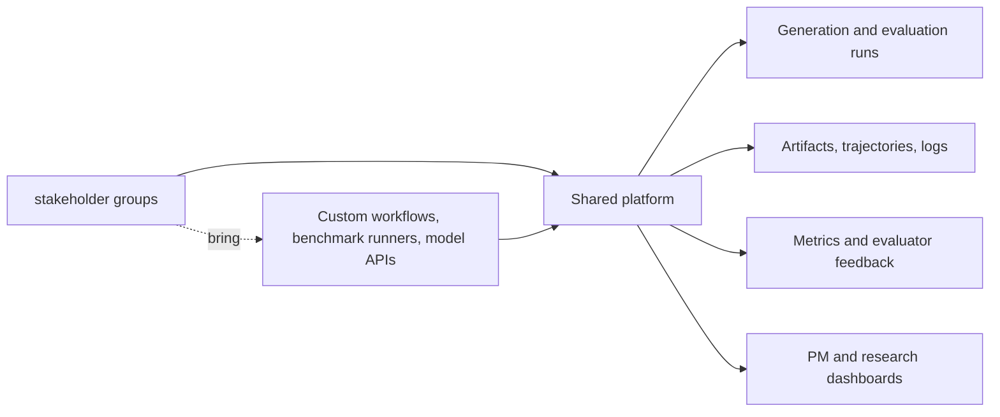
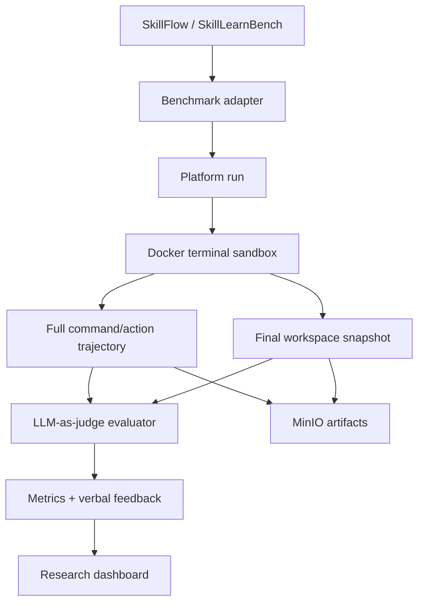
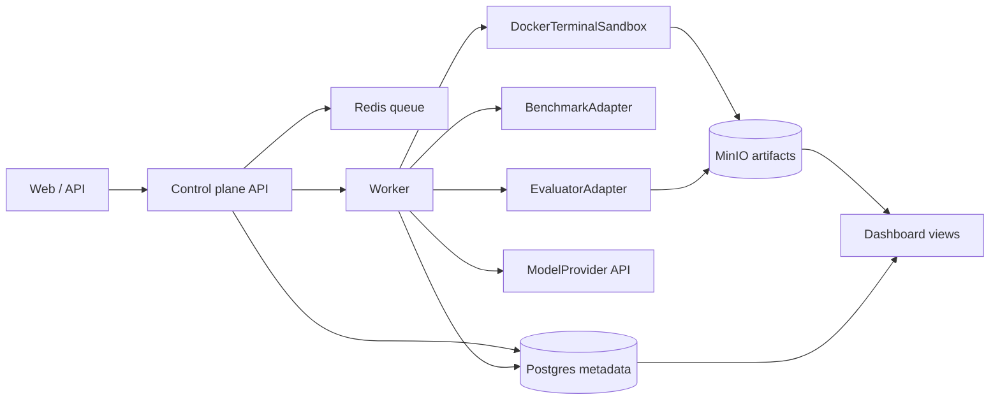

# Agentic Data Platform

Internal platform for shared agentic data generation, terminal-agent benchmark
execution, evaluation, artifact tracking, and research progress visibility.

This repository is a new implementation. The local `coder-harbor-cloud`
repository is useful as a reference for run tracking, task directories, and
control-plane ideas, but this project should not copy its code or inherit its
cloud/runtime assumptions.

## Motivation

Multiple agent research subteams need to generate data, run evaluations, track
artifacts, and report progress. If each team builds its own Docker sandboxes,
benchmark runners, storage layout, evaluator scripts, dashboards, and deployment
path, the organization pays the same engineering cost several times.

The platform provides shared infrastructure for the repeated parts while keeping
research workflows flexible.



## What The Platform Does

- Runs agentic data generation and evaluation workflows.
- Executes terminal-agent benchmarks inside Docker sandboxes for the MVP.
- Records full trajectories, stdout/stderr, final workspace snapshots, artifacts,
  evaluator feedback, metrics, and failure reasons.
- Keeps model access API-based for v0.
- Stores metadata in Postgres and artifacts in a local MinIO-compatible object
  store for the first deployment.
- Gives stakeholder groups and PMs a shared view of progress, quality, failures, and
  reusable data.

## Current MVP Direction

The first high-priority pilot comes from **pilot group**.
It targets full adaptation of SkillFlow and SkillLearnBench as terminal-agent
skill-learning benchmarks.



MVP constraints:

- API model access only.
- Docker terminal sandbox only.
- Internet access allowed inside the pilot sandbox for now.
- No direct model-weight inference in v0.
- Original benchmark runners are wrapped first.
- A user-friendly runner/pipeline contract is still required so future teams can
  bring their own workflows.

## Architecture Sketch



Core object model:

- `BenchmarkSuite`: SkillFlow, SkillLearnBench, or future benchmark families.
- `TaskInstance`: one concrete benchmark instance and its source metadata.
- `Run`: a platform-tracked execution attempt with lifecycle state.
- `InteractionTurn`: command/action, stdout, stderr, exit code, and timing.
- `WorkspaceSnapshot`: final file tree and generated files.
- `Artifact`: durable object-store reference with metadata and lineage.
- `EvaluatorResult`: metrics, verbal feedback, judge model, and rubric version.
- `SkillObject`: flexible skill artifact; not assumed to be `skill.md`.

Detailed design: [terminal-benchmark-mvp.md](docs/architecture/terminal-benchmark-mvp.md).
Original runner wrapper research:
[benchmark-runner-wrapper-spike.md](docs/development/benchmark-runner-wrapper-spike.md).

## Current Progress

| Area | Status | Notes |
| --- | --- | --- |
| Repository setup | In progress | Private GitHub repo, CI, branch protection, CODEOWNERS, labels, milestones, project board |
| Infra discovery | In progress | `shared dev` selected for v0; Docker Engine and Compose installed; Compose smoke test passed |
| Development workflow | Started | `dev` is the default integration branch; `main` is reserved for production releases |
| Docker dev environment | Started | `Dockerfile.dev`, `docker-compose.dev.yml`, and `scripts/deploy-dev.sh` provide local and shared dev validation |
| Production planning | Planning input captured | internal compute shared-cluster and batch scheduler-only possibilities documented, not finalized |
| Requirements collection | In progress | First concrete pilot captured from pilot group; remaining teams still need intake |
| MVP architecture | In progress | Terminal benchmark architecture spec is now the first architecture anchor |
| Run data contract | Started | Python domain schema covers benchmark task identity, API model config, Docker runner config, terminal turns, artifacts, evaluator feedback, and flexible skill objects |
| Sandbox and artifacts | Started | Docker terminal sandbox contract and local artifact persistence are covered by unit tests |
| Evaluation contract | Started | Deterministic mock evaluator and evaluator input contract are available for local smoke runs |
| Dashboard/API projection | Started | First run visibility payload exposes status, progress, artifacts, evaluator score, feedback, and failure reasons |
| Benchmark run integration | Started | SkillFlow/SkillLearnBench adapter contract, offline seed fixture catalogs, local upstream tree importer, executable original runner wrappers, API-only model command provider, and terminal benchmark run orchestrator are under active development |
| pilot group contributor | Active invite accepted | `[REDACTED_CONTRIBUTOR]` is active in `pilot-team` |

## Tracking

- Project board: [Agentic Data Platform MVP](https://github.com/orgs/carinrc/projects/1)
- Requirements process: [docs/requirements/README.md](docs/requirements/README.md)
- pilot group requirements: [docs/requirements/projects/pilot-project/README.md](docs/requirements/projects/pilot-project/README.md)
- Requirements discovery: [#3](https://github.com/carinrc/agentic-data-platform/issues/3)
- Architecture design: [#4](https://github.com/carinrc/agentic-data-platform/issues/4)
- User runner/pipeline contract: [#21](https://github.com/carinrc/agentic-data-platform/issues/21)
- SkillFlow / SkillLearnBench adapters: [#22](https://github.com/carinrc/agentic-data-platform/issues/22)
- Flexible skill object model: [#23](https://github.com/carinrc/agentic-data-platform/issues/23)

## Repository Layout

```text
.github/                 Issue templates, PR template, CI, and deploy workflows.
docs/architecture/       Platform architecture and MVP design specs.
docs/development/        Local developer setup and Docker development environment.
docs/engineering/        GitHub, org, release, and environment setup notes.
docs/infra/              Deployment and infrastructure planning.
docs/requirements/       Versioned research-team project and workflow requirements.
src/                      Platform Python package and domain contracts.
tests/                    Unit tests for package behavior and data contracts.
```

## Development

New contributors should start with
[contributor-onboarding.md](docs/development/contributor-onboarding.md).

Run local checks from the repository root:

```bash
python -m pip install -e .
python -m unittest discover -s tests -v
```

Focused contract checks:

```bash
PYTHONPATH=src python -m unittest \
  tests.benchmark_wrappers.test_executable_wrappers \
  tests.benchmark_wrappers.test_dry_run_wrappers \
  tests.benchmarks.test_fixture_catalog \
  tests.benchmarks.test_manifest_import \
  tests.evaluation.test_mock_evaluator \
  tests.dashboard.test_run_projection \
  -v
```

Run the Docker development checks:

```bash
docker compose -f docker-compose.dev.yml up --build app
```

Deploy or smoke-test the shared dev environment from a machine with SSH access:

```bash
DEPLOY_HOST=shared dev DEPLOY_USER=<ssh-user> ./scripts/deploy-dev.sh
```

pilot group pilot contributors should also read
[pilot-project-onboarding.md](docs/development/pilot-project-onboarding.md).

## Collaboration Notes

- Branch from `dev` and open normal pull requests into `dev`.
- Use `main` only for production release promotion from `dev`.
- Keep related GitHub issues and project items updated.
- Update project documentation in the same pull request as code, workflow,
  deployment, or contract changes.
- Do not commit credentials, private endpoints, dataset dumps, or large
  generated artifacts.
