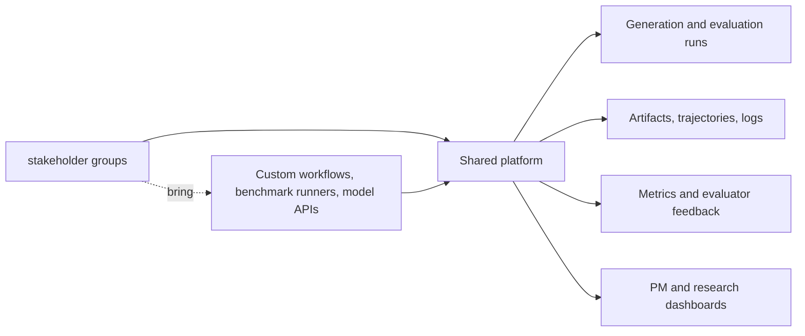
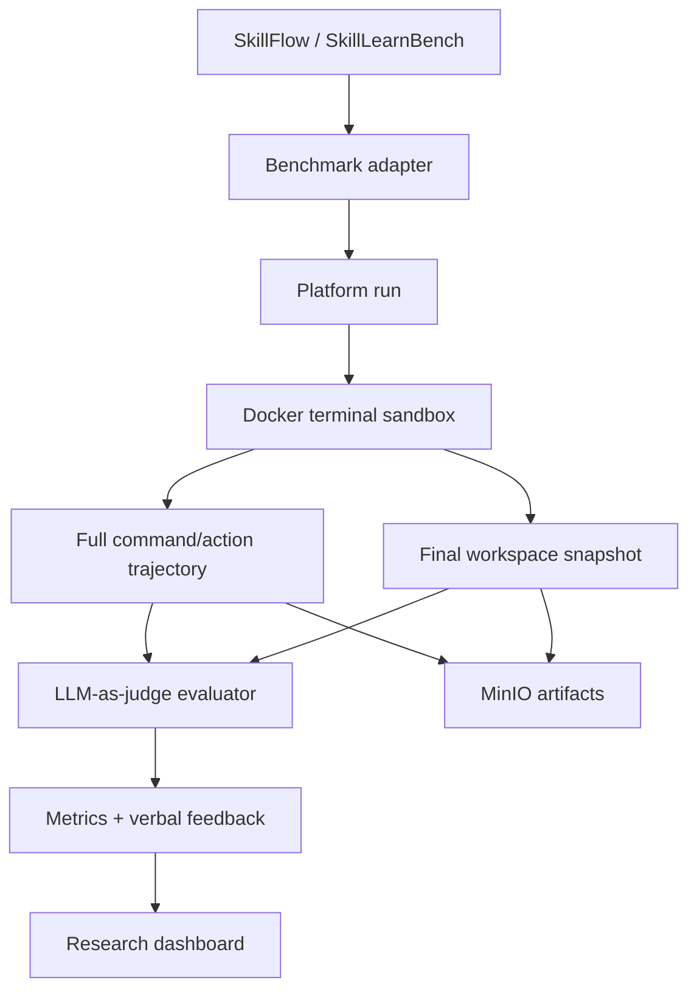
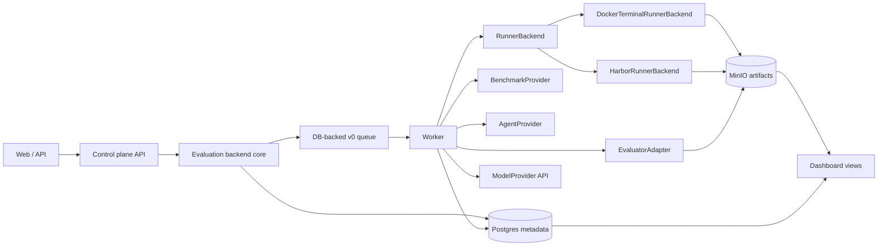

# Agentic Data Platform

Internal platform for shared agentic data generation, terminal-agent benchmark
execution, evaluation, artifact tracking, and research progress visibility.

This repository is a new implementation. The local `coder-harbor-cloud`
repository is useful as a reference for run tracking, task directories, and
control-plane ideas, but this project should not copy its code or inherit its
cloud/runtime assumptions.

## Motivation

Multiple agent research subteams need to generate data, run evaluations, track
artifacts, and report progress. If each team builds its own Docker sandboxes,
benchmark runners, storage layout, evaluator scripts, dashboards, and deployment
path, the organization pays the same engineering cost several times.

The platform provides shared infrastructure for the repeated parts while keeping
research workflows flexible.



## What The Platform Does

- Runs agentic data generation and evaluation workflows.
- Executes terminal-agent benchmarks inside Docker sandboxes for the MVP.
- Supports native benchmark adapters and should support Harbor-compatible
  benchmarks and agents as a first-class evaluation path.
- Records full trajectories, stdout/stderr, final workspace snapshots, artifacts,
  evaluator feedback, metrics, and failure reasons.
- Keeps model access API-based for v0.
- Stores metadata in Postgres and artifacts in a local MinIO-compatible object
  store for the first deployment.
- Gives stakeholder groups and PMs a shared view of progress, quality, failures, and
  reusable data.

## Current MVP Direction

The first high-priority pilot comes from **pilot group**.
It targets full adaptation of SkillFlow and SkillLearnBench as terminal-agent
skill-learning benchmarks.

The broader platform direction is evaluation-first: SkillFlow and SkillLearnBench
are the first native pilot, while official Harbor-compatible benchmarks, agents,
tasks, verifier rewards, and job outputs should be integrated through provider
and runner boundaries rather than treated as one-off scripts.

Both paths share one evaluation backend. Native pilot-project benchmarks and
Harbor-compatible benchmarks may differ by provider, runner, and result
ingestor, but they must share the same API lifecycle, Postgres persistence,
worker queue, artifact model, evaluator result model, and dashboard projection.



MVP constraints:

- API model access only.
- Docker terminal sandbox only.
- Internet access allowed inside the pilot sandbox for now.
- No direct model-weight inference in v0.
- Original benchmark runners are wrapped first.
- A user-friendly runner/pipeline contract is still required so future teams can
  bring their own workflows.

## Architecture Sketch



Core object model:

- `EvaluationJob`: a submitted evaluation batch across benchmark tasks, agents,
  and models.
- `EvaluationTrial`: one attempt for one task, agent, model, runner backend,
  and evaluator configuration.
- `BenchmarkSuite`: SkillFlow, SkillLearnBench, or future benchmark families.
- `TaskInstance`: one concrete benchmark instance and its source metadata.
- `Run`: a platform-tracked execution attempt with lifecycle state.
- `InteractionTurn`: command/action, stdout, stderr, exit code, and timing.
- `WorkspaceSnapshot`: final file tree and generated files.
- `Artifact`: durable object-store reference with metadata and lineage.
- `EvaluatorResult`: metrics, verbal feedback, judge model, and rubric version.
- `SkillObject`: flexible skill artifact; not assumed to be `skill.md`.

Detailed design: [terminal-benchmark-mvp.md](docs/architecture/terminal-benchmark-mvp.md).
pilot group native workflow:
[pilot-project-native-workflow.md](docs/architecture/pilot-project-native-workflow.md).
Unified evaluation backend contract:
[unified-evaluation-backend-contract.md](docs/architecture/unified-evaluation-backend-contract.md).
Persistence design: [postgres-persistence.md](docs/architecture/postgres-persistence.md).
Harbor integration roadmap:
[harbor-integration-roadmap.md](docs/architecture/harbor-integration-roadmap.md).
API resource design: [core-api-resources.md](docs/architecture/core-api-resources.md).
Original runner wrapper research:
[benchmark-runner-wrapper-spike.md](docs/development/benchmark-runner-wrapper-spike.md).

## Current Progress

| Area | Status | Notes |
| --- | --- | --- |
| Repository setup | In progress | Private GitHub repo, CI, branch protection, CODEOWNERS, labels, milestones, project board |
| Infra discovery | In progress | `shared dev` selected for v0; Docker Engine and Compose installed; Compose smoke test passed |
| Development workflow | Active | `dev` is the default integration branch; `main` is reserved for production releases |
| Docker dev environment | MVP backend ready | `Dockerfile.dev`, `docker-compose.dev.yml`, and `scripts/deploy-dev.sh` provide local and shared dev validation, including migration, object-storage, worker, Harbor CLI, API health, API-created Docker sandbox smoke, and frontend-driven Harbor launch smoke checks; the dev image verifies static Docker CLI and Docker Compose plugin downloads by SHA-256 and installs Harbor 0.9.0 |
| Production planning | Planning input captured | internal compute shared-cluster and batch scheduler-only possibilities documented, not finalized |
| Requirements collection | In progress | First concrete pilot captured from pilot group; remaining teams still need intake |
| MVP architecture | In progress | Terminal benchmark architecture, pilot group native workflow, unified backend contract, persistence, core API, and Harbor integration roadmap are documented |
| Unified evaluation backend | Documented | Contract keeps latent native adapters and Harbor integration on one backend surface |
| Run data contract | MVP backend slice merged | Python domain schema covers benchmark task identity, API model config, Docker runner config, terminal turns, artifacts, evaluator feedback, and flexible skill objects |
| Persistence foundation | MVP backend slice merged | Alembic + SQLAlchemy persistence covers identity, projects, benchmark catalogs, runs, attempts, status events, artifacts, evaluator results, and audit events |
| Sandbox and artifacts | MVP backend slice merged | Docker terminal sandbox contract, worker-managed Docker executor path, local artifact persistence, MinIO-compatible object-store upload/download smoke, and API-created Docker sandbox deploy smoke are covered |
| Evaluation contract | MVP backend slice merged | Deterministic mock evaluator and evaluator input contract are available for local smoke runs; multi-evaluator run records now preserve Harbor verifier and LLM judge outputs side by side while retaining the latest-result summary |
| Core API resources | MVP backend slice merged | FastAPI now exposes Postgres-backed teams, projects, benchmark suite versions, task instances, run summaries, run detail trajectories, sanitized artifacts, evaluator feedback, and PM progress summaries with OpenAPI examples |
| Run lifecycle API | MVP backend slice merged | Run creation now creates durable queued records with creator and evaluator config metadata; run detail includes lifecycle events; cancel/retry endpoints enforce state transitions and preserve retry attempts |
| Queue and worker orchestration | MVP slice merged | DB-backed v0 queue claim path, fixture terminal benchmark worker, worker smoke command, and Compose worker service are available |
| Provider config and secrets | MVP slice merged | Dev provider config refs, env secret refs, sensitive metadata redaction, and normalized provider errors are available |
| Internal auth/RBAC/ops | MVP slice merged | Dev token auth, project-scoped role checks, lifecycle audit records, structured request logs, readiness auth checks, and scoped `/ops/metrics` are available |
| Dashboard/API projection | MVP contract merged | Run visibility payloads expose status, progress, full trajectory on detail, artifacts, evaluator score/feedback, failure reasons, and `/dashboard/progress` PM summaries |
| Frontend MVP | First control-plane slice active | FastAPI serves `/app/` as a no-build web UI with cookie login, project/model/harness/benchmark launch controls, live run telemetry, evaluator feedback, trajectory inspection, and object-store-backed artifact bundle download |
| Benchmark run integration | Started | SkillFlow/SkillLearnBench adapter contract, offline seed fixture catalogs, upstream source cache/lock manager, local upstream tree importer, executable original runner wrappers, reusable wrapper smoke entrypoint, redacted upstream config synthesis, upstream output artifact normalization, API-only model command provider, terminal benchmark run orchestrator, and latent native workflow target are under active development |
| Harbor integration | Started | Roadmap defines Harbor-compatible benchmark catalog, agent provider, runner backend, result ingestion, and hybrid evaluation path; the frontend now submits `harbor-local-docker` runs with real `metadata.harbor_run`, the worker materializes the generated Harbor smoke task, and the Harbor runner/`jobs/` ingestion path is covered by shared dev smoke checks |
| pilot group contributor | Active invite accepted | `[REDACTED_CONTRIBUTOR]` is active in `pilot-team` |

## Tracking

- Project board: [Agentic Data Platform MVP](https://github.com/orgs/carinrc/projects/1)
- Requirements process: [docs/requirements/README.md](docs/requirements/README.md)
- pilot group requirements: [docs/requirements/projects/pilot-project/README.md](docs/requirements/projects/pilot-project/README.md)
- Requirements discovery: [#3](https://github.com/carinrc/agentic-data-platform/issues/3)
- Architecture design: [#4](https://github.com/carinrc/agentic-data-platform/issues/4)
- User runner/pipeline contract: [#21](https://github.com/carinrc/agentic-data-platform/issues/21)
- SkillFlow / SkillLearnBench adapters: [#22](https://github.com/carinrc/agentic-data-platform/issues/22)
- pilot group native workflow:
  [#103](https://github.com/carinrc/agentic-data-platform/issues/103)
- Flexible skill object model: [#23](https://github.com/carinrc/agentic-data-platform/issues/23)
- Backend service epic: [#49](https://github.com/carinrc/agentic-data-platform/issues/49)
- Postgres persistence foundation: [#51](https://github.com/carinrc/agentic-data-platform/issues/51)
- Core API resources: [#52](https://github.com/carinrc/agentic-data-platform/issues/52)
- Run lifecycle API: [#53](https://github.com/carinrc/agentic-data-platform/issues/53)
- Provider config and secret boundary:
  [#56](https://github.com/carinrc/agentic-data-platform/issues/56)
- Auth, RBAC, audit, and operations baseline:
  [#57](https://github.com/carinrc/agentic-data-platform/issues/57)
- Worker-managed Docker terminal sandbox execution:
  [#79](https://github.com/carinrc/agentic-data-platform/issues/79)
- Frontend and PM dashboard API contract:
  [#58](https://github.com/carinrc/agentic-data-platform/issues/58)
- Deployment readiness smoke and environment hardening:
  [#82](https://github.com/carinrc/agentic-data-platform/issues/82)
- Harbor-compatible benchmark and agent integration:
  [#61](https://github.com/carinrc/agentic-data-platform/issues/61)
- Unified evaluation backend contract:
  [#72](https://github.com/carinrc/agentic-data-platform/issues/72)
- Harbor integration roadmap:
  [docs/architecture/harbor-integration-roadmap.md](docs/architecture/harbor-integration-roadmap.md)

## Repository Layout

```text
.github/                 Issue templates, PR template, CI, and deploy workflows.
docs/architecture/       Platform architecture and MVP design specs.
docs/development/        Local developer setup and Docker development environment.
docs/engineering/        GitHub, org, release, and environment setup notes.
docs/examples/           API request examples for local and shared dev testing.
docs/infra/              Deployment and infrastructure planning.
docs/requirements/       Versioned research-team project and workflow requirements.
src/                      Platform Python package, API resources, worker, and static frontend.
tests/                    Unit tests for package behavior and data contracts.
```

## Development

New contributors should start with
[contributor-onboarding.md](docs/development/contributor-onboarding.md).

Run local checks from the repository root:

```bash
python -m pip install -e .
python -m unittest discover -s tests -v
```

Focused contract checks:

```bash
PYTHONPATH=src python -m unittest \
  tests.benchmark_wrappers.test_executable_wrappers \
  tests.benchmark_wrappers.test_dry_run_wrappers \
  tests.benchmarks.test_fixture_catalog \
  tests.benchmarks.test_manifest_import \
  tests.evaluation.test_mock_evaluator \
  tests.dashboard.test_run_projection \
  tests.service.test_api_smoke \
  -v
```

Run the Docker development checks:

```bash
docker compose -f docker-compose.dev.yml up --build app
```

Run database migrations against the local Compose Postgres service:

```bash
docker compose -f docker-compose.dev.yml run --rm --build migrate
```

Verify local MinIO bucket bootstrap and upload/download:

```bash
docker compose -f docker-compose.dev.yml run --rm --build object-storage-smoke
```

Verify queue claim and fixture worker execution:

```bash
docker compose -f docker-compose.dev.yml run --rm --build worker-smoke
```

Verify the real Harbor CLI local Docker path without external model keys:

```bash
docker compose -f docker-compose.dev.yml run --rm --build harbor-smoke
```

Start the long-running development API and worker services:

```bash
docker compose -f docker-compose.dev.yml run --rm --build migrate
docker compose -f docker-compose.dev.yml up --build api worker
curl http://localhost:8000/healthz
```

Open the frontend at `http://localhost:8000/app/`. The checked-in development
login is `[REDACTED_OWNER]` / `[REDACTED_PASSWORD]`; it creates an HTTP-only web session cookie
and does not expose the internal bearer token in browser code.

Verify the authenticated API-created Docker sandbox run path with API and worker
running:

```bash
docker compose -f docker-compose.dev.yml run --rm --build api-smoke
```

Verify the frontend login, model/harness/benchmark discovery, Harbor-backed run
launch, telemetry polling, Harbor verifier output, and object-store-backed
artifact bundle download path with API and worker running:

```bash
docker compose -f docker-compose.dev.yml run --rm --build frontend-smoke
```

The checked-in development token is `[REDACTED_TOKEN]` for user `[REDACTED_OWNER]`.
Health, readiness, OpenAPI docs, and static frontend files are public;
control-plane APIs require either a bearer token or a valid web session cookie.

Core API examples after seeding Postgres:

```bash
curl -H 'Authorization: Bearer [REDACTED_TOKEN]' http://localhost:8000/projects
curl -H 'Authorization: Bearer [REDACTED_TOKEN]' \
  'http://localhost:8000/tasks?benchmark_suite=SkillFlow&benchmark_version=<version>'
curl -H 'Authorization: Bearer [REDACTED_TOKEN]' \
  'http://localhost:8000/runs?project_id=latent-skill-pilot'
curl -H 'Authorization: Bearer [REDACTED_TOKEN]' \
  'http://localhost:8000/dashboard/progress?project_id=latent-skill-pilot'
curl -H 'Authorization: Bearer [REDACTED_TOKEN]' http://localhost:8000/ops/metrics
curl -X POST http://localhost:8000/runs \
  -H 'Authorization: Bearer [REDACTED_TOKEN]' \
  -H 'Content-Type: application/json' \
  -d @docs/examples/run-create-request.json
```

Deploy or smoke-test the shared dev environment from a machine with SSH access:

```bash
DEPLOY_HOST=shared dev DEPLOY_USER=<ssh-user> ./scripts/deploy-dev.sh
```

pilot group pilot contributors should also read
[pilot-project-onboarding.md](docs/development/pilot-project-onboarding.md).

## Collaboration Notes

- Branch from `dev` and open normal pull requests into `dev`.
- Use `main` only for production release promotion from `dev`.
- Keep related GitHub issues and project items updated.
- Update project documentation in the same pull request as code, workflow,
  deployment, or contract changes.
- Do not commit credentials, private endpoints, dataset dumps, or large
  generated artifacts.
