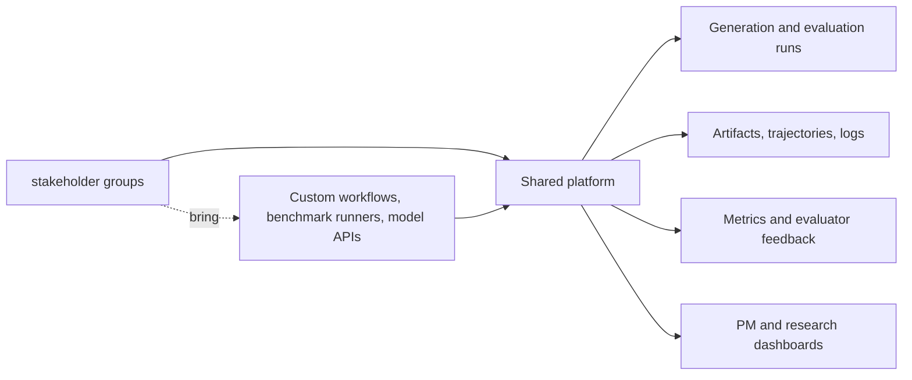
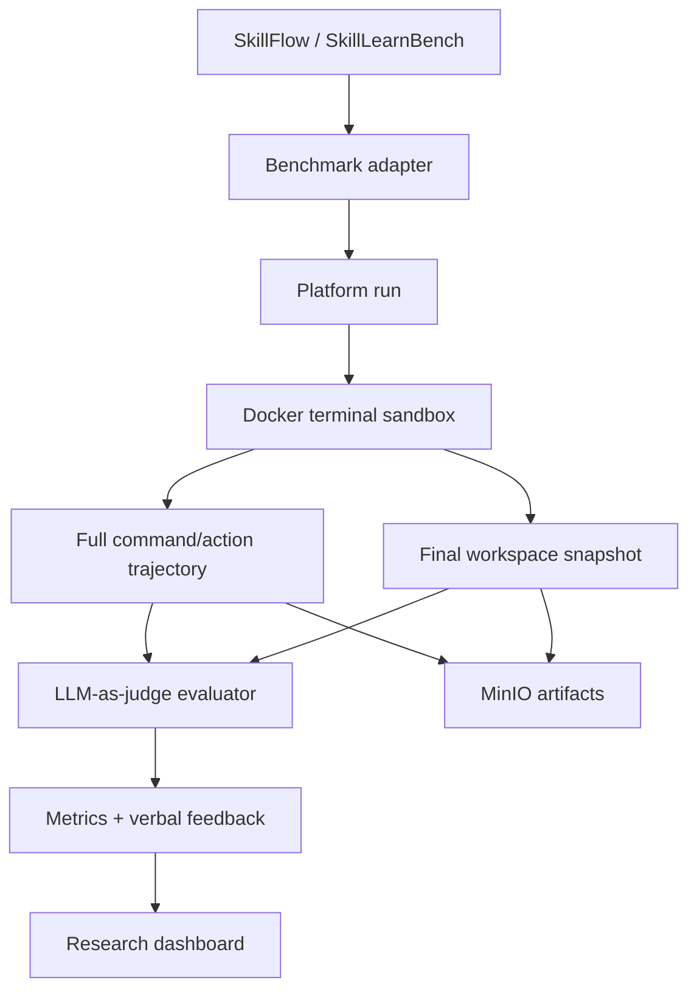
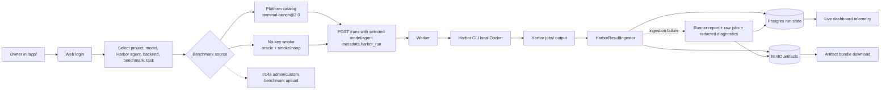
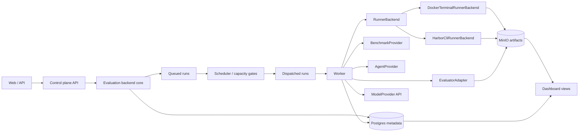

# Agentic Data Platform

Internal platform for shared agentic data generation, terminal-agent benchmark
execution, evaluation, artifact tracking, and research progress visibility.

## Motivation

Multiple agent research subteams need to generate data, run evaluations, track
artifacts, and report progress. If each team builds its own Docker sandboxes,
benchmark runners, storage layout, evaluator scripts, dashboards, and deployment
path, the organization pays the same engineering cost several times.

The platform provides shared infrastructure for the repeated parts while keeping
research workflows flexible.



## What The Platform Does

- Runs agentic data generation and evaluation workflows.
- Executes terminal-agent benchmarks inside Docker sandboxes for the current
  product-grade execution path.
- Supports native benchmark adapters and should support Harbor-compatible
  benchmarks and agents as a first-class evaluation path.
- Records full trajectories, stdout/stderr, final workspace snapshots, artifacts,
  evaluator feedback, metrics, and failure reasons.
- Keeps model access API-based for the current product line; direct
  model-weight inference remains future work.
- Stores metadata in Postgres and artifacts in a local MinIO-compatible object
  store for shared dev, with production storage topology still to be finalized.
- Gives stakeholder groups and PMs a shared view of progress, quality, failures, and
  reusable data.

## Current Product Direction

The first integrated research workflow comes from **pilot group
Reasoning**. It targets full adaptation of SkillFlow and SkillLearnBench as
terminal-agent skill-learning benchmarks.

The broader platform direction is evaluation-first: SkillFlow and SkillLearnBench
are the first native benchmark integrations, while official Harbor-compatible
benchmarks, agents, tasks, verifier rewards, and job outputs should be
integrated through provider and runner boundaries rather than treated as
one-off scripts.

Both paths share one evaluation backend. Native pilot-project benchmarks and
Harbor-compatible benchmarks may differ by provider, runner, and result
ingestor, but they must share the same API lifecycle, Postgres persistence,
worker queue, artifact model, evaluator result model, and dashboard projection.



Current execution constraints:

- API model access only.
- Docker terminal sandbox only.
- Internet access allowed inside Docker sandboxes for now.
- Direct model-weight inference is intentionally deferred to a later product
  release.
- Original benchmark runners are supported through durable runner boundaries.
- The user-friendly runner/pipeline contract is available as the shared path
  for future teams to bring their own workflows.

Current Harbor evaluation paths:



## Architecture Sketch



Core object model:

- `EvaluationJob`: a submitted evaluation batch across benchmark tasks, agents,
  and models.
- `EvaluationTrial`: one attempt for one task, agent, model, runner backend,
  and evaluator configuration.
- `BenchmarkSuite`: SkillFlow, SkillLearnBench, or future benchmark families.
- `TaskInstance`: one concrete benchmark instance and its source metadata.
- `Run`: a platform-tracked execution attempt with lifecycle state.
- `InteractionTurn`: command/action, stdout, stderr, exit code, and timing.
- `WorkspaceSnapshot`: final file tree and generated files.
- `Artifact`: durable object-store reference with metadata and lineage.
- `EvaluatorResult`: metrics, verbal feedback, judge model, and rubric version.
- `SkillObject`: flexible skill artifact; not assumed to be `skill.md`.

Terminal benchmark architecture:
[terminal-benchmark-mvp.md](docs/architecture/terminal-benchmark-mvp.md)
(historical filename; current direction is product-grade hardening).
pilot group native workflow:
[pilot-project-native-workflow.md](docs/architecture/pilot-project-native-workflow.md).
Unified evaluation backend contract:
[unified-evaluation-backend-contract.md](docs/architecture/unified-evaluation-backend-contract.md).
Persistence design: [postgres-persistence.md](docs/architecture/postgres-persistence.md).
Harbor integration roadmap:
[harbor-integration-roadmap.md](docs/architecture/harbor-integration-roadmap.md).
Harbor native integration design:
[harbor-native-integration-design.md](docs/architecture/harbor-native-integration-design.md).
Harbor frontend E2E manual test:
[harbor-e2e-manual-test.md](docs/development/harbor-e2e-manual-test.md).
API resource design: [core-api-resources.md](docs/architecture/core-api-resources.md).
Original runner wrapper research:
[benchmark-runner-wrapper-spike.md](docs/development/benchmark-runner-wrapper-spike.md).
User runner and pipeline contract:
[user-runner-pipeline-contract.md](docs/architecture/user-runner-pipeline-contract.md).
Main developer platform handoff:
[main-developer-platform-guide.md](docs/development/main-developer-platform-guide.md).

## Current Progress

| Area | Status | Notes |
| --- | --- | --- |
| Repository setup | In progress | Private GitHub repo, CI, branch protection, CODEOWNERS, labels, milestones, project board |
| Infra discovery | In progress | `shared dev` selected for shared dev; Docker Engine and Compose installed; Compose smoke test passed |
| Development workflow | Active | `dev` is the default integration branch; `main` is reserved for production releases |
| Docker dev environment | Product dev foundation active | `Dockerfile.dev`, `docker-compose.dev.yml`, and `scripts/deploy-dev.sh` provide local and shared dev validation, including migration, object-storage, worker, Harbor CLI, API health, API-created Docker sandbox smoke, frontend-driven Harbor launch smoke checks, bounded deploy-time labeled-container leak audits for real smoke run ids, and an opt-in shared dev real-upstream wrapper smoke for #114; the dev image verifies static Docker CLI and Docker Compose plugin downloads by SHA-256, installs runtime-sensitive dependencies through `constraints/dev-runtime.txt`, and defaults service host ports to loopback bindings |
| Production planning | Planning input captured | internal compute shared-cluster and batch scheduler-only possibilities documented, not finalized |
| Requirements collection | In progress | First concrete workflow captured from pilot group; remaining teams still need intake |
| Product architecture | In progress | Terminal benchmark architecture, pilot group native workflow, unified backend contract, persistence, core API, Harbor integration roadmap, and product-grade execution hardening plan are documented |
| Unified evaluation backend | Documented | Contract keeps latent native adapters and Harbor integration on one backend surface |
| Run data contract | Product foundation merged | Python domain schema covers benchmark task identity, API model config, Docker runner config, terminal turns, artifacts, evaluator feedback, and flexible skill objects |
| Persistence foundation | Product foundation merged | Alembic + SQLAlchemy persistence covers identity, projects, benchmark catalogs, runs, attempts, sequenced status events, dashboard projection rows, artifacts, artifact chunk indexes, typed artifact/log/upload/evaluator/projection/sandbox lifecycle and cleanup events, transaction-backed terminal stdout/stderr plus failed evaluator-report and original-wrapper artifact chunk metadata written by workers, evaluator results, and audit events |
| Sandbox and artifacts | Product foundation merged | Docker terminal sandbox contract, worker-managed Docker executor path, run-labeled Docker sandbox containers, metadata-only sandbox container start/completion events with Docker cidfile container ids when available, metadata-only Docker `sandbox.resource_sampled` events with bounded CPU/RAM/IO/PID sample fields, scheduler-driven owned-container cleanup for recovered active runs, local artifact persistence, MinIO-compatible object-store upload/download smoke, API-created Docker sandbox deploy smoke, artifact metadata contract v1 for object content types, upload states, persisted chunk metadata indexes, dedicated start/complete/fail chunk upload transaction APIs, worker-written terminal stdout/stderr chunks that reserve rows before object writes and mark upload failures, evaluator-report upload failures recorded as failed artifact chunks without overriding evaluator outputs, original-wrapper generated artifact upload failures recorded as failed artifact chunks without overriding completed wrapper evaluations, typed chunk-recorded and upload-status-change events, chunk metadata API reads, chunk payload download, bundle inclusion of sanitized chunk metadata plus completed chunk payloads, completed object size/SHA-256 validation, plus stale pending/started upload expiry recovery with typed expiry events are covered |
| Evaluation contract | Product foundation merged | Deterministic mock evaluator and evaluator input contract are available for local smoke runs; multi-evaluator run records now preserve Harbor verifier and LLM judge outputs side by side while retaining the latest-result summary; evaluator metadata can carry sanitized observed model-provider usage for token/cost/duration telemetry |
| Core API resources | Product foundation merged | FastAPI now exposes Postgres-backed teams, projects, benchmark suite versions, task instances, run summaries, bounded run detail trajectory previews, sequenced run-event replay/SSE with optional Redis commit-signal fanout/hot buffers, sanitized artifacts, artifact chunk metadata indexes, chunk payload downloads, artifact bundles with completed chunk payloads, evaluator feedback, observed model-provider usage summaries, and PM progress summaries with OpenAPI examples |
| Run lifecycle API | Product foundation merged | Run creation now creates durable queued records with creator and evaluator config metadata; run lifecycle event names, Phase 1 recovery reason codes, and execution-attempt metadata are centralized in shared contracts; scheduler dispatch records `queued -> dispatched` events with `execution_task_id` plus backend/project/provider/model/agent/benchmark capacity keys; capacity-blocked queued runs, including estimated provider/model cost or token budget blockers, record `scheduler.capacity_blocked` events plus current `execution.scheduler.capacity_blocked` metadata; worker heartbeat writes record metadata-only same-status `worker.heartbeat` events with safe liveness fields; artifact/log chunk writes record `artifact.chunk_recorded` or `log.chunk_recorded` events with object metadata only; dedicated chunk upload transaction APIs record `artifact.upload_status_changed` only for real upload-state changes, including terminal log, evaluator-report, and generated-artifact upload failures after the run result is already durable; worker result persistence records summary-only `evaluator.completed` or `evaluator.failed` events after `run.evaluating`; subprocess parents record metadata-only `worker.subprocess_started` and `worker.subprocess_completed` events around child execution; Docker terminal executor records metadata-only `sandbox.container_started`, `sandbox.resource_sampled`, and `sandbox.container_completed` events for each sandbox command when Docker exposes a cidfile container id; stale execution-task result writes are rejected when retry has created a newer attempt; active execution tasks acquire an attempt-level duplicate-delivery lock before subprocess work begins; stale dispatch recovery records `dispatched -> queued` `run.recovered` events; terminal result mismatch recovery records active-state `run.recovered` failures before stale-heartbeat fallback; stale active worker heartbeat recovery records active-state `run.recovered` failures; scheduler Docker cleanup records same-status `sandbox.container_cleanup` events; projection recovery records same-status `projection.refreshed` events; stale artifact upload expiry records same-status `run.recovered`, `artifact.upload_expired`, and `artifact.upload_status_changed` events; run detail includes lifecycle events with `seq` watermarks; `/runs/{run_id}/events` supports `after_seq` replay; cancel/retry endpoints enforce state transitions and preserve retry attempts |
| Queue and worker orchestration | Product-grade hardening in progress | DB-backed queued/dispatched lifecycle, Postgres-safe project fair-share scheduler candidate ordering, transaction-scoped dispatch advisory locking for multi-scheduler capacity decisions, deploy-time scheduler race smoke validation, bounded deploy-time real-smoke Docker container leak audits, scheduler lease metadata, runner process/heartbeat metadata plus durable `worker.heartbeat` events, scheduler capacity-gate and stale-run/artifact-upload recovery service, terminal result mismatch recovery diagnostics, scheduler-driven Docker-owned container cleanup for recovered active runs, configurable active-run caps across global, backend, project, provider, model, agent, and benchmark dimensions, configurable provider/model estimated cost and token dispatch-budget hooks, observed model-provider usage telemetry for completed Harbor-backed runs, provider/model observed-token, observed-request, and observed-cost window guardrails that combine recent completed-run usage with queued-run estimated hints, capacity blocked-reason diagnostics for queued runs, legacy queue claim compatibility path, fixture terminal benchmark worker, worker smoke command, Compose worker service, opt-in subprocess-isolated worker execution path for #158, parent-side subprocess cancellation monitoring, subprocess stale-task guards, attempt-level duplicate-delivery execution locks, typed subprocess start/completion events, typed Docker sandbox container start/completion/resource-sample events, Docker-owned container cleanup labels/CLI, and bounded redacted child log-tail failure diagnostics are available |
| Provider config and secrets | Product foundation merged | Dev provider config refs, env secret refs, sensitive metadata redaction, normalized provider errors, provider `/models` discovery by default for credentialed environments, optional static model allowlist/fallback, model-family metadata, and the first OpenAI-compatible terminal-agent API provider path are available |
| Internal auth/RBAC/ops | Product foundation merged | Dev token auth, project-scoped role checks, lifecycle audit records, structured request logs, readiness auth checks, and scoped `/ops/metrics` with queue depth, scheduler capacity-blocked diagnostics, plus observed model-provider usage totals grouped by provider/model are available; production SSO, secret management, quotas, retention, and audit policy remain open governance work |
| Dashboard/API projection | Product-grade hardening in progress | Run visibility payloads expose status, progress, bounded trajectory previews on detail, artifact metadata/downloads, evaluator score/feedback, sanitized evaluator model-provider usage, failure reasons, and `/dashboard/progress` PM summaries; terminal worker results, terminal status transitions, and scheduler recovery now refresh durable `run_dashboard_projections` rows for missing, dirty, or stale terminal projections; projection recovery also emits same-status `projection.refreshed` events; `/runs`, `/runs/{run_id}` summary fields, `/runs/{run_id}/artifacts`, `/runs/{run_id}/evaluation`, and `/dashboard/progress` now use clean projection rows before falling back to hydrated run records |
| Frontend control plane | First product slice active | FastAPI serves `/app/` as a no-build web UI with cookie login, project/model/backend/agent/benchmark launch controls, model discovery/fallback status, Harbor agent/model adaptation status, full-taxonomy SSE-backed run-event refresh with Redis-assisted wakeups and polling fallback, typed scheduler/worker/sandbox/artifact/evaluator timeline diagnostics including Docker CPU/RAM/PID samples when available, live run telemetry, evaluator feedback, trajectory inspection, and object-store-backed artifact bundle download |
| Native benchmark integration | Product foundation merged | SkillFlow/SkillLearnBench adapter contract, offline seed fixture catalogs, upstream source cache/lock manager, local upstream tree importer, executable original runner wrappers, reusable wrapper smoke entrypoint, shared worker execution of original wrapper contracts, redacted upstream config synthesis, upstream output artifact preservation with failed generated-artifact upload diagnostics, suite-specific evaluator report normalization, API-only terminal-agent model provider, upstream runner provider env/config mapping, terminal benchmark run orchestrator, and latent native workflow target are merged. SkillFlow now has a pinned runner commit, pinned Hugging Face task dataset commit, task-asset lock file, recorded source patch for Harbor API compatibility, and opt-in shared dev real-upstream smoke evidence. |
| User runner/pipeline contract | Product foundation merged | Runner envelope defines task manifest, result JSON, artifact path rules, lifecycle mapping, local validation expectations, and the first Harbor-compatible task-upload implementation with bounded archive size, file count, and uncompressed materialization limits |
| Harbor integration | Product integration active | Roadmap and native design define CLI fallback, native runner backend, Harbor benchmark provider, agent provider, result ingestion, and hybrid evaluation path; the code now names the current CLI path `HarborCliRunnerBackend`, keeps `HarborRunnerBackend` as a compatibility alias, records `backend: cli` in runner reports, adds a Harbor native capability probe, exposes the first `HarborBenchmarkProvider` read model for the registry-versioned `terminal-bench@2.0` catalog plus uploaded task archives, exposes authenticated `GET /agents` metadata through `HarborAgentProvider` for Harbor built-in agents plus custom `--agent-import-path` entries, and can sync Harbor registry datasets into platform benchmark catalogs. The frontend now submits `harbor-local-docker` runs with real `metadata.harbor_run`, uses selected API model plus Harbor agent for catalog-backed Harbor runs, preserves deterministic `oracle` + `smoke/noop` for no-key smoke runs, and the worker maps selected model provider secrets into Harbor agent env only at execution time through shared agent/model adapters. `/harbor/agent-adaptation` gives launch preflight status for selected model/agent/backend combinations, including adapter default kwargs such as the Harbor-compatible OpenHands CLI package version pin. Harbor verifier/result ingestion now preserves safe observed model-provider usage from Harbor `final_metrics`; ingestion failures still preserve runner reports, raw `jobs/` archives, partial trajectory when available, and redacted diagnostics in the run and artifact bundle. `POST /harbor/task-uploads` remains available for admin/custom benchmark onboarding, not the ordinary evaluation path, and the Harbor CLI runner/`jobs/` ingestion path is covered by shared dev smoke checks. |
| pilot group contributor | Active invite accepted | `[REDACTED_CONTRIBUTOR]` is active in `pilot-team` |

## Tracking

- Project board: [Agentic Data Platform MVP](https://github.com/orgs/carinrc/projects/1)
  (legacy board name; current direction is product-grade platform completion)
- Requirements process: [docs/requirements/README.md](docs/requirements/README.md)
- pilot group requirements: [docs/requirements/projects/pilot-project/README.md](docs/requirements/projects/pilot-project/README.md)
- Requirements discovery: [#3](https://github.com/carinrc/agentic-data-platform/issues/3)
- Architecture design: [#4](https://github.com/carinrc/agentic-data-platform/issues/4)
- User runner/pipeline contract: [#21](https://github.com/carinrc/agentic-data-platform/issues/21)
- Harbor-compatible task upload and validation:
  [#67](https://github.com/carinrc/agentic-data-platform/issues/67)
- SkillFlow / SkillLearnBench adapters: [#22](https://github.com/carinrc/agentic-data-platform/issues/22)
- pilot group native workflow:
  [#103](https://github.com/carinrc/agentic-data-platform/issues/103)
- Flexible skill object model: [#23](https://github.com/carinrc/agentic-data-platform/issues/23)
- Backend service epic: [#49](https://github.com/carinrc/agentic-data-platform/issues/49)
- Postgres persistence foundation: [#51](https://github.com/carinrc/agentic-data-platform/issues/51)
- Core API resources: [#52](https://github.com/carinrc/agentic-data-platform/issues/52)
- Run lifecycle API: [#53](https://github.com/carinrc/agentic-data-platform/issues/53)
- Provider config and secret boundary:
  [#56](https://github.com/carinrc/agentic-data-platform/issues/56)
- Auth, RBAC, audit, and operations baseline:
  [#57](https://github.com/carinrc/agentic-data-platform/issues/57)
- Worker-managed Docker terminal sandbox execution:
  [#79](https://github.com/carinrc/agentic-data-platform/issues/79)
- Frontend and PM dashboard API contract:
  [#58](https://github.com/carinrc/agentic-data-platform/issues/58)
- Deployment readiness smoke and environment hardening:
  [#82](https://github.com/carinrc/agentic-data-platform/issues/82)
- Harbor-compatible benchmark and agent integration:
  [#61](https://github.com/carinrc/agentic-data-platform/issues/61)
- Harbor native integration design:
  [#102](https://github.com/carinrc/agentic-data-platform/issues/102)
- Harbor benchmark provider:
  [#62](https://github.com/carinrc/agentic-data-platform/issues/62)
- Harbor agent provider:
  [#63](https://github.com/carinrc/agentic-data-platform/issues/63)
- Harbor registry dataset sync:
  [#131](https://github.com/carinrc/agentic-data-platform/issues/131)
- Frontend selected API model and Harbor agent launch:
  [#142](https://github.com/carinrc/agentic-data-platform/issues/142)
- First non-smoke Harbor benchmark acceptance target:
  [#144](https://github.com/carinrc/agentic-data-platform/issues/144)
- Unified evaluation backend contract:
  [#72](https://github.com/carinrc/agentic-data-platform/issues/72)
- Harbor integration roadmap:
  [docs/architecture/harbor-integration-roadmap.md](docs/architecture/harbor-integration-roadmap.md)

Current executable child tasks for the broad startup workstreams:

- Owner/RACI and PM progress metrics: [#133](https://github.com/carinrc/agentic-data-platform/issues/133)
- Production topology and shared-dev exposure controls: [#134](https://github.com/carinrc/agentic-data-platform/issues/134)
- Remaining research-team intake batch: [#135](https://github.com/carinrc/agentic-data-platform/issues/135)
- v1 product architecture ADR: [#136](https://github.com/carinrc/agentic-data-platform/issues/136)
- Dev-to-main release train and CI/deploy gates: [#137](https://github.com/carinrc/agentic-data-platform/issues/137)
- Access, quotas, retention, and audit baseline: [#138](https://github.com/carinrc/agentic-data-platform/issues/138)
- pilot group end-to-end acceptance plan: [#139](https://github.com/carinrc/agentic-data-platform/issues/139)
- Org access audit and team mapping: [#140](https://github.com/carinrc/agentic-data-platform/issues/140)
- Frontend Harbor task upload launch:
  [#143](https://github.com/carinrc/agentic-data-platform/issues/143)

## Repository Layout

```text
.github/                 Issue templates, PR template, CI, and deploy workflows.
docs/architecture/       Platform architecture, backend contracts, and product design specs.
docs/development/        Local developer setup and Docker development environment.
docs/engineering/        GitHub, org, release, and environment setup notes.
docs/examples/           API request examples for local and shared dev testing.
docs/infra/              Deployment and infrastructure planning.
docs/requirements/       Versioned research-team project and workflow requirements.
src/                      Platform Python package, API resources, worker, and static frontend.
tests/                    Unit tests for package behavior and data contracts.
```

## Development

New contributors should start with
[contributor-onboarding.md](docs/development/contributor-onboarding.md).
Repo admins and primary developers should also read
[main-developer-platform-guide.md](docs/development/main-developer-platform-guide.md)
for the current architecture, API surface, progress, and priority map.

Run local checks from the repository root:

```bash
python -m pip install -e .
python -m unittest discover -s tests -v
```

CI and the Docker dev image install runtime-sensitive dependencies through
`constraints/dev-runtime.txt`. Use the same constraints locally when validating
dependency or Docker runtime changes:

```bash
python -m pip install -c constraints/dev-runtime.txt -e .
```

Focused contract checks:

```bash
PYTHONPATH=src python -m unittest \
  tests.benchmark_wrappers.test_executable_wrappers \
  tests.benchmark_wrappers.test_dry_run_wrappers \
  tests.benchmarks.test_fixture_catalog \
  tests.benchmarks.test_manifest_import \
  tests.evaluation.test_mock_evaluator \
  tests.dashboard.test_run_projection \
  tests.service.test_api_smoke \
  -v
```

Run the Docker development checks:

```bash
scripts/setup-dev-env.sh
docker compose --env-file .env.local -f docker-compose.dev.yml up --build app
```

Run database migrations against the local Compose Postgres service:

```bash
docker compose --env-file .env.local -f docker-compose.dev.yml run --rm --build migrate
```

Verify local MinIO bucket bootstrap and upload/download:

```bash
docker compose --env-file .env.local -f docker-compose.dev.yml run --rm --build object-storage-smoke
```

Verify legacy queue claim plus fixture worker execution:

```bash
docker compose --env-file .env.local -f docker-compose.dev.yml run --rm --build worker-smoke
```

Verify the real Harbor CLI local Docker path without external model keys. Run
`scripts/setup-dev-env.sh` first so `.env.local` contains an absolute
`SANDBOX_HOST_WORKSPACE_ROOT`; Harbor runs inside the dev image but asks the host
Docker daemon to bind-mount the sandbox workspace. The generated smoke task
pre-creates writable verifier and artifact log directories inside its Docker
environment so Harbor can capture verifier output before it ingests
`reward.txt`:

```bash
scripts/setup-dev-env.sh
docker compose --env-file .env.local -f docker-compose.dev.yml run --rm --build harbor-smoke
```

Verify the heavier real-upstream SkillFlow wrapper path on a Docker-ready host:

```bash
scripts/setup-dev-env.sh
docker compose --env-file .env.local -f docker-compose.dev.yml run --rm --build benchmark-real-upstream-smoke
```

This materializes the pinned SkillFlow runner, downloads the selected Hugging
Face task-family subset, and executes the wrapper against the real upstream
entrypoint. It is intentionally separate from the default deploy smokes because
it touches networked benchmark assets and can build/run upstream task
containers.

Start the long-running development API, scheduler, and worker services:

```bash
docker compose --env-file .env.local -f docker-compose.dev.yml run --rm --build migrate
docker compose --env-file .env.local -f docker-compose.dev.yml up --build api scheduler worker
curl http://localhost:8000/healthz
```

By default, Compose binds API, Postgres, Redis, MinIO, and the MinIO console to
`127.0.0.1`. Shared hosts should expose only the approved reverse proxy; direct
service binds require an explicit `ADP_*_HOST_BIND` override.

Open the frontend at `http://localhost:8000/app/`. The checked-in development
login is `[REDACTED_OWNER]` / `[REDACTED_PASSWORD]`; it creates an HTTP-only web session cookie
and does not expose the internal bearer token in browser code.

Verify the authenticated API-created Docker sandbox run path with API,
scheduler, and worker running:

```bash
docker compose --env-file .env.local -f docker-compose.dev.yml run --rm --build api-smoke
```

`scripts/deploy-dev.sh` runs one scheduler recovery preflight before the API and
frontend smokes. It uses `DEPLOY_STALE_ACTIVE_RECOVERY_SECONDS` (default `60`)
as a temporary stale active-run heartbeat timeout while the same recovery pass
first marks active runs with terminal child-process evidence but non-terminal
run rows as `failed` with `recovery=terminal_result_mismatch`. Orphaned active
runs left by a previous worker restart are then marked `failed` with
`run.recovered` evidence before they can hold scheduler capacity and keep new
smoke runs queued. The normal scheduler recovery pass also expires stale
artifact uploads older than `SCHEDULER_STALE_ARTIFACT_UPLOAD_TIMEOUT_SECONDS` so
pending/started object writes become visible as `expired` artifact metadata and
durable recovery events. With `DEPLOY_RUN_SCHEDULER_DOCKER_CLEANUP_SMOKE=1`
(default), the same deploy path also runs
`python -m agentic_data_platform.scheduler.cleanup_smoke` before API/frontend
smokes. That smoke starts a labeled dummy Docker container for a synthetic
stale active run, claims that exact run before marking it stale, runs scheduler
recovery, and fails deployment unless the container is removed and
`sandbox.container_cleanup` evidence is persisted.
With `DEPLOY_RUN_SCHEDULER_PARENT_DEATH_CLEANUP_SMOKE=1` (default), deployment
also runs `cleanup_smoke --mode parent-death`: a helper parent process starts a
live labeled sandbox container, is terminated, and then scheduler recovery must
remove the surviving container and persist cleanup evidence before the API and
frontend smokes continue.
With `DEPLOY_RUN_SCHEDULER_RACE_SMOKE=1` (default), deployment also runs
`python -m agentic_data_platform.scheduler.race_smoke` from the scheduler
container. That smoke seeds synthetic queued runs, runs multiple scheduler
instances concurrently, and fails if the real Postgres stack dispatches more
runs than the configured capacity or reports duplicate dispatch ids. It records
pre-cleanup status counts for evidence, then cancels its synthetic runs so the
deploy check does not leave queued or active capacity behind.
With `DEPLOY_RUN_CONTAINER_LEAK_AUDIT=1` (default), the deploy script assigns
explicit run ids to the worker, Harbor, API, and frontend smokes and runs
`python -m agentic_data_platform.scheduler.container_leak_audit` after each
smoke. The audit lists platform-owned Docker sandbox containers by run label
without deleting them and fails deployment if any real smoke run leaves labeled
containers behind after the bounded audit window. The window defaults to three
attempts five seconds apart and can be tuned with
`DEPLOY_CONTAINER_LEAK_AUDIT_ATTEMPTS` and
`DEPLOY_CONTAINER_LEAK_AUDIT_POLL_SECONDS`.

Verify the frontend login, model/backend/benchmark discovery, Harbor-backed run
launch, durable lifecycle event replay and one-shot SSE replay, typed timeline
diagnostics, telemetry polling, Harbor verifier output, and object-store-backed
artifact bundle download path with API, scheduler, and worker running. The
smoke JSON includes `lifecycle_event_count` and `sse_event_count`, and the
downloaded bundle must carry matching `lifecycle-events.json` and
`artifact-chunks.json` files when chunk metadata exists:

```bash
docker compose --env-file .env.local -f docker-compose.dev.yml run --rm --build frontend-smoke
```

Redis is enabled in the dev stack for live run-event fanout. Event writers only
publish Redis wake-up signals after the Postgres transaction commits, and SSE
clients still replay committed lifecycle events from Postgres. Set
`RUN_EVENT_REDIS_FANOUT_ENABLED=false` to fall back to fixed-interval polling;
`RUN_EVENT_REDIS_HOT_BUFFER_SIZE` controls the short per-run Redis hot buffer.

Install local browser-control tools when validating the actual `/app/` UI in a
real Chromium browser:

```bash
scripts/setup-browser-tools.sh
python -m agentic_data_platform.service.frontend_browser_smoke
```

The browser smoke uses the dev login, waits for catalog readiness, and verifies
the selected project/model/backend/benchmark text from the rendered page. Set
`FRONTEND_BROWSER_SMOKE_APP_URL` when the app is exposed through a forwarded
port such as `http://127.0.0.1:8766/app/`.

Run the manual Harbor E2E browser checklist when owner-visible acceptance is
needed:

[docs/development/harbor-e2e-manual-test.md](docs/development/harbor-e2e-manual-test.md)

The checked-in development token is `[REDACTED_TOKEN]` for user `[REDACTED_OWNER]`.
Health, readiness, OpenAPI docs, and static frontend files are public;
control-plane APIs require either a bearer token or a valid web session cookie.

Core API examples after seeding Postgres:

```bash
curl -H 'Authorization: Bearer [REDACTED_TOKEN]' http://localhost:8000/projects
curl -H 'Authorization: Bearer [REDACTED_TOKEN]' \
  'http://localhost:8000/tasks?benchmark_suite=SkillFlow&benchmark_version=<version>'
curl -H 'Authorization: Bearer [REDACTED_TOKEN]' \
  'http://localhost:8000/runs?project_id=latent-skill-pilot'
curl -H 'Authorization: Bearer [REDACTED_TOKEN]' \
  'http://localhost:8000/dashboard/progress?project_id=latent-skill-pilot'
curl -H 'Authorization: Bearer [REDACTED_TOKEN]' http://localhost:8000/ops/metrics
curl -X POST http://localhost:8000/runs \
  -H 'Authorization: Bearer [REDACTED_TOKEN]' \
  -H 'Content-Type: application/json' \
  -d @docs/examples/run-create-request.json
```

Deploy or smoke-test the shared dev environment from a machine with SSH access:

```bash
DEPLOY_HOST=shared dev DEPLOY_USER=<ssh-user> ./scripts/deploy-dev.sh
```

For #114 evidence, manually dispatch the `Deploy` workflow for the `dev`
environment with `run_real_upstream_benchmark_smoke=true`. The normal
push-to-`dev` deployment leaves that heavier check disabled.

pilot group contributors should also read
[pilot-project-onboarding.md](docs/development/pilot-project-onboarding.md).

## Collaboration Notes

- Branch from `dev` and open normal pull requests into `dev`.
- Use `main` only for production release promotion from `dev`.
- Keep related GitHub issues and project items updated.
- Update project documentation in the same pull request as code, workflow,
  deployment, or contract changes.
- Do not commit credentials, private endpoints, dataset dumps, or large
  generated artifacts.
