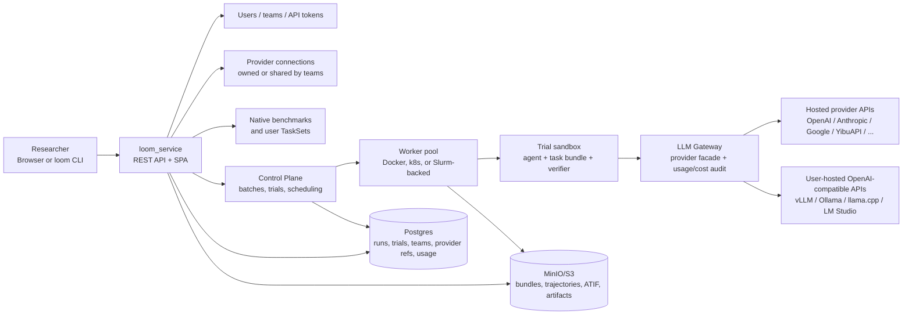

# Loom

Loom is a team platform for running model and agent evaluations. It lets
researchers submit batches, monitor trials, inspect failures, download
trajectories and artifacts, and audit provider usage without operating the
worker fleet directly.

The current product boundary is:

- **Loom runs the evaluation platform.** It owns users, teams, provider
  connections, task catalogs, TaskSets, scheduling, sandbox execution,
  trajectories, metrics, artifacts, usage accounting, and the web/CLI/API
  surfaces.
- **Users bring inference.** A team connects a hosted API such as OpenAI,
  Anthropic, Google, Together, Fireworks, YibuAPI, or any OpenAI-compatible
  endpoint, including a user-operated vLLM/Ollama/llama.cpp/LM Studio service.
- **v1.0 does not host model checkpoints for users.** The platform routes model
  calls through the Loom LLM Gateway, but model serving capacity remains owned
  by the provider or user team.

## Why Loom

Loom is built for the point where evaluation stops being a local script and
becomes shared production work. A team can upload private TaskSets, run many
agent/model trials concurrently, monitor progress, inspect failures, and
download trajectories and artifacts without touching worker machines,
databases, or object storage directly.

The platform centralizes the operational pieces around that workflow:
queue-backed fanout, sandboxed execution, provider-token isolation,
shared-provider audit, usage and cost accounting, verifier evidence, and
reproducible result exports. That lets researchers focus on tasks, agents, and
models while Loom keeps the execution trail and operational boundary explicit.

Current shared staging route: [https://yylx.world/staging](https://yylx.world/staging)

Planned first production route: [https://yylx.world/prod](https://yylx.world/prod)

The `/prod` route is the target for the first `main`-based production release.
Until the v1.0.0 release gates are complete, use `/staging` for shared staging
validation and do not treat `/prod` as the production-ready entrypoint.

## Current Release Posture

v1.0.0 is the first formal production release promoted from `dev` to `main`.
It is not another staging smoke run. The active release work is proving that a
normal scoped user can submit, monitor, debug, and download results through the
public web/CLI/API surfaces without database access, SSH access, operator-only
artifact links, or raw secret handling.

The current staging baseline has already proven the user-brought TaskSet path:
users can upload their own task bundles, submit runs, produce trajectories,
observe gateway call evidence, run task-specific verification, and download
artifacts through user-facing surfaces. Treat that as platform E2E evidence for
private TaskSets, not as a broad official benchmark score-alignment claim.

Before first prod, the remaining release gates are centered on:

- production/staging environment isolation;
- `/prod` and `/dev` frontend route plus API-base separation;
- prod-first worker capacity behavior, including temporary staging leases and
  staging drain under production pressure;
- operator-free user E2E on the v1.0 native benchmark lanes;
- provider sharing, audit, usage, and on-behalf visibility semantics;
- rollout restartability and stale-running-state handling.

## v1.0 Scope

First-prod native benchmark support is intentionally narrow:

| Surface | v1.0 commitment |
|---|---|
| Native benchmark: Terminal-Bench 2.1 rev 6 | The public `terminal-bench-2` selector activates only the audited immutable `terminal-bench-2@tb2.1-r6` profile. |
| Native benchmark: SkillLearnBench | Supported through `skilllearnbench` tasks, catalog provisioning, and artifact-preserving validation. |
| User-brought TaskSets | Supported as team-owned task collections that can be submitted, materialized, run, monitored, and downloaded through TaskSet APIs and CLI. |
| Provider-backed model calls | Supported through team-owned or shared provider connections and the LLM Gateway. |
| Usage/cost audit | Supported through gateway call rows, token accounting, rate-card diagnostics, and usage APIs. |

Other benchmark adapters and local examples may exist in the repository, but
they are not first-prod support commitments unless a v1.0 release gate names
them explicitly. Official score parity for broader benchmark suites, full-scale
stress coverage, self-service runtime serving, mixed OLDLAB/GB10 coverage, and
expanded user surfaces are v1.1+ work.

## Product Flow

Every service-mode run follows the same shape:

1. A user chooses a provider/model, agent, and task source from the web app or
   CLI. The task source can be a native benchmark or an evaluation-ready
   TaskSet.
2. Loom creates a batch and expands it into trials.
3. Workers claim trials, materialize task bundles, run agents in sandboxes, and
   route model calls through the LLM Gateway.
4. Loom records event-sourced trajectories, ATIF metric documents, verifier
   outcomes, token usage, gateway diagnostics, and artifacts.
5. Users inspect results in Monitor, trial/batch detail views, Run Library, the
   CLI, or direct API calls, then download ATIF, trajectory, and artifact files
   through the service API.

The CLI-only `loom run` path still exists for local one-off experiments. It
does not use team ownership, provider registration, Postgres, or MinIO/S3.

## Architecture



The service, control plane, gateway, SPA, and workers are stateless from a data
ownership perspective. Postgres and MinIO/S3 are the durable stores. The same
trial orchestration contract powers local CLI runs and service-mode worker
runs, so trajectory and ATIF shapes stay consistent across modes.

Deeper reading: [`docs/architecture/overview.md`](docs/architecture/overview.md).

## Providers, Sharing, and Secrets

Every real model-backed service run needs a provider connection owned by, or
explicitly shared with, the team submitting the work.

Supported provider connection families include:

| Type | Use for |
|---|---|
| `openai-compatible` | OpenAI, Together, Fireworks, YibuAPI-compatible facades, vLLM, Ollama, LM Studio, or any service exposing `/v1/chat/completions`. |
| `anthropic` | Anthropic native API. |
| `google` | Google Gemini native API. |
| `custom` | A fallback when no first-class dialect fits; usage accounting may be token-only or price-unknown. |

Provider owners can share one connection with another team without copying or
revealing the raw API key. The target team can list, select, and use the
shared provider, while only the owner team or an admin can mutate it. Gateway
usage and cost views distinguish the owning provider, consuming team/user, and
delegated admin-on-behalf actor where applicable.

Secrets must enter through secret references such as `env:PROVIDER_API_KEY`,
`file:/secure/path/provider-token`, or a browser secret field. Raw provider
tokens should not appear in run metadata, logs, JSON evidence, Markdown,
issues, PRs, or command argv evidence.

Provider setup: [`docs/integrations/provider-onboarding.md`](docs/integrations/provider-onboarding.md).

Usage and rate cards: [`docs/architecture/cost-and-rate-cards.md`](docs/architecture/cost-and-rate-cards.md).

## TaskSets

TaskSets are team-owned task collections brought by users. They are separate
from native platform benchmarks and are not renamed as benchmarks internally.

The current TaskSet API supports:

- submitting a manifest plus optional verifier, transform, and bundle archive;
- polling materialization status and per-instance errors;
- rebuilding or soft-deleting a TaskSet;
- running a TaskSet through batch creation with `task_filter.task_set_id` or
  CLI `--task-set`;
- mixing native benchmark and TaskSet sources only through an explicit
  `--task-filter` payload.

Common CLI shape:

```bash
loom tasksets submit ./my-taskset/
loom tasksets status <task-set-id>
loom tasksets list

loom eval batch create \
  --task-set <task-set-id> \
  --agent <agent> \
  --provider <provider-connection> \
  --model <model>
```

Full schema and API contract:
[`docs/architecture/user-brought-tasksets.md`](docs/architecture/user-brought-tasksets.md).

## Agents and Runtime

Loom supports built-in harnesses and CLI-agent adapters. The exact selectable
set depends on the deployed catalog, image build, and benchmark compatibility
checks, but common families include:

- `oracle`, for no-model canaries and ground-truth smoke;
- `litellm`, for provider-backed tool-loop runs;
- coding-agent CLI adapters from `loom-launcher`, including Codex, Claude Code,
  Gemini CLI, OpenHands, OpenHands SDK, OpenCode, Aider, SWE-agent,
  mini-SWE-agent, and Terminus-2.

Provider/model/agent compatibility is enforced at submission time. Invalid
combinations should fail as API validation errors instead of becoming worker
surprises.

Sources of truth:
[`src/loom_service/agent_catalog.py`](src/loom_service/agent_catalog.py) and
[`src/loom_service/routes/provider_connections.py`](src/loom_service/routes/provider_connections.py).

## Quickstart Pointers

Start with the user guide rather than copying commands from this README:
[`docs/user-guide.md`](docs/user-guide.md).

| Goal | Read |
|---|---|
| Install the CLI or run a local throwaway trial | [`docs/user-guide.md`](docs/user-guide.md) |
| Submit from CLI to shared staging | [`docs/user-guide.md#quickstart-submit-from-the-cli-to-a-loom-server`](docs/user-guide.md#quickstart-submit-from-the-cli-to-a-loom-server) |
| Use the web app | [`docs/user-guide.md#quickstart-submit-from-the-web-app`](docs/user-guide.md#quickstart-submit-from-the-web-app) |
| Register or test a provider | [`docs/integrations/provider-onboarding.md`](docs/integrations/provider-onboarding.md) |
| Upload and run user TaskSets | [`docs/architecture/user-brought-tasksets.md`](docs/architecture/user-brought-tasksets.md) |
| Inspect usage and cost | [`docs/architecture/cost-and-rate-cards.md`](docs/architecture/cost-and-rate-cards.md) |

Current shared staging login should use:

```bash
loom auth login --server https://yylx.world/staging --username <user> --password env:LOOM_PASSWORD
```

First production will use the same CLI shape with `https://yylx.world/prod`
after the production release is promoted and validated.

## Operations and Release

Normal development targets `dev`. The `main` branch is reserved for production
release promotion through an explicit release PR after v1.0 validation passes.

Operationally, staging and production are separate environments with distinct
routes, API bases, durable state, object storage, secrets, and desired worker
state. Shared physical worker capacity is prod-first: production keeps maximum
available capacity, staging borrows only the minimum needed for validation, and
staging should stop accepting new work and drain when production needs the
capacity.

Primary runbooks:

- First-prod release:
  [`docs/runbooks/first-prod-release-runbook.md`](docs/runbooks/first-prod-release-runbook.md)
- General operator path:
  [`docs/runbooks/operator-runbook.md`](docs/runbooks/operator-runbook.md)
- Remote worker capacity:
  [`docs/runbooks/remote-worker-pool.md`](docs/runbooks/remote-worker-pool.md)
  (including the repo-only, fail-closed
  [non-exclusive Slurm containment acceptance](docs/runbooks/remote-worker-pool.md#non-exclusive-slurm-containment-acceptance)
  workflow)

## Where to Read More

- [`docs/index.md`](docs/index.md) - documentation map.
- [`docs/user-guide.md`](docs/user-guide.md) - install, quickstarts, CLI and
  web workflows, providers, usage, downloads, and troubleshooting.
- [`docs/architecture/overview.md`](docs/architecture/overview.md) - component
  map and execution model.
- [`docs/architecture/service-mode.md`](docs/architecture/service-mode.md) -
  service-mode details.
- [`docs/architecture/user-brought-tasksets.md`](docs/architecture/user-brought-tasksets.md) -
  TaskSet schema, API, CLI, materialization, and security model.
- [`docs/integrations/provider-onboarding.md`](docs/integrations/provider-onboarding.md) -
  hosted API and self-hosted GPU-cluster provider setup.
- [`docs/integrations/authoring-a-task.md`](docs/integrations/authoring-a-task.md) -
  creating a new task or benchmark adapter.
- [`docs/contributing/contributor-quickstart.md`](docs/contributing/contributor-quickstart.md) -
  repo layout, tests, and contribution workflow.
- [`CONTRIBUTING.md`](CONTRIBUTING.md) - contribution workflow, branch
  conventions, release flow, and maintainer-only repository hardening.

## License and Contributing

Loom is licensed under Apache-2.0. The canonical development repository is
[`qianyi-sun/loom`](https://github.com/qianyi-sun/loom). Historical issue and
PR references from before the public repo migration may still point at the
archive repository; active development, issues, PRs, and release work use
`qianyi-sun/loom`.
