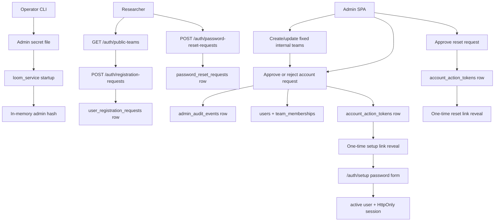

# Auth And Team Registration Implementation Spec

This spec turns the [auth threat model](auth-threat-model.md) into the shipped
implementation baseline. The original issue #10 scope added singleton admin
secret verification, default-closed team registration, admin review, audit
events, operator secret commands, and DB-admin removal. Issue #326 extends that
baseline with browser users, team memberships, role-derived permissions,
current-team context, HttpOnly session cookies, and CSRF protection for the
public platform track. Issue #58 changes the normal public onboarding path from
email/invite-code sign-in to no-email username/password accounts with
admin-approved setup and reset links.

## Goals

- Replace database-backed admin credentials with one singleton admin secret
  loaded from a process-readable file or mounted Kubernetes Secret.
- Keep team and worker tokens database-backed, but prevent team tokens from
  creating admin credentials or escaping their team scope.
- Add a default-closed access-request path with admin approval into a fixed
  internal team.
- Do not collect email during registration, login, or password reset.
- Use globally unique, case-insensitive usernames as the user-facing account
  identifier.
- Seed `admin` as a real team and keep platform admins such as `Qianyi` and
  `Hongjian` as real users in that team.
- Attribute batches, direct trials, API-token submissions, and batch fan-out to
  the submitting user plus that user's team.
- Add persisted browser users, team memberships, session rows, and current-team
  context for the SPA.
- Enforce viewer/member/owner/platform-admin semantics server-side while
  preserving existing team bearer tokens for CLI/backward compatibility.
- Protect browser-session mutations with CSRF validation.
- Record durable audit events for admin mutations before returning success.
- Provide first-run and rotation operator commands that do not print secrets by
  default.
- Keep the current development path usable while making production startup fail
  closed when required admin-secret material is absent or unsafe.

## Non-Goals

- SSO, SAML, OIDC, and automated email delivery. The platform intentionally has
  no official mailbox requirement. Admins copy setup/reset links manually after
  approving requests.
- Removing legacy invite routes in the same release. They remain compatibility
  routes, but the SPA and CLI no longer depend on them for normal onboarding.
- Org-wide completed-result sharing is documented in its own API/UX specs.
  This document keeps the auth, membership, password, and CSRF contract
  focused.
- Run Library sharing and artifact reuse must use explicit visibility/
  share-state checks instead of weakening existing team-scoped execution/
  control routes.
- Changing step-scoped sandbox JWTs or gateway provider egress controls.

## Target Flow



## Principal Model

| Principal | Auth source | Scope | Notes |
| --- | --- | --- | --- |
| Admin | File-backed singleton secret | Global administration | Compared in memory with `hmac.compare_digest`; not stored in `tokens`. |
| Browser user | Username/password plus `user_sessions` row and `loom_session` cookie | Current team role | Normal SPA identity. The raw session secret is HttpOnly; unsafe requests must send the CSRF header. |
| Staging admin browser acceptance session | Singleton admin bearer exchanged for a short-lived `user_sessions` row | Existing platform-admin user | Staging-only validation identity. It cannot be refreshed and must never be used as a production or normal user login path. |
| User-owned API token | `tokens` row with `type='team'` and `created_by_user_id` | One team plus submitting user | CLI/API identity for service workflows. Submissions made with the token carry both `team_id` and `user_id`. |
| Legacy team token | `tokens` row with `type='team'` and no user owner | One team | Compatibility path for old automation; it cannot create user-facing work, admin credentials, or cross-team scope. |
| Worker | `tokens` row with `type='worker'` | Internal worker APIs | Not accepted by `loom_service` user/admin routes. |
| Step session | `loom_step_<jwt>` | One trial step | Gateway-only runtime token, out of scope for #10. |

`AuthContext.type == "admin"` continues to represent admin authority for route
code, but the admin branch is derived from the singleton secret rather than a
database `Token` row. Browser users use `AuthContext.type == "user"`; a
`platform_admin` user role gets the same cross-team inspection/admin wildcard
without making the singleton admin secret a browser identity.

### Browser User Roles

| Role | Scopes | Intended use |
| --- | --- | --- |
| `viewer` | `read:own` | Read-only access to the current team's execution/control resources. |
| `member` | `read:own`, `submit` | Submit team work without managing credentials or tokens. |
| `owner` | `read:own`, `submit`, `tokens:manage`, `providers:manage`, `team:manage` | Manage user-owned API tokens, provider connections, and team-admin surfaces exposed by the service. |
| `platform_admin` | `admin:platform` | Global operator/admin user for inspection and incident response. |

The team boundary remains the execution, cost attribution, credential, member,
and API-token administration boundary. Completed run metadata and safe artifacts
are organization-visible only through the Run Library after explicit
visibility/share-state checks pass.

## Admin Secret File

### File Location

- Operator command default: `~/.config/loom/secrets.toml`.
- Local dev stack default: `loom service up` creates
  `.loom/admin/secrets.toml` and dev compose mounts it read-only into each
  admin-aware service.
- Production: `LOOM_SVC_ADMIN_SECRET_FILE`, `LOOM_CP_ADMIN_SECRET_FILE`, and
  `LOOM_GW_ADMIN_SECRET_FILE` are required and must point to the same mounted
  secret file, not an `envFrom` value.
- `loom_control_plane` reads the same secret for CP-internal admin routes such
  as worker-token bootstrap; the LLM Gateway reads it for rate-card admin
  mutation routes.

### File Shape

```toml
[admin]
token = "loom_admin_<256-bit-url-safe-secret>"
created_at = "2026-06-16T00:00:00Z"
version = 1
```

The file contains the admin bearer credential, so file permissions are part of
the security boundary. Startup must reject files that are group- or
world-readable. On POSIX systems the expected mode is `0600`; on filesystems
that do not expose POSIX modes, production must fail and development may emit a
loud warning only when `LOOM_ENV != production`.

### Startup Behavior

1. Load the admin secret file during `loom_service` lifespan startup.
2. Validate token prefix, entropy length, TOML shape, and file mode.
3. Derive `sha256(token)` in memory and discard the raw token string as soon as
   settings initialization completes.
4. Store an `AdminSecretVerifier` object on `app.state`.
5. `verify_bearer_token(...)` checks this verifier before consulting the
   database-backed token table.
6. `hmac.compare_digest(candidate_hash, admin_hash)` is the only comparison
   path.

If `LOOM_ENV=production`, startup fails when the file is missing, unreadable,
malformed, empty, low entropy, or has unsafe permissions. Development stacks use
the same singleton-admin path by default through `loom service up`; DB-backed
admin rows are not accepted as a fallback.

## Database Changes

Issue #10 adds two admin/onboarding tables and a cleanup migration that revokes
legacy DB-backed admin authority.

### `pending_team_registrations`

| Column | Type | Notes |
| --- | --- | --- |
| `id` | UUID primary key | Generated by service. |
| `name` | text | Requester/display label. It is not used as the team key. |
| `contact_email` | text | Requester contact. |
| `status` | text | `pending`, `approved`, `rejected`, or `expired`. |
| `requested_at` | timestamptz | Server timestamp. |
| `reviewed_at` | timestamptz nullable | Set on approve/reject. |
| `reviewed_by_actor` | text nullable | `X-Loom-Admin-Actor` value. |
| `approved_team_id` | UUID nullable | Set when approved. |
| `source_ip_hash` | text nullable | Optional abuse/debug signal, never raw IP in v0. |
| `user_agent_hash` | text nullable | Optional abuse/debug signal. |
| `metadata` | JSONB | Future-safe request context. |

Create a partial unique index on lower-case contact email for rows whose status
is `pending` or `approved`, so one requester cannot leave multiple active
approval targets.

### `admin_audit_events`

| Column | Type | Notes |
| --- | --- | --- |
| `id` | UUID primary key | Generated by service. |
| `created_at` | timestamptz | Server timestamp. |
| `actor` | text | Required `X-Loom-Admin-Actor` header. |
| `action` | text | Stable action id such as `team_registration.approve`. |
| `target_type` | text | `team_registration`, `team`, `token`, `rate_card`, etc. |
| `target_id` | text | UUID or stable identifier. |
| `request_id` | text nullable | From request middleware when available. |
| `source_ip_hash` | text nullable | Hashed request source, not raw IP. |
| `user_agent_hash` | text nullable | Hashed UA string. |
| `metadata` | JSONB | Safe, summary-only context. |

Admin mutations must write the audit row in the same database transaction as the
mutation when both rows live in the same database. If the audit write fails, the
mutation fails.

Issue #326 adds the browser identity tables:

### `users`

| Column | Type | Notes |
| --- | --- | --- |
| `id` | UUID primary key | Stable user id. |
| `username` | text | Display-preserving account name. |
| `username_normalized` | text | Unique case-insensitive login key. |
| `email` | text nullable | Legacy compatibility only; new registration does not collect it. |
| `password_hash` | text nullable | Argon2id encoded password hash. Null means pending setup or legacy account without password. |
| `password_set_at` | timestamptz nullable | Last successful setup/reset timestamp. |
| `status` | text | `pending_setup`, `active`, or `disabled`. |
| `disabled_at` | timestamptz nullable | Set when the account is disabled. |
| `display_name` | text nullable | UI label when available. |
| `is_platform_admin` | bool | Grants platform-admin session semantics. |
| `created_at`, `updated_at` | timestamptz | Server timestamps. |

The migration creates an `admin` team and ensures `Qianyi` and `Hongjian` are
platform-admin users in that team. Usernames are immutable for the public API;
operators should create a new user if an account needs a different public name.

### `team_memberships`

| Column | Type | Notes |
| --- | --- | --- |
| `team_id` | UUID | Team boundary for execution, cost attribution, credentials, members, and tokens. |
| `user_id` | UUID | User assigned to the team. |
| `role` | text | `owner`, `member`, or `viewer`. |
| `created_at`, `updated_at` | timestamptz | Server timestamps. |

The primary key is `(team_id, user_id)`. Normal users must have a membership
before selecting a current team. Platform-admin users can inspect across teams
but should still choose a current team for ordinary submission flows.

### `team_invites`

| Column | Type | Notes |
| --- | --- | --- |
| `id` | UUID primary key | Stable invite id. |
| `team_id` | UUID | Team that will receive the membership. |
| `email` | text | Intended invite email, normalized lower-case. |
| `allowed_domain` | text nullable | Optional explicit domain policy for multi-use invites. |
| `role` | text | `owner`, `member`, or `viewer`. |
| `status` | text | `pending`, `accepted`, `revoked`, or `expired`. |
| `code_hash` | bytea | SHA-256 of the raw `loom_invite_...` code. |
| `code_prefix` | text | Short safe prefix for display and audit. |
| `max_uses`, `accepted_uses` | integer | Use limit and current use count. |
| `created_by_actor`, `created_by_user_id` | text / UUID | Audit attribution. |
| `created_at`, `expires_at`, `last_sent_at` | timestamptz | Lifecycle timestamps. |
| `accepted_at`, `revoked_at`, `revoked_reason` | nullable | Terminal lifecycle metadata. |

The raw invite code/link is returned only from create/resend responses. List,
lookup, audit, and database rows expose only the safe `code_prefix`.

### `user_sessions`

| Column | Type | Notes |
| --- | --- | --- |
| `id` | UUID primary key | Session row id. |
| `user_id` | UUID | Browser user. |
| `session_hash` | bytea | SHA-256 of the raw `loom_session` value. |
| `csrf_hash` | bytea | SHA-256 of the current CSRF token. |
| `current_team_id` | UUID nullable | Active team context. |
| `expires_at`, `revoked_at` | timestamptz | Expiry and logout state. |
| `created_at`, `updated_at` | timestamptz | Server timestamps. |

Only hashed session and CSRF secrets are persisted. The raw session secret is
returned only as an HttpOnly cookie; the raw CSRF secret is returned in auth
JSON responses and kept in SPA memory so same-site JavaScript can prove
mutation intent without storing that secret in a browser-readable cookie.

### `user_registration_requests`

| Column | Type | Notes |
| --- | --- | --- |
| `id` | UUID primary key | Generated by service. |
| `username`, `username_normalized` | text | Requested account name. |
| `team_id` | UUID | Existing team selected by the requester. |
| `role` | text | Role approved by admin, default `member`. |
| `status` | text | `pending`, `approved`, or `rejected`. |
| `requested_at`, `reviewed_at` | timestamptz | Lifecycle timestamps. |
| `reviewed_by_actor` | text nullable | Authenticated admin actor when reviewed. |
| `metadata` | JSONB | Future-safe request context. |

Pending requests are unique on `username_normalized`. Public registration does
not accept email. If a requested team does not exist, the user must ask an
admin to create it first.

### `account_action_tokens`

| Column | Type | Notes |
| --- | --- | --- |
| `id` | UUID primary key | Token row id. |
| `user_id` | UUID | User that can use the token. |
| `kind` | text | `setup_password` or `reset_password`. |
| `token_hash` | bytea | SHA-256 of raw `loom_setup_...` or `loom_reset_...`. |
| `token_prefix` | text | Safe display prefix. |
| `expires_at`, `consumed_at`, `revoked_at` | timestamptz | Lifecycle state. |
| `created_by_user_id` | UUID nullable | Admin user that approved the action. |

The raw setup/reset link is returned only from the approve response. Database,
list, audit, and diagnostics expose only safe prefixes.

Setup, reset, and invite links are generated from the configured public origin
when available. Deployed Kubernetes profiles render `LOOM_SVC_PUBLIC_BASE_URL`
as the public browser route base, for example `https://yylx.world/dev` for
staging and `https://yylx.world/prod` for production; compatibility deployments
may still set `LOOM_PUBLIC_BASE_URL`. If neither is set, Loom uses trusted
forwarded `proto`/`host` headers and finally the request base URL, preserving
local/dev behavior without asking operators to manually rewrite one-time link
schemes.

### `password_reset_requests`

| Column | Type | Notes |
| --- | --- | --- |
| `id` | UUID primary key | Generated by service. |
| `username`, `username_normalized` | text | Requested account. |
| `status` | text | `pending`, `approved`, or `rejected`. |
| `requested_at`, `reviewed_at` | timestamptz | Lifecycle timestamps. |
| `reviewed_by_actor` | text nullable | Authenticated admin actor when reviewed. |
| `reset_token_prefix` | text nullable | Safe prefix after approval. |

Unknown public reset requests return the same response as known usernames.
Admins can only approve requests that resolve to a real user.

### `login_challenges` (legacy)

| Column | Type | Notes |
| --- | --- | --- |
| `id` | UUID primary key | Challenge row id. |
| `user_id` | UUID | Existing user. |
| `challenge_hash` | bytea | SHA-256 of the one-time login token. |
| `expires_at`, `consumed_at` | timestamptz | Challenge validity. |
| `created_at` | timestamptz | Server timestamp. |

This table remains only for legacy email-code development flows. Normal public
login uses username/password and does not create login challenges.

## API Contract

### Public Account Registration

`GET /api/v1/auth/public-teams`

Returns fixed teams that users may request to join. Registration cannot create a
new team. If a team is missing, the user contacts an admin and retries after the
admin creates it.

`POST /api/v1/auth/registration-requests`

Request:

```json
{
  "username": "Ada",
  "team_id": "00000000-0000-0000-0000-000000000000",
  "metadata": {}
}
```

Creates a pending account request. The username is normalized for uniqueness but
the original spelling is preserved for display. The request body intentionally
has no email field.

`GET /api/v1/auth/setup/lookup?token=loom_setup_...`

Returns safe setup context such as username, team name, and expiry for a valid
unconsumed setup token.

`POST /api/v1/auth/setup/complete`

Request:

```json
{
  "token": "loom_setup_...",
  "password": "long-passphrase-1",
  "confirm_password": "long-passphrase-1"
}
```

Consumes the setup token, stores an Argon2id password hash, activates the user,
sets the HttpOnly browser session cookie, and returns the same shape as
`/auth/me` plus `csrf_token`.

### Password Login And Reset

`POST /api/v1/auth/login`

Accepts `{ "username": "ada", "password": "..." }`. Username lookup is
case-insensitive. Success sets the HttpOnly `loom_session` cookie and returns
the same shape as `/auth/me` plus `csrf_token`.

`POST /api/v1/auth/password-reset-requests`

Accepts `{ "username": "Ada" }` and always returns a generic pending response.
Unknown usernames are not disclosed to the caller.

`GET /api/v1/auth/reset/lookup?token=loom_reset_...`

Returns safe reset context for a valid unconsumed reset token.

`POST /api/v1/auth/reset/complete`

Consumes the reset token, stores the new Argon2id password hash, revokes
existing browser sessions and user-owned API tokens for that user, sets a new
browser session, and returns `/auth/me` plus `csrf_token`.

### Legacy Public Registration

`POST /api/v1/teams/register`

Request:

```json
{
  "name": "Mark Li",
  "contact_email": "owner@example.com"
}
```

This is a compatibility endpoint for old team-registration and invite-based
onboarding. New UI and CLI flows use `/api/v1/auth/registration-requests`.

### Admin Review

`GET /api/v1/admin/teams`

Requires admin auth. Returns fixed internal teams with quota, token metadata,
and browser-user memberships so admins can choose the right destination during
approval.

`POST /api/v1/admin/teams`

Requires admin auth plus `X-Loom-Admin-Actor`. Creates a fixed internal team
and its default `team_quotas` row. Team names are unique case-insensitively.

`PATCH /api/v1/admin/teams/{team_id}`

Requires admin auth plus `X-Loom-Admin-Actor`. Updates the team display name.
This is for operator cleanup and naming consistency; it does not move existing
runs or memberships.

`GET /api/v1/admin/team-registrations?status=pending`

Returns pending legacy invite-based team registration summaries from
`/api/v1/teams/register`. Requires admin auth. Username/password account
approvals use `/api/v1/admin/registration-requests`.

`POST /api/v1/admin/team-registrations/{id}/approve`

Requires admin auth plus `X-Loom-Admin-Actor`. The request body selects the
existing team and membership role:

```json
{
  "team_id": "00000000-0000-0000-0000-000000000000",
  "role": "member"
}
```

Approval creates one invite for the registration contact in that team and role.
The approval response returns the raw invite code/link exactly once; the
database stores only the invite code hash and safe prefix. The contact accepts
the invite link to create or reuse a browser user, create the selected
membership, and receive an HttpOnly browser session. Loom does not email the
link in staging; the admin copies and shares it manually. If the admin UI
loses the response, use invite resend to rotate and reveal a replacement link.

`POST /api/v1/admin/team-registrations/{id}/reject`

Requires admin auth plus `X-Loom-Admin-Actor`. Marks the request rejected and
records review metadata on the registration row. It does not delete the request
row.

`GET /api/v1/admin/registration-requests?status=pending`

Returns pending username account requests. Requires platform-admin session or
singleton admin auth. This is the primary username/password approval path and
is surfaced from the default Admin Access Requests section.

`POST /api/v1/admin/registration-requests/{id}/approve`

Requires platform-admin authority. The body selects the role:

```json
{
  "role": "member"
}
```

Approval creates or activates the user record in `pending_setup` state, creates
the team membership, writes an account-action setup token, records audit
metadata using the authenticated admin actor where available, and returns
`setup_link` exactly once. The link uses the configured public HTTPS origin
in deployed environments.

`POST /api/v1/admin/registration-requests/{id}/reject`

Marks the request rejected and records review metadata.

`GET /api/v1/admin/password-reset-requests?status=pending`

Returns pending password reset requests. Requires platform-admin authority.

`POST /api/v1/admin/password-reset-requests/{id}/approve`

Creates an account-action reset token for the target user and returns
`reset_link` exactly once. The admin copies the link and shares it manually;
the link uses the configured public HTTPS origin in deployed environments.

`POST /api/v1/admin/password-reset-requests/{id}/reject`

Marks the reset request rejected and records review metadata.

### Invites

`POST /api/v1/invites`

Requires a platform admin or team owner. Creates an invite with `email`,
`team_id` (optional for a team owner using their current team), `role`,
`expires_in_days`, optional `max_uses`, and optional `allowed_domain`. Returns
the invite summary plus `invite_code` and `invite_link` exactly once.

`GET /api/v1/invites?team_id=<team>&status=pending`

Lists invite summaries for team owners/admins. Responses include email, role,
status, counts, timestamps, and `code_prefix`, never raw invite code or link.

`GET /api/v1/invites/lookup?code=loom_invite_...`

Public safe lookup for the SPA invite page. It returns only team name, role,
status, and code prefix so expired/revoked/used states can be explained without
leaking membership data.

`POST /api/v1/invites/accept`

Accepts `{ "code": "loom_invite_...", "email": "user@example.com" }`.
Acceptance succeeds only when the email matches the intended email or an
explicit invite `allowed_domain`. It creates the user if needed, creates the
team membership, records an `invite.accept` audit event with safe metadata, sets
the HttpOnly session cookie, and returns the `/auth/me` shape with a CSRF token.

`POST /api/v1/invites/{id}/revoke`

Revokes a pending/expired invite. The raw code remains unrecoverable.

`POST /api/v1/invites/{id}/resend`

Rotates the invite code hash, extends expiry, and reveals a new raw link exactly
once. The old link fails with `invalid invite`.

### Admin Audit

`GET /api/v1/admin/audit-events?limit=50&cursor=<event-id>`

Returns recent admin audit rows with cursor pagination. The current backend uses
the last event id as the next cursor. Team users never see this endpoint. Raw
tokens, provider secrets, request bodies, and artifact paths must not appear in
audit metadata. The platform-admin Audit table renders each safe request ID so
browser acceptance can visibly correlate a row with the current bootstrap
request instead of matching only a repeated action name.

### Staging Admin Browser Acceptance Session

`POST /api/v1/auth/staging-admin-browser-session`

This endpoint exists only when `LOOM_ENV=staging`; development, production, and
unset environments return `404` before authentication. It accepts
`{ "username": "..." }` from the file-backed singleton admin bearer and also
requires safe, non-secret `X-Loom-Admin-Actor` and `X-Request-ID` headers. The
authenticated context must be the singleton `admin` context, not an existing
browser session.

The target must already be an enabled `active` or `pending_setup`
`platform_admin` user with an owner membership in the single enabled `admin`
team. The exchange never creates, enables, promotes, or repairs a user, team, or
membership. Success returns an empty `204`, sets a distinct Secure, HttpOnly,
SameSite=Lax cookie with a fixed 900-second maximum lifetime, and adds
`Cache-Control: no-store`. The service image must carry a lowercase 40-character
SHA baked into `/opt/loom/build-sha` and its OCI revision label; the exchange
reads the image file, fails `503` without it, and returns that identity as
`X-Loom-Build-SHA`. A runtime environment variable cannot override the image
identity. The session is validation-only: `GET`, `HEAD`, and
`OPTIONS` remain available, while every unsafe request fails `403` before route
handling except the exact `POST /api/v1/auth/logout` cleanup path. It cannot be
refreshed, and verification fails outside staging or after the target is
disabled or loses platform-admin authority. Because this is automated
acceptance rather than a human login, it does not update the target user's
`last_login_at` field.

The session creation and `auth.staging_admin_browser_session.create` audit row
commit atomically. Audit metadata contains only the target username/status,
fixed TTL, and singleton-admin auth source; it never contains the bearer or raw
cookie. It also records the running build SHA so the browser report can
correlate the exact bootstrap request with the deployed runtime. This route is
solely an audited #692 browser-acceptance bridge. It does not replace #802
grant/revoke controls, normal password/setup flows, or candidate evidence from
a non-admin user.

### Legacy Email-Code Browser Auth

`POST /api/v1/auth/login/start`

Accepts `{ "email": "user@example.com" }` and always returns
`{ "status": "sent" }`. When `LOOM_SVC_AUTH_RETURN_LOGIN_TOKEN=true`, the
response also includes `login_token` for local development and automated tests.

`POST /api/v1/auth/login/complete`

Accepts `{ "token": "loom_login_..." }`, consumes the one-time challenge, sets
the HttpOnly `loom_session` cookie, and returns the same shape as `/auth/me`
plus `csrf_token`. This path is retained for compatibility only; username/
password login is the normal browser and CLI path.

`GET /api/v1/auth/me`

Returns the browser user, available teams, current team, current role, scopes,
platform-admin flag, and a freshly rotated `csrf_token`. Bearer tokens are not
accepted as browser identity for this route.

`POST /api/v1/auth/team`

Switches the current team when the user is a member of the target team. This is
a mutating browser-session route and must include the configured CSRF header.
The response includes a freshly rotated `csrf_token`.

`POST /api/v1/auth/refresh` and `POST /api/v1/auth/logout`

Refresh extends a normal user session, rotates both the session cookie and CSRF
state, and returns a fresh `csrf_token`. The staging admin browser acceptance
session is never refreshable or writable beyond exact logout. Logout revokes
either session row and clears the session cookie.

Every unsafe method authenticated by a browser session requires the configured
CSRF header to match the server-side CSRF hash for that session. Bearer token
requests keep their existing Authorization-header behavior and are not subject
to browser CSRF.

## Token Route Changes

`POST /api/v1/tokens` rejects `type='admin'` and any requested `admin:*` scope
for every caller. Admin credentials are created and rotated only by local
operator commands and mounted secret files.

API-token behavior stays database-backed:

- tokens are named and reveal a raw `loom_api_...` value only at creation or
  rotation time;
- tokens created by browser users store `created_by_user_id`; bearer-token auth
  restores both `AuthContext.team_id` and `AuthContext.user_id`;
- team callers can mint only same-team tokens and cannot grant scopes they do
  not hold;
- supported public team scopes include `read:own`, `submit`,
  `providers:manage`, and `tokens:manage`;
- admin callers can mint legacy team tokens for approved teams only for
  migration or non-submitting compatibility;
- browser users must have the owner-derived `tokens:manage` scope before they
  can mint, rotate, revoke, or list user-owned API tokens through the SPA/API;
- admin callers must send `X-Loom-Admin-Actor` for token mint/rotate/revoke so
  the action can be written to `admin_audit_events`;
- token list/detail responses reveal only names, scopes, metadata, last-used
  timestamps, and hash prefixes.

Batch and direct-trial creation requires a browser session or user-owned API
token and stores `submitted_by_user_id` from that principal. Legacy team tokens
without `created_by_user_id` are rejected for batch creation, direct trial
creation, failed-case reruns, Run Library clone, and Run Library artifact reuse.
Batch fan-out uses the internal `submit:batch` credential and copies the parent
batch submitter onto child trials. List/detail APIs expose both
`submitted_by_user` and `owner_team`; frontends render the stable ownership
label as `username / team`.

Provider connection creation, key rotation, provider tests, model refresh,
manual model insertion, hide/unhide, and delete are similarly owner-gated for
browser users and bearer API tokens through `providers:manage`.

Migration `0024_revoke_db_admin_tokens` revokes active legacy
`Token.type='admin'` rows and any DB token carrying `admin:*` scopes. The auth
layer also ignores such rows if they remain in an older database or are inserted
manually.

## Operator Commands

Add commands under `loom service`:

- `loom service init-admin --secret-file PATH`: generate a high-entropy admin
  token, write `secrets.toml` with mode `0600`, and print the file path plus
  next-step instructions. It must not print the raw token by default.
- `loom service reveal-admin --secret-file PATH`: explicitly reveal the raw
  admin token for local operator use. Require an interactive confirmation unless
  `--yes` is supplied.
- `loom service rotate-admin --secret-file PATH`: replace the admin token,
  atomically rewrite the file, and tell the operator which service deployments
  must restart. Old admin tokens become invalid after restart.

These commands operate on local files only. Kubernetes rotation remains an
operator workflow: update the mounted Secret, restart affected deployments, and
verify old tokens fail.

## SPA Contract

The production SPA uses browser user sessions, not pasted bearer tokens in
localStorage. On load, the SPA calls `/api/v1/auth/me`; a `401` means signed
out, and any later `401` clears cached user/team data. The shared API client
always sends `credentials: "include"` and copies the in-memory CSRF token from
auth responses into the configured header for unsafe methods.

Settings is the session and team-settings surface:

- signed-out users sign in with username and password, submit a username
  request for an existing team, or submit a password reset request;
- signed-out users see CLI setup guidance for the same username/password
  account flow;
- signed-in users see their user, current team, role, platform-admin flag, team
  list, joined browser users, and role-derived capabilities;
- the authenticated app shell shows the current team name and role in the
  global navigation so users can identify the team context before submitting
  work, managing providers, creating invites, or minting API tokens;
- Home is the authenticated default route and reads `GET /api/v1/overview`,
  a service-side summary of the current team's readiness, provider health,
  benchmark readiness, worker capacity, recent activity, and role-appropriate
  next actions;
- team switching clears cached queries because the current-team context changes
  authorization and result scope;
- owner users can navigate to Team access for scoped CLI/API token lifecycle,
  legacy invites, and provider setup; platform admins also manage fixed
  internal teams, approve username account requests, and approve password reset
  requests;
  member/viewer users do not get owner-only UI affordances and still receive
  server-side 403s for forbidden mutations.

Team access is organized into role-aware sections. Platform admins see Requests,
Accounts, Teams, Invites, API tokens, and Audit sections; team owners see
Invites and API tokens only. The default Requests section lists pending
username registration requests first and clearly separates legacy
team-registration invite requests. The Accounts section also lists username
registration requests alongside password reset requests. Approvals reveal
setup/reset links exactly once for manual sharing. Deployed environments should
reveal links with the public HTTPS origin at source. Manual invite creation
remains available as a compatibility path and selects from visible team names
for platform admins instead of requiring a pasted raw team id; team-owner invite
creation uses the current team from the session context.

The setup page at `/auth/setup?token=...` and reset page at
`/auth/reset?token=...` perform safe lookups, then accept password and
confirmation fields. The legacy invite acceptance page at
`/invites/accept?code=...` remains available for old links and compatibility
tests.

The legacy Admin Access page and singleton admin secret remain operator tools.
They are not normal browser identity for public users.

## Delivery Slices

1. **Spec and docs:** this document plus links from docs index, service-mode,
   operator runbook, and security docs.
2. **Admin secret verifier:** settings, file validation, in-memory verifier,
   `loom_service`, Control Plane, and LLM Gateway admin-route auth integration,
   Kubernetes secret mounts, and production startup guards.
3. **Team registration API:** migration for `pending_team_registrations`, public
   register endpoint, admin list/approve/reject endpoint, and token mint once.
4. **Audit events:** migration for `admin_audit_events`, audit writer helper,
   admin mutation hooks for registration approval/rejection and service token
   mint/revoke, plus the backend audit listing endpoint and SPA audit table.
5. **Operator CLI and runbook:** `init-admin`, `reveal-admin`, `rotate-admin`,
   production runbook update, and rotation smoke.
6. **DB-admin removal:** reject admin token/admin-scope creation, revoke
   existing DB admin rows in migration, remove the fallback, and keep seed data
   on team/worker tokens only.
7. **User sessions/RBAC:** `users`, `team_memberships`, `user_sessions`, and
   `login_challenges`, plus `/auth/*` routes, CSRF checks, current-team context,
   SPA session UX, and route-level owner gates for token/provider management.

## Test Requirements

- Unit tests for admin secret parsing, mode checks, entropy checks, and
  constant-time hash compare behavior.
- Integration tests proving production startup fails when the admin secret file
  is missing, malformed, or permission-unsafe.
- Auth tests proving singleton admin succeeds, wrong admin token fails, team
  tokens still work, and DB admin rows are rejected.
- User-session tests for username/password login, `/auth/me`, logout, refresh,
  team switch, CSRF denial, role-derived scopes, and cross-team denial.
- Staging-admin browser-session tests proving the route is hidden outside
  staging, requires the singleton admin plus safe actor/request attribution,
  never repairs target authority, expires within 900 seconds, cannot refresh,
  and is revoked by logout.
- API tests for no-email username registration, duplicate pending usernames,
  approval into an existing team/role, setup-link completion, password reset
  approval, reset completion, session/token revocation after reset, and
  membership after approval.
- Attribution tests proving browser sessions and user-owned API tokens persist
  `submitted_by_user_id` on batches, direct trials, batch fan-out trials, and
  Run Library clone/reuse submissions.
- Invite API tests for create/list/revoke/resend/accept, expired and duplicate
  acceptance, explicit domain policy, and raw-code redaction from list/audit.
- Audit tests proving admin mutations fail if audit insertion fails, team users
  cannot read the audit endpoint, admin token mutations require an actor, and
  audit metadata excludes raw secrets.
- CLI tests proving `init-admin` and `rotate-admin` do not print raw token values
  by default and write files with mode `0600`.

## Rollout Rules

- Development compose uses `.loom/admin/secrets.toml`; seeded DB admin tokens
  are no longer created or accepted.
- Production deployment is blocked unless the same singleton admin secret is
  mounted into `loom_service`, Control Plane, and LLM Gateway.
- Backend audit is present for #10 registration review, invite create/revoke/
  resend/accept, and service token admin mutations; broader admin mutation
  coverage should be handled by follow-up issues instead of silently claiming
  complete platform-wide audit.
- Browser sessions must set HttpOnly, SameSite cookies. Production deployments
  must use Secure cookies by running with `LOOM_ENV=production` behind HTTPS.
- Staging browser acceptance may use only the audited, fixed-lifetime exchange
  described above. Its sanitized report is candidate evidence, not a reusable
  login credential or proof of normal-user acceptance.
- Existing batch/trial/artifact execution and control routes remain owner-team
  scoped. Org-wide completed-result sharing is explicit Run Library behavior
  with redaction/share-state enforcement.
