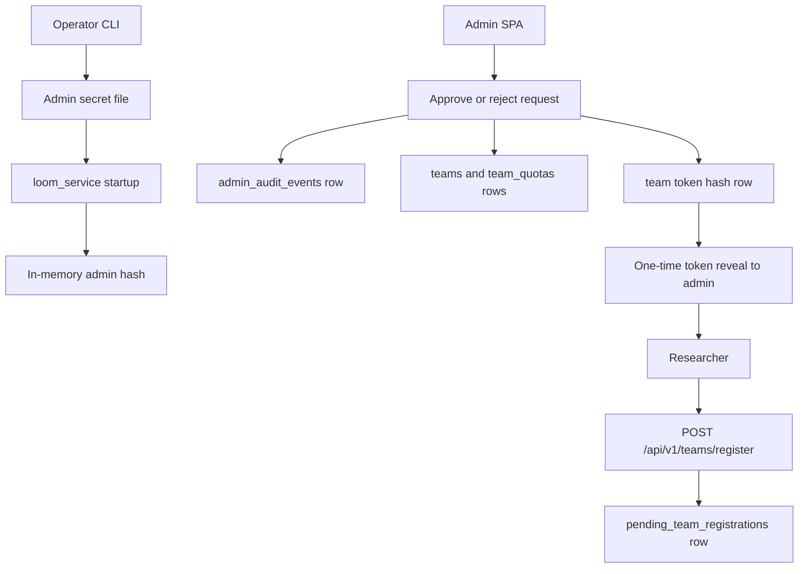

# Auth And Team Registration Implementation Spec

This spec turns the [auth threat model](auth-threat-model.md) into an
implementation plan for issue #10. It is a target design, not current shipped
behavior. Current development stacks still support database-backed admin tokens
seeded by `scripts/seed_test_data.py`; production deployment must not rely on
that model after #10 ships.

## Goals

- Replace database-backed admin credentials with one singleton admin secret
  loaded from a process-readable file or mounted Kubernetes Secret.
- Keep team and worker tokens database-backed, but prevent team tokens from
  creating admin credentials or escaping their team scope.
- Add a default-closed team registration path with admin approval.
- Record durable audit events for admin mutations before returning success.
- Provide first-run and rotation operator commands that do not print secrets by
  default.
- Keep the current development path usable while making production startup fail
  closed when required admin-secret material is absent or unsafe.

## Non-Goals

- SSO, SAML, OIDC, or per-user RBAC inside a team.
- Production cookie migration for the SPA. Token-in-localStorage remains a
  known development-mode risk and must be handled by a sibling issue.
- Automated email delivery for team credentials.
- Changing step-scoped sandbox JWTs or gateway provider egress controls.

## Target Flow



## Principal Model

| Principal | Auth source | Scope | Notes |
| --- | --- | --- | --- |
| Admin | File-backed singleton secret | Global administration | Compared in memory with `hmac.compare_digest`; not stored in `tokens`. |
| Team | `tokens` row with `type='team'` | One team | Can submit and read own resources according to scopes. |
| Worker | `tokens` row with `type='worker'` | Internal worker APIs | Not accepted by `loom_service` user/admin routes. |
| Step session | `loom_step_<jwt>` | One trial step | Gateway-only runtime token, out of scope for #10. |

`AuthContext.type == "admin"` continues to represent admin authority for route
code, but the admin branch is derived from the singleton secret rather than a
database `Token` row.

## Admin Secret File

### File Location

- Development default: `~/.config/loom/secrets.toml`.
- Production: `LOOM_SVC_ADMIN_SECRET_FILE` is required and must point to a
  mounted secret file, not an `envFrom` value.
- `loom_control_plane` may also read the same secret for CP-internal admin
  routes until those routes are fully driven through `loom_service`.

### File Shape

```toml
[admin]
token = "loom_admin_<256-bit-url-safe-secret>"
created_at = "2026-06-16T00:00:00Z"
version = 1
```

The file contains the admin bearer credential, so file permissions are part of
the security boundary. Startup must reject files that are group- or
world-readable. On POSIX systems the expected mode is `0600`; on filesystems
that do not expose POSIX modes, production must fail and development may emit a
loud warning only when `LOOM_ENV != production`.

### Startup Behavior

1. Load the admin secret file during `loom_service` lifespan startup.
2. Validate token prefix, entropy length, TOML shape, and file mode.
3. Derive `sha256(token)` in memory and discard the raw token string as soon as
   settings initialization completes.
4. Store an `AdminSecretVerifier` object on `app.state`.
5. `verify_bearer_token(...)` checks this verifier before consulting the
   database-backed token table.
6. `hmac.compare_digest(candidate_hash, admin_hash)` is the only comparison
   path.

If `LOOM_ENV=production`, startup fails when the file is missing, unreadable,
malformed, empty, low entropy, or has unsafe permissions. In development,
startup may continue without a singleton admin only while the current seeded DB
admin-token fallback is still present; the log message must say the fallback is
development-only and blocked from production.

## Database Changes

Add two new tables before removing DB admin tokens.

### `pending_team_registrations`

| Column | Type | Notes |
| --- | --- | --- |
| `id` | UUID primary key | Generated by service. |
| `name` | text | Requested team display name. |
| `contact_email` | text | Requester contact. |
| `status` | text | `pending`, `approved`, `rejected`, or `expired`. |
| `requested_at` | timestamptz | Server timestamp. |
| `reviewed_at` | timestamptz nullable | Set on approve/reject. |
| `reviewed_by_actor` | text nullable | `X-Loom-Admin-Actor` value. |
| `approved_team_id` | UUID nullable | Set when approved. |
| `source_ip_hash` | text nullable | Optional abuse/debug signal, never raw IP in v0. |
| `user_agent_hash` | text nullable | Optional abuse/debug signal. |
| `metadata` | JSONB | Future-safe request context. |

Create a partial unique index on lower-case team name for rows whose status is
`pending` or `approved`, so repeated pending requests do not create ambiguous
approval targets.

### `admin_audit_events`

| Column | Type | Notes |
| --- | --- | --- |
| `id` | UUID primary key | Generated by service. |
| `created_at` | timestamptz | Server timestamp. |
| `actor` | text | Required `X-Loom-Admin-Actor` header. |
| `action` | text | Stable action id such as `team_registration.approve`. |
| `target_type` | text | `team_registration`, `team`, `token`, `rate_card`, etc. |
| `target_id` | text | UUID or stable identifier. |
| `request_id` | text nullable | From request middleware when available. |
| `source_ip_hash` | text nullable | Hashed request source, not raw IP. |
| `user_agent_hash` | text nullable | Hashed UA string. |
| `metadata` | JSONB | Safe, summary-only context. |

Admin mutations must write the audit row in the same database transaction as the
mutation when both rows live in the same database. If the audit write fails, the
mutation fails.

## API Contract

### Public Registration

`POST /api/v1/teams/register`

Request:

```json
{
  "name": "latent-reasoning",
  "contact_email": "owner@example.com"
}
```

Closed mode is the default: create a pending row and return `202 Accepted` with
the registration id and status. Open mode is explicitly enabled by
`LOOM_SVC_TEAM_REGISTRATION_OPEN=true`; open mode still requires rate limiting
and a challenge hook before it can return an approved team token.

### Admin Review

`GET /api/v1/admin/team-registrations?status=pending`

Returns pending registration summaries. Requires admin auth.

`POST /api/v1/admin/team-registrations/{id}/approve`

Creates `teams`, `team_quotas`, and one `tokens` row with `type='team'`, then
returns the raw team token exactly once in the approval response. The raw token
is not stored after hashing. If the admin UI loses the response, the admin must
mint a replacement team token and revoke the lost hash prefix.

`POST /api/v1/admin/team-registrations/{id}/reject`

Marks the request rejected and records audit metadata. It does not delete the
request row.

### Admin Audit

`GET /api/v1/admin/audit-events`

Returns recent admin audit rows with cursor pagination. Team users never see
this endpoint. Raw tokens, provider secrets, request bodies, and artifact paths
must not appear in audit metadata.

## Token Route Changes

`POST /api/v1/tokens` currently accepts `type='admin'`. After singleton admin
ships, the route must reject `type='admin'` for every caller. Admin credentials
are created and rotated only by local operator commands and mounted secret
files.

Team-token behavior stays database-backed:

- team callers can mint only same-team `read:own` and `submit` tokens;
- admin callers can mint team tokens for approved teams;
- token responses reveal raw token values only on creation;
- token list/detail responses reveal only hash prefixes.

The final #10 migration deletes or revokes existing `Token.type='admin'` rows.
There must be no long-lived compatibility window where production accepts both
singleton-admin and DB-admin credentials.

## Operator Commands

Add commands under `loom service`:

- `loom service init-admin --secret-file PATH`: generate a high-entropy admin
  token, write `secrets.toml` with mode `0600`, and print the file path plus
  next-step instructions. It must not print the raw token by default.
- `loom service reveal-admin --secret-file PATH`: explicitly reveal the raw
  admin token for local operator use. Require an interactive confirmation unless
  `--yes` is supplied.
- `loom service rotate-admin --secret-file PATH`: replace the admin token,
  atomically rewrite the file, and tell the operator which service deployments
  must restart. Old admin tokens become invalid after restart.

These commands operate on local files only. Kubernetes rotation remains an
operator workflow: update the mounted Secret, restart affected deployments, and
verify old tokens fail.

## SPA Contract

The first implementation can keep bearer-token login. The admin SPA needs only
three additions for #10:

- a pending team registration table;
- approve/reject actions that require an admin actor string;
- a one-time token reveal state after approval, with clear copy/download affordance.

HttpOnly cookie auth, CSRF protection, and per-user admin identity are separate
production UX/security issues and must not block the singleton-admin backend.

## Delivery Slices

1. **Spec and docs:** this document plus links from docs index, service-mode,
   operator runbook, and security docs.
2. **Admin secret verifier:** settings, file validation, in-memory verifier,
   `loom_service` auth integration, Kubernetes secret mount, and production
   startup guard. Keep DB-admin fallback only for development until the
   migration slice. Control Plane admin-route integration may land as a
   follow-up if the worker-token route is still served directly by CP.
3. **Team registration API:** migration for `pending_team_registrations`, public
   register endpoint, admin list/approve/reject endpoint, and token mint once.
4. **Audit events:** migration for `admin_audit_events`, audit writer helper,
   and admin mutation hooks for registration approval/rejection and token
   mint/revoke.
5. **Operator CLI and runbook:** `init-admin`, `reveal-admin`, `rotate-admin`,
   production runbook update, and rotation smoke.
6. **DB-admin removal:** reject admin token creation, delete or revoke existing
   DB admin rows in migration, remove production fallback, and verify
   `LOOM_ENV=production` cannot start with DB-admin-only auth.

## Test Requirements

- Unit tests for admin secret parsing, mode checks, entropy checks, and
  constant-time hash compare behavior.
- Integration tests proving production startup fails when the admin secret file
  is missing, malformed, or permission-unsafe.
- Auth tests proving singleton admin succeeds, wrong admin token fails, team
  tokens still work, and DB admin rows are rejected after the removal slice.
- API tests for closed-mode registration, duplicate pending names, approve,
  reject, one-time token reveal, and team-token usability after approval.
- Audit tests proving admin mutations fail if audit insertion fails and that
  audit metadata excludes raw secrets.
- CLI tests proving `init-admin` and `rotate-admin` do not print raw token values
  by default and write files with mode `0600`.

## Rollout Rules

- Development compose can keep seeded admin tokens until the DB-admin removal
  slice, but must log the fallback as development-only.
- Shared dev can run the singleton-admin path before migration to validate SPA
  behavior without breaking Hongjian's v0.1 dev-env lane.
- Production deployment is blocked until singleton admin, team approval, audit,
  rotation, and DB-admin removal are all complete or an explicit deployment
  exception is documented.
