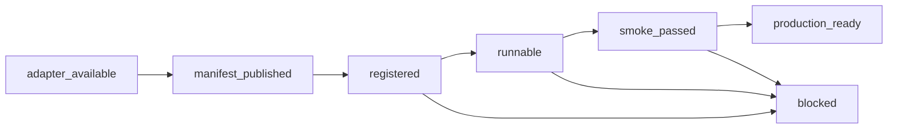

# Benchmark Onboarding Pipeline

Status: design

Date: 2026-06-19

Tracking:

- Umbrella: [#270](https://github.com/carinrc/loom/issues/270)
- Lifecycle and manifest contract: [#271](https://github.com/carinrc/loom/issues/271)
- Publish/register valid TaskConfig rows: [#272](https://github.com/carinrc/loom/issues/272)
- Audit/readiness tooling: [#273](https://github.com/carinrc/loom/issues/273)
- First runnable benchmark wave: [#274](https://github.com/carinrc/loom/issues/274)
- User-owned benchmark onboarding: [#275](https://github.com/carinrc/loom/issues/275)
- SPA readiness states: [#276](https://github.com/carinrc/loom/issues/276)

## Goal

Make benchmark support scalable. Loom should move benchmarks through an
explicit lifecycle from adapter availability to runnable, smoke-tested
readiness. First-party benchmark enablement and user-owned benchmark onboarding
should use the same platform concepts: validated task configs, durable bundle
sources, readiness diagnostics, and clear UI states.

The immediate trigger is #267: the platform had raw task rows for benchmarks
such as SWE-Bench Verified, but many rows had `config={}`. After #267, those
rows are correctly not counted as runnable. The next step is to fix the
publish/register lifecycle so batch benchmark support produces valid runnable
tasks instead of placeholders.

## Non-Goals

- Do not make browser zip upload the normal evaluation path.
- Do not hard-code benchmark-specific readiness in the SPA.
- Do not require service-code changes for ordinary user-owned benchmarks.
- Do not migrate production object storage in this slice. The design must work
  with the current object-store abstraction and leave MinIO/SeaweedFS/S3
  replaceable.
- Do not make heavy benchmarks such as SWE-Bench or OSWorld appear ready until
  their runtime, image, verifier, and smoke requirements are validated. If a
  benchmark is intentionally outside the current supported runtime surface,
  mark it `Not supported yet` instead of hiding it or treating raw task rows as
  runnable.

## Current State

Loom currently has three benchmark-related paths:

1. Adapter discovery through the `loom.benchmarks` entry point.
2. `publish` / `register` commands that publish bundles and register rows.
3. Operator `config/benchmarks.toml` for no-Python local/remap registration.

The weak boundary is between publication and registration. Some manifests
register task rows with `config={}` and rely on comments that say worker claim
will fill config lazily. The current API contract no longer accepts that:
`POST /trials`, `POST /api/v1/batches`, `/benchmarks`, and `/tasks/count` treat
stored `TaskConfig` validity as the runnable boundary.

That boundary should stay. Worker execution should materialize sources and run
tasks, not repair catalog rows.

## Lifecycle

Each benchmark has a readiness state derived from platform data, not from a
hard-coded benchmark name.



States:

- `adapter_available`: code or config declares the benchmark.
- `manifest_published`: task bundles and a manifest exist in a supported
  storage target.
- `registered`: benchmark and task metadata are in Postgres.
- `runnable`: registered task rows contain valid `TaskConfig` and a materializer
  can resolve their `source`.
- `smoke_passed`: a small operator-defined sample has completed through Loom.
- `production_ready`: smoke is stable and docs, resource notes, and operational
  constraints are recorded.
- `blocked`: readiness cannot advance. The blocker reason must be explicit,
  such as `legacy_manifest_missing_task_config`, `bundle_source_unreachable`,
  `missing_worker_capability`, or `smoke_failed`. Source license metadata is
  not a blocker.

## Data Model And Contract

The existing `benchmarks` and `tasks` tables remain the source of truth.

The key rule:

> A task row is runnable only when `tasks.config` validates as `TaskConfig`.

Manifest registration can still create placeholder rows, but those rows must be
explicitly non-runnable and must produce a readiness blocker. They must not be
shown as available work.

Manifest vNext should include:

- `schema_version`
- `benchmark_id`
- display metadata: name, series, license, upstream locator, revision, splits
- per-task metadata:
  - `task_id`
  - `checksum`
  - `source`
  - `tags`
  - `task_config`, or a canonical path to a `task.toml` that can be fetched
    and validated during `register`
  - optional requirements: sandbox image, network policy, worker capabilities,
    estimated runtime class

Registration behavior:

- If `task_config` is present, validate it and write it to `tasks.config`.
- If only a remote `task.toml` path is present, fetch just that file, validate
  it, and write it to `tasks.config`.
- If neither is present, write or update the raw row only as a placeholder and
  mark the benchmark as blocked by legacy manifest data.
- Re-registering should be idempotent and should update checksums, tags, source,
  and configs when the manifest revision changes.

The first #272 implementation uses inline `task_config` in schema v3 manifests.
The remote-path variant remains the scalable extension point for very large or
non-HF user-owned benchmark manifests.

## Existing Manifest Compatibility And Backfill

Current published benchmark manifests are not all equivalent:

- v1 manifests predate `series` and per-task `tags`.
- v2 manifests add `series` and `tags`, but still do not guarantee a
  register-time `TaskConfig`.
- vNext manifests must provide either inline `task_config` or a canonical
  remote `task.toml` path for every runnable task.

Registration must keep reading v1 and v2 manifests so existing published
datasets do not disappear from the catalog. However, compatibility does not
mean treating them as runnable. The rules are:

- v1: preserve benchmark metadata, derive missing optional fields as today,
  register raw task metadata, and set readiness blocker
  `manifest_legacy_missing_task_config` until backfilled.
- v2: preserve `series` and `tags`, register raw task metadata, and set the
  same blocker when task config data is absent.
- vNext: validate every supplied task config before writing it to
  `tasks.config`; malformed configs fail registration unless the operator asks
  for placeholder-only import.

Backfill should be explicit and repeatable. Operators should republish a
benchmark using the vNext manifest, then re-run register. The second register
updates the existing `tasks` rows in place with valid configs, checksum/source
metadata, and tags. If republishing is not possible, an operator-owned backfill
tool can fetch each bundle's `task.toml`, validate it, and update `tasks.config`
without changing the manifest; that still advances readiness only after audit
confirms the stored configs are valid.

The worker should not be part of backfill. Worker claim/materialization is too
late in the lifecycle to decide catalog readiness and creates confusing UI
states under concurrency. Workers should assume the catalog row they claim
already passed the runnable boundary.

## Storage And Materialization

Source materialization stays behind the existing worker materializer boundary:

- `hf://...`: fetch one bundle path from a HuggingFace dataset repo.
- `s3://...`: fetch one object-store prefix from S3-compatible storage.
- `fixture://...`: dev/test fixture path only.
- no `source`: allowed only for inline rows whose validated `TaskConfig` is
  already complete in Postgres and does not need external bundle materialization.
- local folder registration: accepted only when the worker fleet has access to
  the same configured `fixtures_root` or after the bundle is published to object
  storage.

Production should prefer object-store-backed sources for user-owned benchmarks.
Local folders are useful for dev and small internal pilots, but the scalable
path is: validate local bundle -> publish to managed object storage -> register
manifest -> smoke.

## Operator CLI

The first audit/readiness command is operator-facing and direct-DB. It can be
used before and after registration:

```bash
loom datasets audit --all --db-url "$LOOM_DB_URL"
loom datasets audit humaneval --db-url "$LOOM_DB_URL"
loom datasets audit --all --db-url "$LOOM_DB_URL" --json
loom datasets publish humaneval --hf-org "$LOOM_HF_ORG"
loom datasets register humaneval --hf-org "$LOOM_HF_ORG" --db-url "$LOOM_DB_URL"
loom datasets verify humaneval --limit 3
```

Required audit columns:

- benchmark id
- adapter status
- manifest status
- raw task count
- valid task config count
- source schemes
- materializer availability
- latest smoke status
- readiness state
- blocker reason

The CLI must support a JSON mode for CI/release gates and a compact table for
operators.

## Service And SPA

The service exposes readiness as catalog data on `GET /api/v1/benchmarks` and
`GET /api/v1/benchmarks/{id}`. The SPA renders readiness from those API fields
rather than hard-coded benchmark names.

The response keeps `task_count` as the user-submit runnable count: rows whose
stored config validates as `TaskConfig`. Source license metadata is visible but
does not reduce this count. It also includes diagnostic fields for operators
and the New Batch picker:

- `raw_task_count`
- `valid_task_config_count`
- `invalid_task_config_count`
- `license_allowed_task_count` (compatibility field; equals valid task count)
- `license_blocked_task_count` (compatibility field; always `0`)
- `blocked_licenses` (compatibility field; always empty)
- `source_schemes`
- `adapter_status`, `manifest_status`, `materializer_status`, `smoke_status`
- `readiness_state`, `readiness_label`, `readiness_message`
- `selectable`
- `blocker_reason`

New Batch behavior:

- `Ready`: selectable; show runnable count.
- `Needs publish`: disabled; show publish/register guidance.
- `Needs republish` or `Needs repair`: disabled; show raw-versus-runnable
  count and the stored `TaskConfig` blocker.
- `Not supported yet`: disabled; show the runtime contract that must land
  before the benchmark can be selected.
- `Deferred`: disabled; show the tracked product or data-access blocker that
  must land before the benchmark can enter the supported catalog.
- `Smoke failed`: disabled by default; allow operator override later if needed.
- `Heavy/special requirements`: disabled unless worker capabilities and runtime
  requirements are satisfied.

This makes the user-facing UX consistent with the backend: the UI should never
offer a benchmark as launchable when the API will reject it.

Source licenses are catalog metadata rather than team-policy blockers. Service
catalog and task-count previews therefore match the slate batch creation will
accept based on structural validity, subset filters, and runtime requirements.
Deterministic fan-out failures are still recorded on the Batch as
`fanout_errors` and surfaced in Batch Detail/CLI as a defense-in-depth
backstop; they must not leave the Batch indefinitely `submitted`.

## User-Owned Benchmark Path

The user-owned path should be folder-first, not code-first.

Recommended local layout:

```text
my-benchmark/
  benchmark.toml
  tasks/
    task-001/
      task.toml
      solution/
      tests/
      data/
    task-002/
      task.toml
      solution/
      tests/
      data/
```

Dev/local operator flow:

```bash
loom datasets validate-local ./my-benchmark

# Copy the printed [[local]] snippet into config/benchmarks.toml, then sync it
# against the worker fixtures root that contains ./my-benchmark as <id>/.
loom datasets sync-config \
  --config ./config/benchmarks.toml \
  --fixtures-root "$LOOM_WORKER_FIXTURES_ROOT" \
  --db-url "$LOOM_DB_URL"

loom datasets audit my-benchmark --db-url "$LOOM_DB_URL"
```

Production object-store operator flow:

```bash
loom datasets validate-local ./my-benchmark
loom datasets publish-local ./my-benchmark \
  --db-url "$LOOM_DB_URL" \
  --minio-endpoint "$LOOM_MINIO_ENDPOINT" \
  --minio-access-key "$LOOM_MINIO_ACCESS_KEY" \
  --minio-secret-key "$LOOM_MINIO_SECRET_KEY" \
  --bucket loom-benchmarks

loom datasets audit my-benchmark --db-url "$LOOM_DB_URL"
```

`publish-local` stores each task bundle under
`s3://<bucket>/<benchmark-id>/<task-id>/` and writes that prefix into
`tasks.source`. Workers materialize those rows through the existing `s3://`
materializer, so production does not require mounting the user's source folder.
If a task declares `environment.dockerfile`, the Dockerfile and build context
are uploaded with the same bundle. The worker builds the image from the
materialized bundle before the first trial that needs it and caches the result
under a deterministic `loom-task:<hash>` tag based on the task checksum and
Dockerfile path. Operator-owned worker limits reject oversized build contexts
before Docker starts: `LOOM_TASK_IMAGE_BUILD_MAX_FILES` defaults to 2000 and
`LOOM_TASK_IMAGE_BUILD_MAX_BYTES` defaults to 536870912.

After audit passes, launch a small first_n=3 smoke from the New Batch UI, or
through the existing batch API/CLI with `task_filter.benchmark_id` set to
`my-benchmark`. For oracle/no-model smoke, omit provider and model:

```bash
loom eval batch create \
  --name my-benchmark-oracle-smoke \
  --agent oracle \
  --benchmark my-benchmark \
  --n-per-task 1
```

For model-backed agents such as `litellm`, include the provider connection and
model id:

```bash
loom eval batch create \
  --name my-benchmark-litellm-smoke \
  --agent litellm \
  --provider smoke-openai \
  --model gpt-4o-mini \
  --benchmark my-benchmark \
  --n-per-task 1
```

The smoke path should exercise the same registered task rows that production
evaluations will use.

The `validate-local` path intentionally uses the same `TaskConfig` boundary as
production trial execution: each discovered `task.toml` must validate before it
can enter `sync-config`. Tasks configured with `agent.name = "oracle"` should
ship an executable `solution/solve.sh` when the smoke path will use the oracle
agent.
For code benchmarks whose reference answer already lives in
`solution/solution.py`, that script can be a no-op and the verifier
tests provide the actual pass/fail signal.

The current implementation is CLI/operator owned and folder-first. A later
admin API can wrap the same validation, publish, and sync primitives. Browser
upload should call the same backend path eventually, but it is not the default
onboarding workflow.

## First Benchmark Wave

Start with low-cost, high-signal benchmarks that exercise different platform
surfaces:

- HumanEval: regression baseline and already partially runnable.
- MBPP: second code benchmark, cheap and simple.
- AIME 2022-2025: lightweight provider/model smoke with full per-year
  registration and source-license metadata.
- Terminal-Bench-2 full pinned v0.1.1 task set: terminal sandbox behavior. The
  registered set contains 86 valid task configs, each declaring
  `workdir = "/app"`, a build-only `.loom-build/client` Docker context, and the
  upstream bash `run-tests.sh` script verifier. The 3 multi-service tasks use
  `environment.sidecars` so workers run the official auxiliary services instead
  of a single-image approximation.
- SkillFlow and SkillLearnBench: research-demanded agentic skill learning
  paths. Their real upstreams publish task bundles rather than one JSON row per
  instance, so the adapter must wrap each bundle with Loom `task.toml` and a
  verifier shim over upstream `tests/test.sh` before marking them runnable.

Defer heavy benchmarks until readiness tooling can explain blockers:

- SWE-Bench and SWE-Bench Verified.
- OSWorld.
- WebArena.
- GAIA.

## Error Handling

Every failed transition should produce a blocker reason that operators can act
on. Examples:

- `adapter_missing`
- `manifest_missing`
- `manifest_legacy_missing_task_config`
- `task_config_invalid`
- `bundle_source_unreachable`
- `materializer_missing`
- `worker_capability_missing`
- `smoke_failed`

The CLI should exit nonzero only for command failures or policy violations. A
benchmark being blocked should be reported as data, not as a tool crash, unless
the caller requests `--fail-on-blocked`.

## Testing

Minimum tests for the implementation plan:

- Manifest vNext validation accepts task configs and rejects malformed configs.
- Register writes valid `tasks.config` rows for vNext manifests.
- Register keeps legacy manifests non-runnable and reports a blocker.
- Audit reports correct readiness for ready, placeholder, missing source, and
  smoke-failed fixtures.
- SPA renders readiness states from API data and disables non-runnable choices.
- End-to-end smoke registers at least one first-wave benchmark and runs a small
  sample through API or SPA.
- Policy-blocked fan-out is diagnosable at the Batch layer and does not retry
  forever.

## Implementation Order

1. #271: lock lifecycle and manifest contract in docs/tests.
2. #272: make publish/register emit and persist valid `TaskConfig`.
3. #273: add audit/readiness CLI with JSON and table output.
4. #274: publish/register/smoke first benchmark wave.
5. #276: expose readiness to SPA and render states.
6. #275: harden user-owned benchmark onboarding using the same primitives.

This order keeps the contract stable before broad benchmark work begins and
avoids patching individual benchmarks around a broken lifecycle boundary.
