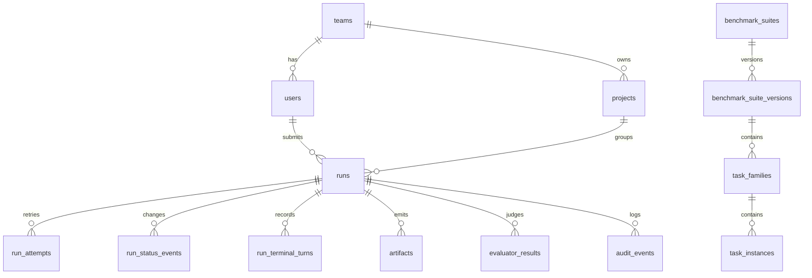

# Postgres Persistence Foundation

Last updated: 2026-05-28

Related trackers:

- Backend epic: https://github.com/carinrc/agentic-data-platform/issues/49
- Postgres schema and repositories: https://github.com/carinrc/agentic-data-platform/issues/51
- Core API resources: https://github.com/carinrc/agentic-data-platform/issues/52
- Run lifecycle API: https://github.com/carinrc/agentic-data-platform/issues/53
- Platform architecture: https://github.com/carinrc/agentic-data-platform/issues/4

## Goal

Issue #51 establishes the first durable metadata layer for the backend service.
The platform keeps Python dataclasses as public domain contracts, while
repositories persist and hydrate those contracts from Postgres.

## Migration Tooling

The project uses Alembic with SQLAlchemy 2.x:

- Migration entrypoint: `python -m agentic_data_platform.persistence.migrations`
- Migration scripts: `src/agentic_data_platform/persistence/alembic/`
- Runtime driver: `psycopg`
- Local/CI repository tests: SQLite-backed migration smoke through the same
  Alembic command path
- Shared dev validation: `scripts/deploy-dev.sh` runs migrations against the
  Compose Postgres service before starting the API

`postgresql://` URLs are normalized to `postgresql+psycopg://` by the
persistence package so existing `.env` files do not need driver-specific URLs.

## Initial Tables

The initial schema covers:

- Identity and ownership: `users`, `teams`, `team_memberships`, `projects`
- Benchmark catalog metadata: `benchmark_suites`,
  `benchmark_suite_versions`, `task_families`, `task_instances`
- Run lifecycle metadata: `runs`, `run_attempts`, `run_status_events`,
  `run_terminal_turns`
- Outputs and evaluation: `artifacts`, `evaluator_results`, `skill_objects`
- Operations history: `audit_events`

Flexible benchmark, runner, model, evaluator, and artifact metadata is stored in
JSON columns for v0. `runs.evaluator_configs` preserves the submitted evaluator
plan before worker execution writes evaluator results. Stable object-store URIs
and keys are stored in Postgres; large payloads such as full workspace archives
remain object-store artifacts.

## Repository Boundary

Repositories take a SQLAlchemy `Session` and return domain dataclasses or small
read models:

- `IdentityRepository`: teams, users, and memberships
- `ProjectRepository`: project create/read/list/update
- `BenchmarkCatalogRepository`: fixture catalog upsert, suite-version listing,
  and task-instance detail/listing
- `RunRepository`: `RunRecord` save/list/get, create queued runs,
  scheduler dispatch, stale-dispatch recovery, worker claim, cancel/retry state
  transitions, status-event history, terminal turns, artifacts, and latest
  evaluator result hydration
- `AuditEventRepository`: structured event recording for later PM/operator views

For v0, `RunRecord` has no public `attempt_id`, so `RunRepository.get_run()`
hydrates the latest internal attempt back into the existing dataclass shape.
`RunRepository.dispatch_queued_runs(...)` moves eligible `queued` rows to
`dispatched` after global, backend, and project capacity checks and records a
`run.dispatched` event with scheduler id, backend key, and project id metadata.
`RunRepository.requeue_stale_dispatched_runs(...)` moves stale `dispatched`
rows back to `queued` in bounded batches and records `run.recovered` events
with scheduler id, recovery reason, and stale cutoff metadata.
Workers prefer `RunRepository.claim_next_dispatched_run(...)` and then retain
`RunRepository.claim_next_queued_run(...)` as a compatibility path during
scheduler rollout; both claim paths persist a `run.claimed` transition to
`provisioning`.
Retry creates a new `run_attempts` row for the same `run_id`, moves the run back
to `queued`, and records a `run.retried` status event. Follow-on `save_run()`
calls update the latest internal attempt so worker code can persist terminal
turns and artifacts after a retry without replacing attempt 1. Cancel and retry
events record `from_status`, `to_status`, `reason`, `actor_user_id`, and
`request_id` in `run_status_events` for dashboard and debugging use. Status
events have a monotonic integer primary key that is exposed as `seq` for
durable replay. API clients can call `GET /runs/{run_id}/events?after_seq=N`
or reconnect to `GET /runs/{run_id}/stream` to recover missed lifecycle events
without hydrating full trajectories or artifact payloads.
Terminal turn stdout/stderr columns are bounded previews, not canonical log
storage. When a stream exceeds the inline limit, persistence stores truncation
metadata such as original byte count and inline byte count, while full
trajectory/log payloads remain object-store artifacts.
Evaluator results are stored as many rows per latest attempt. `RunRecord`
hydrates the ordered `evaluator_results` collection and continues to expose the
latest result through `RunRecord.evaluator_result` for existing worker,
dashboard, and API clients. The `evaluator_results.mode` column distinguishes
Harbor verifier, platform LLM judge, hybrid, and future manual-review outputs;
judge metadata is nullable so deterministic verifier rewards can be stored
without synthesizing an LLM judge identity.

The #53 lifecycle migration adds indexes for dashboard filters:
`runs(project_id, status, created_at)`,
`runs(benchmark_suite, task_family, task_instance_id)`,
`runs(created_by_user_id)`, and `run_status_events(run_id, created_at)`.

## API Resource Boundary

Issues #52 and #53 connect these repositories to FastAPI resource endpoints
through a per-request SQLAlchemy session dependency. The first API routes expose
teams, projects, benchmark suite versions, task instances, queued run creation,
run dashboard projections, lifecycle events, cancel/retry operations, sanitized
artifact references, and latest evaluator summaries.

The API intentionally keeps artifact payloads out of Postgres responses. It
returns stable metadata such as `artifact_id`, `media_type`, `size_bytes`, and
`storage_key`, while `RunDashboardProjection` suppresses local host paths and
signed URL query parameters.

Detailed endpoint notes live in
`docs/architecture/core-api-resources.md`.
