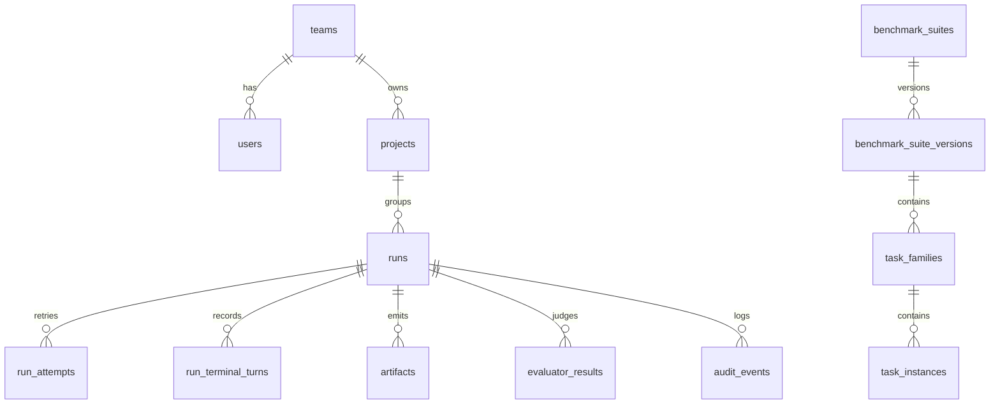

# Postgres Persistence Foundation

Last updated: 2026-05-28

Related trackers:

- Backend epic: https://github.com/carinrc/agentic-data-platform/issues/49
- Postgres schema and repositories: https://github.com/carinrc/agentic-data-platform/issues/51
- Platform architecture: https://github.com/carinrc/agentic-data-platform/issues/4

## Goal

Issue #51 establishes the first durable metadata layer for the backend service.
The platform keeps Python dataclasses as public domain contracts, while
repositories persist and hydrate those contracts from Postgres.

## Migration Tooling

The project uses Alembic with SQLAlchemy 2.x:

- Migration entrypoint: `python -m agentic_data_platform.persistence.migrations`
- Migration scripts: `src/agentic_data_platform/persistence/alembic/`
- Runtime driver: `psycopg`
- Local/CI repository tests: SQLite-backed migration smoke through the same
  Alembic command path
- Shared dev validation: `scripts/deploy-dev.sh` runs migrations against the
  Compose Postgres service before starting the API

`postgresql://` URLs are normalized to `postgresql+psycopg://` by the
persistence package so existing `.env` files do not need driver-specific URLs.

## Initial Tables

The initial schema covers:

- Identity and ownership: `users`, `teams`, `team_memberships`, `projects`
- Benchmark catalog metadata: `benchmark_suites`,
  `benchmark_suite_versions`, `task_families`, `task_instances`
- Run lifecycle metadata: `runs`, `run_attempts`, `run_terminal_turns`
- Outputs and evaluation: `artifacts`, `evaluator_results`, `skill_objects`
- Operations history: `audit_events`

Flexible benchmark, runner, model, evaluator, and artifact metadata is stored in
JSON columns for v0. Stable object-store URIs and keys are stored in Postgres;
large payloads such as full workspace archives remain object-store artifacts.

## Repository Boundary

Repositories take a SQLAlchemy `Session` and return domain dataclasses or small
read models:

- `IdentityRepository`: teams, users, and memberships
- `ProjectRepository`: project create/read/list/update
- `BenchmarkCatalogRepository`: fixture catalog upsert and task-instance listing
- `RunRepository`: `RunRecord` save/list/get with terminal turns, artifacts, and
  latest evaluator result hydration
- `AuditEventRepository`: structured event recording for later PM/operator views

For v0, `RunRecord` has no public `attempt_id`, so `RunRepository.get_run()`
hydrates the latest internal attempt back into the existing dataclass shape.
Evaluator results are stored as many rows, while current callers receive the
latest result through `RunRecord.evaluator_result`.
