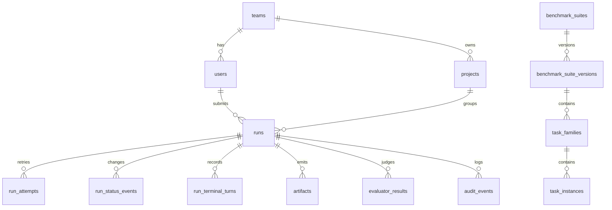

# Postgres Persistence Foundation

Last updated: 2026-06-03

Related trackers:

- Backend epic: https://github.com/carinrc/agentic-data-platform/issues/49
- Postgres schema and repositories: https://github.com/carinrc/agentic-data-platform/issues/51
- Core API resources: https://github.com/carinrc/agentic-data-platform/issues/52
- Run lifecycle API: https://github.com/carinrc/agentic-data-platform/issues/53
- Platform architecture: https://github.com/carinrc/agentic-data-platform/issues/4

## Goal

Issue #51 establishes the first durable metadata layer for the backend service.
The platform keeps Python dataclasses as public domain contracts, while
repositories persist and hydrate those contracts from Postgres.

## Migration Tooling

The project uses Alembic with SQLAlchemy 2.x:

- Migration entrypoint: `python -m agentic_data_platform.persistence.migrations`
- Migration scripts: `src/agentic_data_platform/persistence/alembic/`
- Runtime driver: `psycopg`
- Local/CI repository tests: SQLite-backed migration smoke through the same
  Alembic command path
- Shared dev validation: `scripts/deploy-dev.sh` runs migrations against the
  Compose Postgres service before starting the API

`postgresql://` URLs are normalized to `postgresql+psycopg://` by the
persistence package so existing `.env` files do not need driver-specific URLs.

## Initial Tables

The initial schema covers:

- Identity and ownership: `users`, `teams`, `team_memberships`, `projects`
- Benchmark catalog metadata: `benchmark_suites`,
  `benchmark_suite_versions`, `task_families`, `task_instances`
- Run lifecycle metadata: `runs`, `run_attempts`, `run_status_events`,
  `run_terminal_turns`
- Outputs and evaluation: `artifacts`, `evaluator_results`, `skill_objects`
- Operations history: `audit_events`

Flexible benchmark, runner, model, evaluator, and artifact metadata is stored in
JSON columns for v0. `runs.evaluator_configs` preserves the submitted evaluator
plan before worker execution writes evaluator results. Stable object-store URIs
and keys are stored in Postgres; large payloads such as full workspace archives
remain object-store artifacts.

## Repository Boundary

Repositories take a SQLAlchemy `Session` and return domain dataclasses or small
read models:

- `IdentityRepository`: teams, users, and memberships
- `ProjectRepository`: project create/read/list/update
- `BenchmarkCatalogRepository`: fixture catalog upsert, suite-version listing,
  and task-instance detail/listing
- `RunRepository`: `RunRecord` save/list/get, create queued runs,
  scheduler dispatch, stale-dispatch recovery, worker heartbeat persistence,
  stale active-run recovery, worker claim, cancel/retry state transitions,
  status-event history, terminal turns, artifacts, and latest evaluator result
  hydration
- `AuditEventRepository`: structured event recording for later PM/operator views

For v0, `RunRecord` has no public `attempt_id`, so `RunRepository.get_run()`
hydrates the latest internal attempt back into the existing dataclass shape.
`RunRepository.dispatch_queued_runs(...)` moves eligible `queued` rows to
`dispatched` after global, backend, project, provider, model, agent, and
benchmark capacity checks, records a `run.dispatched` event with scheduler id,
capacity keys, project id, and current `execution_task_id`, and writes the v1
scheduler lease block to `run_attempts.metadata.execution`.
Queued candidate selection uses project fair-share ordering: each project's
oldest queued run is considered before a second queued run from the same
project, while the existing capacity gates remain responsible for the final
dispatch/block decision. Because PostgreSQL rejects `FOR UPDATE` on queries
with window functions, the repository first ranks candidate run ids with
`row_number()` in a read-only query, then locks those queued rows with a
separate `FOR UPDATE SKIP LOCKED` query before dispatching them in ranked
order. PostgreSQL dispatch also takes a transaction-scoped
`pg_advisory_xact_lock(...)` before reading active capacity and locking queued
candidates. That serializes capacity decisions across concurrent scheduler
instances while still keeping row-level `SKIP LOCKED` behavior for candidate
selection. Non-Postgres local tests use a process-local dispatch decision lock
for the same in-process capacity invariant, and that fallback lock is held
until the surrounding SQLAlchemy session commits or rolls back so SQLite CI
tests do not read stale active capacity between the dispatch write and commit.
`RunRepository.dispatch_queued_runs_with_diagnostics(...)` uses the same
transactional dispatch path but also returns queued runs blocked by capacity.
Blocked rows stay `queued`, store the current blocker under
`run_attempts.metadata.execution.scheduler.capacity_blocked`, and emit
`scheduler.capacity_blocked` only when the blocker signature changes, avoiding
event spam from repeated scheduler loops.
In addition to active-run count gates, dispatch can enforce provider/model
estimated cost and token budget hooks. The repository reads trusted queued-run
hints from `runs.metadata.scheduler.estimated_cost_usd` and
`runs.metadata.scheduler.estimated_tokens`, sums in-flight dispatched/active
usage by provider and model, and blocks a candidate when projected usage would
exceed configured budget windows. These blockers reuse
`capacity_blocked` with dimensions such as `provider_cost_usd` or
`model_tokens`, metric names such as `estimated_cost_usd` or
`estimated_tokens`, and `candidate_usage` / `projected_usage` fields for
operator diagnostics. They are scheduler guardrails, not billing truth.
Completed Harbor-backed runs can also carry observed model-provider usage under
evaluator metadata as `provider_usage`. That metadata is normalized to safe
numeric fields such as input/output/total tokens, request counts, cost, and
duration, and is surfaced through dashboard projections and scoped
`/ops/metrics` aggregates. Dispatch can optionally use those completed-run
total-token or request-count observations as recent provider/model windows,
adding active and candidate estimated-token or estimated-request hints before
launching the next queued run. These blockers use dimensions such as
`provider_observed_tokens`, `model_observed_tokens`,
`provider_observed_requests`, or `model_observed_requests` with metrics
`observed_plus_estimated_tokens` or `observed_plus_estimated_requests`. They
still do not retroactively turn estimated dispatch hints into a billing ledger.
`RunRepository.requeue_stale_dispatched_runs(...)` moves stale `dispatched`
rows back to `queued` in bounded batches and records `run.recovered` events
with scheduler id, recovery reason, and stale cutoff metadata.
Run lifecycle writers share the v1 execution-event contract in
`agentic_data_platform.domain.execution_events`; Postgres still stores string
values, but repository, worker, subprocess-failure, recovery, and run-audit
paths now use the same `RunEventType` enum before persistence. Recovery events
store their canonical reason in `metadata_json.recovery` using
`RecoveryReasonCode`; implemented reasons are `stale_dispatched`,
`stale_worker_heartbeat`, `terminal_result_mismatch`,
`artifact_upload_expired`, and `docker_container_cleanup`; reserved Phase 1
follow-up reasons are `canceled_resource_cleanup` and
`projection_refresh_failed`. Scheduler-driven Docker cleanup records
same-status `sandbox.container_cleanup` events with container ids, removed ids,
exit codes, cleanup status, and bounded cleanup error reasons. Docker terminal
workers record same-status `sandbox.container_started`,
`sandbox.resource_sampled`, and `sandbox.container_completed` events for each
sandbox command. Container events include only worker id, execution task id,
sandbox command index, image, resource limits, sandbox status, exit code,
timeout flag, changed-path count, and cidfile container id when available.
Resource sample events include bounded normalized Docker stats such as CPU
percent, memory used/limit/percent, IO byte counts, PID count, sample status,
and sample timestamp, not raw stats JSON. Subprocess worker parents record same-status
`worker.subprocess_started` and `worker.subprocess_completed` events with only
worker id, execution task id, child-entrypoint module, timeout, and return
code. Worker result persistence records `evaluator.completed` or
`evaluator.failed` events after the run enters `evaluating`; these events keep
evaluator progress replayable while storing only summary metadata and safe
artifact refs.
Attempt-level execution metadata has a v1 contract in
`agentic_data_platform.domain.execution_metadata`. The `execution.scheduler`
block records scheduler id, lease status, backend key, project id, dispatch
time, `execution_task_id`, and any provider/model/agent/benchmark capacity keys
used during dispatch. When a queued row is blocked by capacity, the same
`execution.scheduler` block stores a `capacity_blocked` object with dimension,
key, active count or active estimated usage, limit, reason, scheduler id,
observed time, metric, optional candidate/projected usage, and capacity keys.
The `execution.runner` block records worker id, runner
process status, heartbeat status, claim time, latest heartbeat, and completion
time when available. The older `worker` metadata block is still
written for compatibility with current recovery code and historic rows.
`RunRepository.record_worker_heartbeat(...)` updates this metadata while
execution is active and appends a same-status `worker.heartbeat` event with
bounded liveness metadata so replay/SSE/bundle consumers can see worker
progress before any stale-heartbeat recovery runs.
`RunRepository.fail_stale_active_runs_by_heartbeat(...)` marks active runs with
expired heartbeats as failed with a `run.recovered` event. Active recovery skips
runs without heartbeat metadata so legacy or partially migrated rows are not
failed solely because they predate worker lease tracking.
`RunRepository.recover_terminal_result_mismatches(...)` runs before stale
heartbeat recovery and marks active runs failed when the latest attempt runner
metadata already shows a terminal child process result but the run row is still
non-terminal. It records `run.recovered` with
`recovery=terminal_result_mismatch`, preserves the runner process evidence in
event metadata, and refreshes the terminal dashboard projection.
Workers prefer `RunRepository.claim_next_dispatched_run(...)` and then retain
`RunRepository.claim_next_queued_run(...)` as a compatibility path during
scheduler rollout; both claim paths persist a `run.claimed` transition to
`provisioning` with the current `execution_task_id`.
`RunRepository.current_execution_task_id(...)` and
`RunRepository.validate_current_execution_task(...)` let worker parents and
subprocess children validate that the latest attempt still matches the claimed
execution task before heartbeat or terminal result persistence. If retry has
created a newer attempt, stale worker results are rejected instead of mutating
the current run state. `RunRepository.acquire_execution_task_lock(...)` records
`execution.runner.execution_lock_id` and `execution_lock_acquired_at` before a
subprocess child enters benchmark execution; a duplicate delivery for the same
`execution_task_id` is rejected before it can run Harbor/Docker/model work a
second time.
Retry creates a new `run_attempts` row for the same `run_id`, moves the run back
to `queued`, and records a `run.retried` status event. Follow-on `save_run()`
calls update the latest internal attempt so worker code can persist terminal
turns and artifacts after a retry without replacing attempt 1. Cancel and retry
events record `from_status`, `to_status`, `reason`, `actor_user_id`, and
`request_id` in `run_status_events` for dashboard and debugging use. Status
events have a monotonic integer primary key that is exposed as `seq` for
durable replay. API clients can call `GET /runs/{run_id}/events?after_seq=N`
or reconnect to `GET /runs/{run_id}/stream` to recover missed lifecycle events
without hydrating full trajectories or artifact payloads. Redis live fanout is
optional acceleration only: writers queue a small wake-up signal after commit,
and stream readers still reread committed `run_status_events` rows before
emitting SSE frames.
`run_dashboard_projections` is the first durable projection table for dashboard
read models. Each row stores one sanitized run projection payload, the source
attempt id, the latest lifecycle event `seq`, current run status, terminal flag,
dirty flag, refresh reason, and refresh timestamps. Worker terminal result
persistence and terminal status transitions upsert this row immediately.
Terminal-result mismatch and stale active heartbeat recovery also refresh the
failed terminal projection, and
`RunRepository.refresh_terminal_dashboard_projections(...)` gives the scheduler
a bounded sweep to repair terminal projections that are missing, dirty, or stale
relative to `runs.updated_at`. Each scheduler repair also emits a same-status
`projection.refreshed` event with scheduler id, execution task id, refresh
reason, previous projection state, and source event sequence metadata so
projection-only recovery is visible through durable event replay and artifact
bundles. Non-terminal transitions mark an existing projection dirty so a
retried or redispatched run is not mistaken for a fresh terminal projection by
projection-backed readers. `GET /runs`, `GET /runs/{run_id}` summary fields,
`GET /runs/{run_id}/artifacts`, `GET /runs/{run_id}/evaluation`, and the
dashboard progress API now read clean projection rows for list, detail,
artifact, evaluator, and aggregate counts, then fall back to hydrated run
records when the projection is missing or dirty.
Terminal turn stdout/stderr columns are bounded previews, not canonical log
storage. When a stream exceeds the inline limit, persistence stores truncation
metadata such as original byte count and inline byte count, while full
trajectory/log payloads remain object-store artifacts.
Evaluator results are stored as many rows per latest attempt. `RunRecord`
hydrates the ordered `evaluator_results` collection and continues to expose the
latest result through `RunRecord.evaluator_result` for existing worker,
dashboard, and API clients. The `evaluator_results.mode` column distinguishes
Harbor verifier, platform LLM judge, hybrid, and future manual-review outputs;
judge metadata is nullable so deterministic verifier rewards can be stored
without synthesizing an LLM judge identity.

The #53 lifecycle migration adds indexes for dashboard filters:
`runs(project_id, status, created_at)`,
`runs(benchmark_suite, task_family, task_instance_id)`,
`runs(created_by_user_id)`, and `run_status_events(run_id, created_at)`.
The #157/#160 projection refresh migration adds
`run_dashboard_projections(project_id, status, updated_at)` and
`run_dashboard_projections(dirty, is_terminal, updated_at)` indexes for
projection refresh, run-list, and dashboard progress queries. Detail projection
queries remain a later #157 migration.
The #159 artifact chunk migrations add
`artifact_chunks(run_id, attempt_id, chunk_kind, chunk_sequence)` for ordered
chunk reads and `artifact_chunks(upload_status, created_at)` for upload-state
inspection. Started or failed upload rows may have null `size_bytes` and
`sha256`; completed rows must carry real object size and SHA-256. `GET
/runs/{run_id}/artifact-chunks` exposes bounded project-scoped metadata reads
over those indexes without loading object payloads into API responses.

## API Resource Boundary

Issues #52 and #53 connect these repositories to FastAPI resource endpoints
through a per-request SQLAlchemy session dependency. The first API routes expose
teams, projects, benchmark suite versions, task instances, queued run creation,
run dashboard projections, lifecycle events, cancel/retry operations, sanitized
artifact references, and latest evaluator summaries.

The API intentionally keeps artifact payloads out of Postgres responses. It
returns stable metadata such as `artifact_id`, `media_type`, `size_bytes`, and
`storage_key`, while `RunDashboardProjection` suppresses local host paths and
signed URL query parameters.
Artifact object metadata now has a v1 Python contract in
`agentic_data_platform.domain.artifact_metadata`. Existing object-store writes
persist completed payload metadata with `artifact_metadata_schema`,
`upload_status=completed`, `storage_key`, `object_size_bytes`, and
`object_sha256`; `ArtifactRow` continues to index the stable `storage_key`,
SHA-256, size, media type, and metadata JSON. The contract also reserves upload
states (`pending`, `started`, `completed`, `failed`, `expired`) and
`artifact-chunk-metadata-v1` for stdout/stderr, trajectory, and artifact chunk
rows. The `artifact_chunks` table now stores one row per object-backed chunk
with run id, attempt id, artifact id, chunk kind, sequence, object key, media
type, nullable byte size/SHA-256 until completion, upload status, optional
upload error reason, metadata JSON, and timestamps. The unique key is
`(artifact_id, chunk_kind, chunk_sequence)`, making repeated writes for the same
chunk coordinate idempotent. `RunRepository.start_artifact_chunk_upload(...)`,
`complete_artifact_chunk_upload(...)`, and `fail_artifact_chunk_upload(...)`
provide the dedicated transaction boundary for object writers: starts reserve a
safe object key without fake hash data, completion validates size/SHA-256, and
failures persist an operator-visible reason. Artifact bundles already treat
non-`completed`
upload states as unavailable and surface `upload_status` /
`upload_error_reason` in `manifest.json`.
`RunRepository.expire_stale_artifact_uploads(...)` now marks stale `pending`
and `started` rows as `expired`, records the previous upload status, scheduler
id, expiry timestamp, and error reason in artifact metadata, and appends a
same-status `run.recovered` event with `recovery=artifact_upload_expired`.
The current service API exposes chunk metadata through
`GET /runs/{run_id}/artifact-chunks`. Worker result persistence now commits the
terminal run result before terminal log object writes, then records each
stdout/stderr chunk through the chunk upload transaction APIs against the
current attempt's trajectory artifact. Each terminal log chunk has a `started`
row before object storage is touched, transitions to `completed` only with real
object size/SHA-256, and transitions to `failed` with a redacted reason if the
object write fails. Original-wrapper generated artifact upload failures are
also persisted after the run result: the failed artifact row records
`upload_status=failed`, and a failed `artifact` chunk row preserves the intended
object key, artifact path, runner contract, and redacted upload reason for
bundle/replay diagnostics without changing a completed wrapper evaluation into
a worker failure. Required trajectory/workspace object writes use the same
failed-artifact row shape when they fail before evaluator execution: the run
terminates as an artifact-boundary failure, while Postgres preserves the
intended trajectory or workspace storage key, file/turn counts, and redacted
upload reason in a failed `artifact` chunk. Terminal benchmark evaluator-report
upload failures use the same pattern after evaluator output exists: Postgres
preserves the evaluator result, records the report artifact as
`upload_status=failed`, and writes a failed `artifact` chunk row with evaluator
id/status plus the redacted upload reason. Chunk writes append metadata-only
`log.chunk_recorded` events for
stdout/stderr chunks and `artifact.chunk_recorded` events for
trajectory/artifact chunks. Upload expiry also appends
`artifact.upload_expired` alongside the recovery event. Chunk upload-state
changes and expiry append `artifact.upload_status_changed` with previous/current
status metadata. The chunk content endpoint downloads completed chunk payloads
by metadata reference while rejecting non-completed upload states before object
storage access. Artifact bundle generation also reads the same chunk index:
`artifact-chunks.json` records sanitized chunk metadata, completed chunk
payloads are included under `artifact-chunks/<kind>/`, and non-completed chunks
are represented as manifest errors without object-store reads.

Detailed endpoint notes live in
`docs/architecture/core-api-resources.md`.
