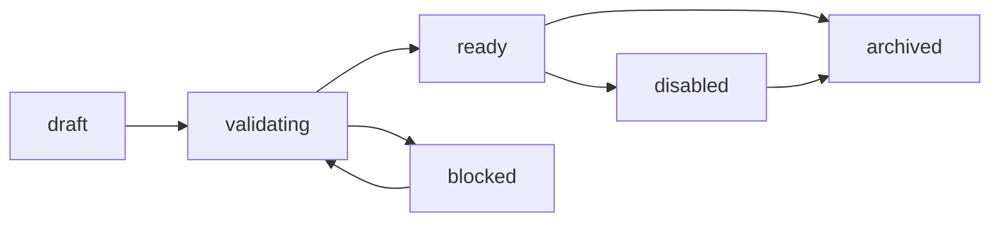
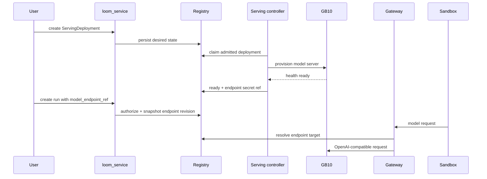

# Self-Service Runtime Registration

Status: partially superseded; no active self-service model-serving roadmap

Date: 2026-06-29

Owner disposition (2026-08-01): #144 is closed as not planned. Loom does not
offer user-managed `ServingDeployment`, dedicated `ModelEndpoint`, or
self-service GB10/vLLM launch/status/stop/TTL product surfaces. Supported
provider connections and models remain the evaluation entrypoint. The
model-serving sections below are retained as historical design only and must
not be implemented or presented as supported without a new owner decision.

The `EvaluationHarness` discussion is also design context rather than an active
delivery commitment; any future harness-registration work requires its own
freshly scoped roadmap item.

Tracking:

- Umbrella ADR: [#131](https://github.com/qianyi-sun/loom/issues/131)
- First API/CLI contract skeleton:
  [#132](https://github.com/qianyi-sun/loom/issues/132)
- Agentic RL GB10 serving umbrella:
  [#144](https://github.com/qianyi-sun/loom/issues/144)
- Skill artifact reuse: [#13](https://github.com/qianyi-sun/loom/issues/13)
- Custom container security: [#15](https://github.com/qianyi-sun/loom/issues/15)
- User TaskSet and data-production model: [#17](https://github.com/qianyi-sun/loom/issues/17)
- GB10 and dual-architecture capacity gate: [#49](https://github.com/qianyi-sun/loom/issues/49)
- Harness/provider compatibility validation: [#114](https://github.com/qianyi-sun/loom/issues/114)

## Historical Goal (Inactive)

Give teams a self-service way to register and use runtime objects without
turning benchmark adapters or worker code into one-off integration points.

The first two product capabilities are:

1. A user can use platform GB10 capacity to start an inference service for a
   platform-supported model or a model they trained and registered.
2. A user can register their own evaluation harness, then select it in a run
   after Loom validates the harness contract and execution boundary.

Both capabilities need the same platform machinery: team ownership,
authorization, validation, provenance, resource admission, health diagnostics,
secret references, and cleanup. They should be designed together even though
their implementation can land in separate slices.

This ADR belongs to the v1.1 platform-foundations track. It should inform
Agentic RL model-serving work, but it should not expand the v1.0 release gate
unless a specific compatibility blocker is explicitly promoted.

## Non-Goals

- Do not execute arbitrary user model code, model-serving images, or harness
  images before the security and validation gates are implemented.
- Do not bypass the LLM Gateway for model calls that belong to a Loom run.
- Do not weaken team-scoped authorization on batches, trials, provider
  credentials, artifacts, or Run Library routes.
- Do not make browser upload the normal path for large model or harness assets.
- Do not silently fall back to a platform default when a requested endpoint or
  harness is blocked, unauthorized, or not implemented.
- Do not require a browser UI in the first implementation slice. API and CLI
  contracts should stabilize first.

## Current Boundaries To Preserve

Loom already has several boundaries that this design should reuse:

- The LLM Gateway is the chokepoint for model calls, provider policy, token
  usage, and cost attribution. Agents should still call through Gateway routes
  when a run uses a Loom-managed endpoint.
- Provider connections are team scoped. They store secret references and model
  allowlists instead of leaking raw keys into run payloads.
- The Run Library is the safe cross-team completed-work surface. It must not be
  replaced by direct cross-team access to execution objects.
- Benchmark onboarding already treats catalog readiness as a validation
  lifecycle. Runtime registration should follow the same pattern: register,
  validate, become selectable only after the durable row is ready.
- Worker scheduling is trial oriented. Long-lived model-serving deployments
  should use a controller/admission model rather than pretending they are normal
  one-shot trials.

## Product Objects

The design uses three product-facing objects. Internal code can use lower-level
helpers such as source resolvers, runtime backends, and validators, but users
and API clients should see these names.

### ModelEndpoint

`ModelEndpoint` is the stable handle a user selects for a run. It describes
what model endpoint to call, not necessarily how that endpoint is currently
implemented.

Examples:

- `platform/llama-3.1-8b`
- `team-a/math-tune-v3`
- `external/openai-compatible-prod`

Responsibilities:

- Own the user-facing reference, display name, scope, owner team, and active
  revision.
- Point to one backing target: an external provider connection, a platform
  catalog model, a team-owned model artifact, a `ServingDeployment`, or a
  future routing policy.
- Record validation status, last validation diagnostics, allowed model ids, and
  policy metadata.
- Expose a stable selectable reference for batch, trial, and data-production
  creation.

It is deliberately separate from `ServingDeployment`. Users should be able to
select a stable endpoint while operators rotate, replace, stop, or recreate the
deployment behind it.

### ServingDeployment

`ServingDeployment` is the managed runtime instance that turns a model source
into a reachable inference service. GB10 is the first target runtime, but the
object should not bake GB10 into every API field.

Responsibilities:

- Capture desired state: model source, serving template, runtime backend,
  resource request, TTL, health policy, cleanup policy, and owner team.
- Own admission and current state: requested, admitted, provisioning, ready,
  degraded, stopping, stopped, failed, or expired.
- Store endpoint secret references, never raw endpoint keys.
- Produce or reference an internal provider connection that the Gateway can
  route to after the deployment is ready.
- Preserve logs, health diagnostics, runtime ids, and provenance needed for
  cleanup and audits.

For the first slice, creating a `ServingDeployment` may only persist desired
state and return `runtime_not_implemented`. It must not pretend to launch GB10
capacity until the controller exists.

### EvaluationHarness

`EvaluationHarness` is the reusable evaluation or data-production harness a
team can register and then select in a run.

Responsibilities:

- Capture the harness source or image reference, version, input schema, output
  schema, evaluator/verifier contract, and compatibility metadata.
- Declare resource requirements, network policy, filesystem policy, sidecar
  needs, timeout class, and result semantics.
- Record validation status, diagnostics, active revision, owner team, and
  provenance.
- Become selectable only after the blocking validation gates pass.

Harness registration should be generic. SkillLearnBench, Terminal-Bench, and
future user harnesses should differ by spec and validation result, not by
hard-coded runner branches.

## Scope And Authorization

Registry objects are scoped before they are selectable:

| Scope | Meaning | MVP behavior |
|---|---|---|
| `platform` | Platform-supported models, serving templates, and harnesses | Readable by all teams; admins mutate |
| `team` | Team-owned endpoints, deployments, and harnesses | Readable and selectable by the owner team |
| `public` | Future explicit sharing scope | Designed but not enabled by default |

Run creation may reference:

- `platform/*`
- objects owned by the submitting user's team
- future shared/public objects after a sharing policy exists

Cross-team references must be rejected before run creation unless an explicit
sharing policy says otherwise. Admin visibility does not imply ordinary users
can execute another team's runtime object.

Every object should preserve:

- `created_by_user`
- `owner_team`
- `schema_version`
- source artifact or source locator
- active revision/version
- validation status and diagnostics
- last validation time
- secret references, not secret values
- audit metadata for create, validate, disable, and delete actions

## Lifecycle

Registry lifecycle should be explicit and durable.



The common states are:

- `draft`: object exists but is not selectable.
- `validating`: validators are running or a dry-run was requested.
- `ready`: object passed blocking checks and can be selected by an authorized
  run.
- `blocked`: object failed a blocking validation gate.
- `disabled`: owner or admin intentionally prevents new run references.
- `archived`: object is retained for provenance but hidden from normal pickers.

`ServingDeployment` also has runtime states because it can be long lived:

- `requested`
- `admitted`
- `provisioning`
- `ready`
- `degraded`
- `stopping`
- `stopped`
- `failed`
- `expired`

## Run Creation Contract

Runs should reference stable registry objects, not raw URLs, images, code
paths, or model-serving scripts.

Requested shape:

```json
{
  "model_endpoint_ref": "team-a/math-tune-v3",
  "evaluation_harness_ref": "platform/skilllearnbench",
  "request_params": {
    "temperature": 0,
    "seed": 1234
  }
}
```

Submission flow:

1. `loom_service` resolves each reference in the caller's team context.
2. Authorization checks reject cross-team or disabled objects.
3. Validation checks reject objects that are not `ready`.
4. The service snapshots object revision ids and validation ids into the batch
   or trial metadata so later endpoint or harness changes do not rewrite
   history.
5. The worker receives resolved execution metadata, not broad registry write
   privileges.
6. Model calls go through the Gateway, which resolves the selected endpoint to
   a provider route or managed deployment target.

Existing `provider_connection_id` and `provider_model_id` payloads can remain
as compatibility paths. `ModelEndpoint` should become the product-level wrapper
that eventually makes provider source differences less visible to users.

## Gateway And Serving Flow

Managed model serving should still flow through the Gateway.



The Gateway remains responsible for request policy, usage attribution, rate
limits, and safe diagnostics. The deployment controller owns service lifecycle,
health, and cleanup. Workers should not launch or tear down long-lived GB10
serving processes as part of individual trials.

## API And CLI Skeleton

The first implementation slice should create contracts and persistence without
launching high-risk runtime paths.

REST surface:

`ModelEndpoint`:

- `POST /api/v1/model-endpoints`
- `GET /api/v1/model-endpoints`
- `GET /api/v1/model-endpoints/{ref}`
- `POST /api/v1/model-endpoints/{ref}/validate`

`ServingDeployment`:

- `POST /api/v1/serving-deployments`
- `GET /api/v1/serving-deployments`
- `GET /api/v1/serving-deployments/{id}`
- `DELETE /api/v1/serving-deployments/{id}`
- `POST /api/v1/serving-deployments/{id}/validate`

`EvaluationHarness`:

- `POST /api/v1/evaluation-harnesses`
- `GET /api/v1/evaluation-harnesses`
- `GET /api/v1/evaluation-harnesses/{ref}`
- `POST /api/v1/evaluation-harnesses/{ref}/validate`

CLI surface:

```bash
loom model-endpoints create ...
loom model-endpoints list
loom model-endpoints get team-a/math-tune-v3
loom model-endpoints validate team-a/math-tune-v3

loom serving-deployments create ...
loom serving-deployments list
loom serving-deployments get DEPLOYMENT_ID
loom serving-deployments delete DEPLOYMENT_ID
loom serving-deployments validate DEPLOYMENT_ID

loom evaluation-harnesses register ...
loom evaluation-harnesses list
loom evaluation-harnesses get team-a/math-verifier-v1
loom evaluation-harnesses validate team-a/math-verifier-v1
```

Skeleton behavior:

- Persist minimal metadata, owner team, scope, and validation status.
- Support `validate-only` and dry-run operations.
- Return explicit blocked states for unsupported runtime backends.
- Reject run creation against non-ready objects.
- Redact secret-looking values before persistence or API responses.

## Validation Gates

Validation should be split into durable gates so users see where an object is
blocked.

`ModelEndpoint` gates:

- Reference shape and scope are valid.
- Owner team can access the backing provider connection, model artifact, or
  platform catalog entry.
- Provider/model preflight passes when the backing target is already reachable.
- License or allowlist policy allows the selected model for the team.
- Endpoint does not require raw secrets in user payloads.

`ServingDeployment` gates:

- Model source is supported: platform catalog, typed training artifact, object
  store artifact, or approved external source.
- Serving template is platform approved.
- Resource request is within team quota and GB10 admission policy.
- Endpoint exposure path is internal or approved for Gateway egress.
- Secret references exist and are readable by the controller, not by ordinary
  users.
- Controller/runtime backend is implemented for the requested backend.

`EvaluationHarness` gates:

- Spec schema version is supported.
- Input and output schemas are valid.
- Evaluator/verifier result semantics are declared.
- Image or source reference passes provenance and policy checks.
- Network, filesystem, sidecar, and resource requirements are allowed.
- The harness can run in a sandbox-compatible execution contract.

Blocking failures should produce durable diagnostics. Examples:

- `unauthorized_scope`
- `validation_pending`
- `blocked_by_policy`
- `unsupported_schema_version`
- `runtime_not_implemented`
- `quota_exceeded`
- `preflight_failed`
- `unsafe_secret_reference`

## Data Model Sketch

The exact table and Pydantic model names can be refined during implementation,
but the first slice should avoid overloading existing benchmark or provider
tables.

Suggested durable records:

- `model_endpoints`
- `model_endpoint_revisions`
- `serving_deployments`
- `evaluation_harnesses`
- `evaluation_harness_revisions`
- `runtime_validation_results`

Provider connections remain the right place for provider credentials. A
`ServingDeployment` can create or reference a provider connection internally,
but raw endpoint keys should not be stored on the deployment row.

Trials and batches should snapshot:

- selected `model_endpoint_ref`
- selected endpoint revision id
- selected `evaluation_harness_ref`
- selected harness revision id
- validation result ids used at submission time
- resolved provider route metadata needed by the worker or Gateway

## Historical Implementation Order (Not Authorized)

Recommended follow-up split:

1. Add API/CLI contract skeleton for `ModelEndpoint`,
   `ServingDeployment`, and `EvaluationHarness`
   ([#132](https://github.com/qianyi-sun/loom/issues/132)).
2. Add `ServingDeployment` lifecycle and `ModelEndpoint` readiness APIs
   ([#145](https://github.com/qianyi-sun/loom/issues/145)).
3. Add platform catalog `ModelEndpoint` entries backed by existing provider
   connections.
4. Add GB10 `ServingDeployment` controller for platform-approved models
   ([#151](https://github.com/qianyi-sun/loom/issues/151)).
5. Add platform and user-trained model source import and validation
   ([#150](https://github.com/qianyi-sun/loom/issues/150)).
6. Add `EvaluationHarness` registry validation gates.
7. Add sandboxed harness execution integration after #15 settles the custom
   container security model.
8. Add run-creation reference checks, metadata snapshots, and evaluation-batch
   integration without breaking existing provider-connection runs
   ([#146](https://github.com/qianyi-sun/loom/issues/146)).
9. Add CLI launch-to-evaluate flows
   ([#147](https://github.com/qianyi-sun/loom/issues/147)).
10. Add UI surfaces for endpoint, deployment, and harness registries
    ([#149](https://github.com/qianyi-sun/loom/issues/149)).
11. Add quota, cost/status, health, and cleanup dashboards.

This order gives users a stable contract before exposing GB10 service lifecycle
or arbitrary harness execution.

## Test Strategy

First-slice tests should cover:

- Platform-scoped objects are readable by normal teams but mutable only by
  admins.
- Team-scoped objects are not visible or selectable across teams.
- Run creation rejects missing, blocked, disabled, or unauthorized references.
- Run creation snapshots object revision ids.
- Secret-looking payload fields are rejected or redacted according to the
  existing secret-reference policy.
- `ServingDeployment` requests for unimplemented backends return an explicit
  runtime state instead of launching anything.
- CLI commands use the same API contract and render blocking diagnostics.

Later runtime tests should add:

- GB10 admission success and quota rejection.
- Deployment health transitions and TTL cleanup.
- Gateway routing to a ready managed deployment.
- Harness validation rejection for unsafe image, network, and filesystem
  policies.
- Sandboxed harness execution only after the security model is accepted.

## Historical Unresolved Decisions

- Whether `public` registry scope ships in v1.1 or remains a documented future
  state.
- Whether `ModelEndpoint` supports routing policies in the first API schema or
  reserves the field for a later revision.
- Which artifact type represents user-trained model outputs once training jobs
  are first-class.
- Whether harness result semantics should reuse the current verifier protocol
  directly or introduce a narrower `EvaluationHarnessResult` envelope.
- Whether long-lived serving quota is measured in GB10 slots, GPU memory,
  deployment count, tokens, or a combination.
