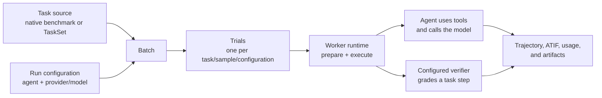

# Loom documentation

Loom is a team platform for running model and agent evaluations. It turns a
task source, an agent, and a model into reproducible trials, then preserves the
execution record so people can inspect results without operating workers,
databases, or object storage themselves.

This page explains Loom from the outside in. Follow it in order for the system
model; use the linked pages when you need the contract for one part. All pages
under `docs/` describe current behavior. Historical decisions, completed
migrations, research notes, and implementation plans live in
[`archive/`](../archive/).

## 1. Start with Loom's boundary

Loom owns the evaluation platform: users and teams, provider connections,
task catalogs and private TaskSets, batch and trial state, scheduling, sandbox
execution, verification, trajectories, artifacts, usage accounting, and the
web, CLI, and API surfaces around them.

Users bring model inference. A team can connect a hosted API or its own
OpenAI-compatible endpoint, but Loom does not host model checkpoints on the
team's behalf. In service mode, the [LLM Gateway](architecture/llm-gateway.md)
keeps provider credentials out of trial sandboxes while routing and accounting
for model calls. The [project README](../README.md#why-loom) gives the product
motivation and current supported task sources.

## 2. The evaluation model

The main objects form a hierarchy:

- A **task source** supplies the instructions, environment, and grading
  contract. It is either an operator-managed native benchmark or a private,
  team-owned [TaskSet](architecture/user-brought-tasksets.md).
- A **run configuration** chooses an agent and a provider/model, along with
  options such as the number of samples. Provider connections are owned by or
  shared with the submitting team; [provider onboarding](integrations/provider-onboarding.md)
  explains the supported connection paths.
- A **batch** records one evaluation request and expands the selected work into
  **trials**. A trial is Loom's atomic execution and result unit: one task and
  one agent/model configuration. A task can contain multiple steps, each with
  its own optional verifier result.
- A completed trial produces an event-sourced
  [trajectory and ATIF projection](architecture/trajectory-and-atif.md), usage
  data, plus any verifier results and task or agent artifacts. Completed
  batches can be found again through the [Run Library](architecture/run-library.md).

The normal flow is:

This is the stable conceptual path even though local and distributed runs wire
the supporting services differently.

## 3. One trial, end to end

1. **Submit.** A researcher selects tasks, an agent, and a model through the
   CLI, web application, or service API. Loom validates that the task,
   provider, model, agent, and execution capabilities are compatible before
   work reaches a worker. Start with the [user guide](user-guide.md) to run
   this workflow.
2. **Expand and queue.** A batch becomes one or more trials. In service mode,
   the Control Plane stores their state and workers claim eligible trials
   atomically. [Dominant Resource Fairness scheduling](architecture/drf-scheduling.md)
   shares capacity between teams while respecting worker capabilities.
3. **Prepare the environment.** The worker obtains the task bundle and asks a
   [Driver](architecture/driver-protocol.md) to create its sandbox. Drivers
   provide the common lifecycle implemented by Docker, Fake, and
   Modal. Kubernetes and Slurm can host worker pools, but they are not
   additional Driver implementations.
4. **Run the agent.** The shared `Trial.run()` orchestrator gives the task
   instruction to a built-in agent or an
   [agent adapter](architecture/agent-adapter.md). Model calls go directly to
   the upstream provider in local CLI mode or through the LLM Gateway in
   service mode.
5. **Verify.** At each task step, the configured
   [verifier](architecture/verifier-protocol.md) grades the resulting state and
   returns a typed result. A private-workspace policy can stage the public
   agent workspace into a fresh verifier-only driver instead of exposing
   private verifier inputs to the agent environment. Verification failure is
   recorded as trial evidence rather than hidden as a worker-side detail.
6. **Finalize and inspect.** Loom closes the trajectory, projects it to ATIF,
   stores artifacts and usage, and moves the trial to a terminal state. The
   service exposes live progress through its
   [event APIs](integrations/live-streaming.md) and completed data through the
   web app, CLI, and API.

## 4. The same runtime in two modes

Both modes converge on the same trial orchestrator, driver and verifier
contracts, trajectory events, and ATIF result shape. They differ in how those
contracts are wired.

| Concern | [CLI mode](architecture/cli-mode.md) | [Service mode](architecture/service-mode.md) |
| --- | --- | --- |
| Intended use | One person running local experiments | Teams sharing a distributed evaluation platform |
| Coordination | The CLI calls `Trial.run()` directly | The Control Plane queues trials and workers claim them |
| Model calls | Direct to a configured provider or local server | Through the LLM Gateway |
| Durable state | Local files; no service database required | Postgres plus MinIO/S3-compatible object storage |
| Product surface | `loom run` and local configuration | REST API, `loom eval`, web application, and Run Library |

The [architecture overview](architecture/overview.md) is the bridge from this
conceptual model to source packages and concrete dependencies.

## 5. Service mode, from the edge inward

Service mode adds shared coordination around the trial runtime. Its topology
has five layers:

1. **Product and tenancy.** The external product edge consists of the
   `loom_service` REST API under `/api/v1` and the separately deployed
   `loom-web` React application. The service authenticates users, applies
   [team ownership and roles](architecture/auth-and-teams.md), manages provider
   connections and TaskSets, accepts submissions, and presents results.
2. **Control.** The Control Plane owns batch and trial state, worker
   registration, scheduling, claims, cancellation, and fenced state changes.
   Ordinary batches fan out into independent trials; opt-in
   [family runs](architecture/family-runs.md) serialize related work, while the
   disabled-by-default [pipeline orchestrator](architecture/pipeline-orchestrator.md)
   reconciles durable run graphs. The pipeline controller does not execute
   containers or create Batch or Trial rows.
3. **Execution.** Workers poll for eligible trials, materialize their inputs,
   invoke the shared trial runtime, and use a driver to isolate the agent and
   task. [Remote worker pools](runbooks/remote-worker-pool.md) add execution
   hosts without moving control-plane ownership to those hosts.
4. **Inference.** The LLM Gateway resolves the permitted provider connection,
   proxies model traffic, and records token, diagnostic, and
   [cost data](architecture/cost-and-rate-cards.md). Trial sandboxes receive a
   short-lived Loom credential instead of the upstream provider secret.
5. **Persistence.** Postgres is authoritative for users, teams, configuration,
   scheduling state, and result metadata. Object storage holds task bundles,
   trajectory parts, ATIF documents, and artifacts. The application services
   are stateless with respect to this durable data.

Read [service mode](architecture/service-mode.md) for the detailed request,
claim, execution, and finalization sequence.

## 6. Where Loom is extended

Loom separates extension contracts so a new integration does not need a new
execution platform:

- **Tasks:** write a self-contained task bundle using the
  [task authoring guide](integrations/authoring-a-task.md), register a reusable
  native catalog through a [benchmark adapter](architecture/benchmark-adapter.md),
  or submit a private TaskSet through the service.
- **Agents:** select a built-in harness or add a subprocess-based adapter
  through `loom-launcher`. The Harbor-based `terminus-2` integration is an
  intentionally separate in-process runtime; its boundary is documented in
  [Harbor-embedded Terminus-2](architecture/terminus2-runtime.md).
- **Sandboxes:** implement the Driver protocol when execution requires a new
  environment backend. Agent code remains above this boundary and should not
  depend on a particular driver.
- **Verification:** attach pytest, script, structured, judge, or composite
  verification through the common typed verifier result contract.
- **Providers:** connect a supported hosted provider or an operator/user-owned
  OpenAI-compatible endpoint. Provider registration is separate from model
  execution so access, sharing, and audit remain team-scoped.

The [integration index](integrations/README.md) covers author-facing workflows;
the [architecture index](architecture/README.md) catalogs every current
component and protocol contract.

## 7. Concerns that cross every layer

- **Trust and secrets.** Tasks and agents are untrusted relative to platform
  and provider credentials. The current supported workload boundary is
  `internal_trusted`; read [sandbox isolation](architecture/sandbox-isolation.md)
  for what is enforced and what is not. Release and workload terms are defined
  centrally in the [domain model](agent/domain-model.md).
- **Fairness and capacity.** Service workers claim rather than receive pushed
  jobs. Scheduling, eligibility, retry recovery, worker pools, and fleet
  controls determine where a trial can run; the architecture index groups the
  current capacity contracts.
- **Evidence and reproducibility.** Trajectories preserve ordered agent events,
  ATIF provides a portable projection, and verifier results preserve grading.
  The [score contract](score-alignment/README.md) and
  [evidence schemas](evidence/README.md) identify machine-checked claims.
- **Operations.** Deployment, credentials, storage, recovery, observability,
  and release promotion belong to operators rather than trial code. Begin with
  the [operator runbook](runbooks/operator-runbook.md); the
  [runbook index](runbooks/README.md) routes to environment- and
  capacity-specific procedures.

## 8. Continue at the right level

After this tour, use the area indexes as reference catalogs:

| Goal | Continue with |
| --- | --- |
| Install Loom or run evaluations | [User guide](user-guide.md) |
| Author tasks or connect external systems | [Integration guides](integrations/README.md) |
| Understand components and protocols | [Architecture index](architecture/README.md) |
| Deploy, release, or recover Loom | [Runbooks](runbooks/README.md) |
| Change Loom itself | [Contributor documentation](contributing/README.md) and [`CONTRIBUTING.md`](../CONTRIBUTING.md) |
| Decide between Loom and Harbor | [Loom and Harbor](contributing/loom-vs-harbor.md) |
